# 因子图与GTSAM：实践介绍

> 参考[GTSAM][https://github.com/borglab/gtsam]

​		在这篇文章中，作者提供了一个关于因子图和 GTSAM 的实践性介绍。这是一篇更新版本的技术报告，它针对 GTSAM 4.0 库及其后续版本进行了定制。

​		**因子图**是一种图形模型（Koller和Friedman，2009），非常适合用来建模复杂的估计问题，例如同时定位和绘图（SLAM）或运动结构（SFM）。您可能熟悉另一种经常使用的图形模型，贝叶斯网络，它是一个有向无环图。然而，**因子图**是一个由因子连接到变量的二分图。**变量**表示估计问题中未知的随机变量，而**因子**表示对这些变量的概率约束，源自测量或先验知识。在接下来的部分$I$中，我将用来自机器人和视觉领域的例子来说明这一点。

​		GTSAM工具箱（GTSAM代表“Georgia Tech Smoothing and Mapping”）是一个基于因子图的BSD许可的C++库。它提供了最先进的SLAM和SFM问题解决方案，但也可以用来建模和解决更简单和更复杂的估计问题。它还提供了MATLAB和Python包装器，可以快速进行原型开发、可视化和用户交互。此外，它在Jupyter笔记本和/或Google的coLaboratory中也很容易使用。

​		GTSAM利用稀疏性来提高计算效率。通常，测量仅提供有关少数变量之间关系的信息，因此所得因子图将稀疏连接。GTSAM中实现的算法利用这一点来降低计算复杂度。即使图形太密集而无法通过直接方法有效处理，GTSAM也提供了相当有效的迭代方法。

## 1 因子图

​		本篇是因子图的一个简要概述，但它并不能取代Kschischang等人(2001年)和Loeliger等人(2004年)的优秀论文。

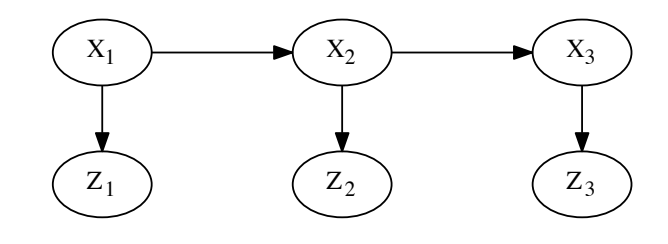

​		图显示了一个隐马尔可夫模型(hidden Markov model,HMM)在三个时间步长上的贝叶斯网络。在贝叶斯网络中，每个节点都与一个条件概率密度(conditional density)相关联：顶部的马尔可夫链编码了先验概率(prior)$P(X_1)$和转移概率(transition probabilities)$P(X_2|X_1)$和$P(X_3|X_2)$，而测量值$Z_t$仅取决于状态$X_t$，由条件概率密度$P(Z_t|X_t)$建模。给定已知的测量值$z_1$、$z_2$和$z_3$，我们对最大化后验概率(posterior probability)$P(X_1,X_2,X_3|Z_1=z_1,Z_2=z_2,Z_3=z_3)$感兴趣。由于测量值$Z_1$、$Z_2$和$Z_3$是已知的，后验概率与六个因子(factors)的乘积成正比，其中三个来自马尔可夫链，三个似然因子定义为$L(X_t;z)\propto P(Z_t = z|X_t)$:
$$
P\left(X_1, X_2, X_3 \mid Z_1, Z_2, Z_3\right) \propto P\left(X_1\right) P\left(X_2 \mid X_1\right) P\left(X_3 \mid X_2\right) L\left(X_1 ; z_1\right) L\left(X_2 ; z_2\right) L\left(X_3 ; z_3\right)
$$
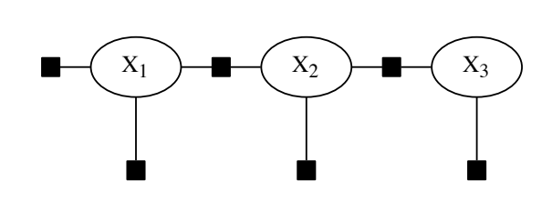

因子图是一种不同的图形模型，它只表示未知变量$X_1,X_2,X_3$，并将它们连接到编码概率信息的因子上，如图2所示。为了进行最大后验（MAP）推断，最大化乘积:
$$
f\left(X_1, X_2, X_3\right)=\prod f_i\left(\mathcal{X}_i\right)
$$
也就是因子图的值。从图中可以清楚地看出，因子图的连通性表示每个因子$f_i$依赖于哪些变量$\mathcal{X}_i$的子集。在下面的例子中，我们将使用因子图来模拟更复杂的MAP推断问题，例如机器人领域中的问题。

## 2 机器人运动建模

### 2.1 因子图建模

​		在深入探究SLAM例子之前，让我们思考简单的机器人运动建模问题。这可以通过连续马尔科夫链来完成，并为GTSAM提供一个简单的介绍。

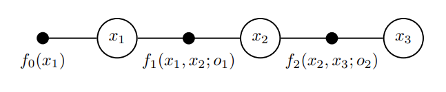

​		图3显示了一个简单示例的因子图。有三个变量$x_1,x_2,x_3$，它们表示机器人随时间变化的姿态，在图中由开圆变量节点呈现。在这个例子中，我们有一个一元因子$f_0(x_1)$在第一个姿态$x_1$上，它编码了我们对$x_1$的先验知识，并且有两个二元因子分别关联连续的姿态，分别为$f_1(x_1,x_2;o_1)$和$f_2(x_2,x_3;o_2)$，其中$o_1$和$o_2$表示里程计测量。

### 2.2 创建一个因子图

​		下面的C++代码作为GTSAM中的一个示例，创建了图3中的因子图:

```c++
#include <iostream>
#include <gtsam/nonlinear/NonlinearFactorGraph.h>
#include <gtsam/geometry/Pose2.h>
#include <gtsam/slam/PriorFactor.h>
#include <gtsam/slam/BetweenFactor.h>
#include <gtsam/nonlinear/Marginals.h>
using namespace std;
using namespace gtsam;
int main(int argc, char** argv)
{
    // Create an empty nonlinear factor graph
    NonlinearFactorGraph graph;
    
    // Add a Gaussian prior on pose x_1
    Pose2 priorMean(0.0, 0.0, 0.0);
    auto priorNoise = noiseModel::Diagonal::Sigmas(Vector3 (0.3, 0.3, 0.1));
    graph.add(PriorFactor<Pose2>(1, priorMean, priorNoise));
    
    // Add two odometry factors
    Pose2 odometryMean(2.0, 0.0, 0.0);
    auto odometryNoise = noiseModel::Diagonal::Sigmas(Vector3 (0.2, 0.2, 0.1));
    graph.add(BetweenFactor<Pose2>(1, 2, odometryMean, odometryNoise));
    graph.add(BetweenFactor<Pose2>(2, 3, odometryMean, odometryNoise));
    graph.print("\nFactor Graph:\n");
    return 0;
}
```

​		在上面代码当中，第13行创建了一个空的因子图。然后我们在第16-18行添加了因子$f_0(x_1)$，作为`PriorFactor<T>`的一个实例，这是一个模板类，提供在slam子文件夹中，其中`T=Pose2`。它的构造函数接受一个变量Key(在这种情况下为1)，一个类型为`Pose2`的均值，在第16行创建，并且为先验密度提供噪声模型。我们通过指定三个标准差来提供类型为`noiseModel::Diagonal`的高斯对角阵，在第17行分别为机器人位置的30厘米和机器人方向的0.1弧度。请注意，`Sigmas`构造函数返回一个共享指针，预计通常相同的噪声模型将用于许多不同的因子。

​		里程计测量被指定为`Pose2`，位于第21行。第22行定义了一个略有不同的噪声模型。然后，我们在第23-24行添加了两个因子$f_1(x_1, x_2; o_1)$和$f_2(x_2, x_3; o_2)$，作为另一个模板类`BetweenFactor<T>`的实例，其中`T=Pose2`。

​		当在命令提示符下运行示例(使用make OdometryExample.run命令)时，它将打印出因子图：

``` shell
Factor Graph:
size: 3

Factor 0: PriorFactor on 1
  prior mean:  (0, 0, 0)
  noise model: diagonal sigmas [0.3; 0.3; 0.1];

Factor 1: BetweenFactor(1,2)
  measured:  (2, 0, 0)
  noise model: diagonal sigmas [0.2; 0.2; 0.1];

Factor 2: BetweenFactor(2,3)
  measured:  (2, 0, 0)
  noise model: diagonal sigmas [0.2; 0.2; 0.1];
```

### 2.3 因子图(Factor Graphs)与值(Values)的区别

​			这一点上，需要强调GTSAM背后的两个重要设计理念：

1. 因⼦图及其在代码中的体现指定了机器⼈整个轨迹$ X=\{x_1, x_2, x_3\}$上的联合概率分布$P(X|Z)$，⽽不仅仅是最后 ⼀个姿势。这种平滑的世界观给了 GTSAM ⼀个名字：“平滑(smoothing)和(mapping)”。在本⽂档的后⾯，我们将讨论如何使⽤  GTSAM 进⾏滤波(您通常不想这样做)或增量推理(我们⼀直在这样做)。

2. GTSAM中的因⼦图只是概率密度$P(X|Z)$的规范，对应的***FactorGraph***类及其派⽣类不包含“解”。相反，有⼀个单独的类型***Values***⽤于指定(在本例中)$x_1,x_2,x_3$的特定值，然后可⽤于评估与特定值关联的概率(或更常⻅的误差)。

   ​		后⼀点通常是 GTSAM 初学者容易混淆的地⽅。这有助于记住，在设计 GTSAM 时，我们采⽤了与数学对象相对应的类的函数式⽅法，这些对象通常是不可变的。您应该将因⼦图视为应⽤于值的函数，正如符号 $f(X) \propto P(X|Z)$ 所暗⽰的那样，⽽不是要修改的对象。

### 2.4 GTSAM中的非线性优化

​		下⾯的代码创建了⼀个`Values`实例，并将其⽤作初始估计来找到轨迹$X$的最⼤后验 (MAP) 分配：

``` c++
#include <iostream>
#include <gtsam/nonlinear/NonlinearFactorGraph.h>
#include <gtsam/geometry/Pose2.h>
#include <gtsam/slam/PriorFactor.h>
#include <gtsam/slam/BetweenFactor.h>
#include <gtsam/nonlinear/Marginals.h>
#include <gtsam/nonlinear/LevenbergMarquardtOptimizer.h>
using namespace std;
using namespace gtsam;
int main(int argc, char** argv)
{
    NonlinearFactorGraph graph;

    Pose2 priorMean(0.0, 0.0, 0.0);
    auto priorNoise = noiseModel::Diagonal::Sigmas(Vector3 (0.3, 0.3, 0.1));
    graph.add(PriorFactor<Pose2>(1, priorMean, priorNoise));

    Pose2 odometryMean(2.0, 0.0, 0.0);
    auto odometryNoise = noiseModel::Diagonal::Sigmas(Vector3 (0.2, 0.2, 0.1));
    graph.add(BetweenFactor<Pose2>(1, 2, odometryMean, odometryNoise));
    graph.add(BetweenFactor<Pose2>(2, 3, odometryMean, odometryNoise));
    
    Values initial;
    initial.insert(1, Pose2(0.5, 0.0, 0.2));
    initial.insert(2, Pose2(2.3, 0.1, -0.2));
    initial.insert(3, Pose2(4.1, 0.1, 0.1));

    Values result = LevenbergMarquardtOptimizer(graph, initial).optimize();
    initial.print("\nInitial Values:\n");
    result.print("\nFinal Result:\n");
    return 0;
}
```

​		代码中的第23-26⾏创建了初始估计，在第28⾏我们创建了⼀个⾮线性 Levenberg Marquardt方式的优化器，并使⽤默认参数设置调⽤***优化器***。 GTSAM 之所以需要进⾏⾮线性优化，是因为⾥程计因⼦$f_1(x_1, x_2; o_1)$和$f_2(x_2, x_3;  o_2)$是⾮线性的，因为它们涉及到机器⼈的⽅向。这也解释了为什么我们在代码1中创建的因⼦图是***NonlinearFactorGraph***类型。优化类对该图进⾏线性化，可能多次，以最⼩化由因⼦指定的⾮线性平⽅误差。

​		运⾏⽰例的相关输出如下：

```shell
Initial Values:

Values with 3 values:
Value 1: (gtsam::Pose2)
(0.5, 0, 0.2)

Value 2: (gtsam::Pose2)
(2.3, 0.1, -0.2)

Value 3: (gtsam::Pose2)
(4.1, 0.1, 0.1)


Final Result:

Values with 3 values:
Value 1: (gtsam::Pose2)
(7.46978e-16, -5.34409e-16, -1.78382e-16)

Value 2: (gtsam::Pose2)
(2, -1.09237e-15, -2.48671e-16)

Value 3: (gtsam::Pose2)
(4, -1.70076e-15, -2.50944e-16)
```

​		可以看出，在⾮常⼩的容差下，ground truth的解$x_1 = (0, 0, 0)， x_2 = (2, 0, 0)， x_3 = (4, 0, 0)$ 被恢复。

### 2.5 全后验推理

​		GTSAM还可⽤于在合并来⾃所有测量$Z$的信息后计算每个姿势的协⽅差矩阵。认识到因⼦图编码***后验密度*** $P(X|Z)$ ，平均值 $\mu$ 以及每个位姿 $x$ 的协⽅差近似***边缘后验密度***$P(x|Z)$。请注意，这只是⼀个近似值，因为即使在这种简单的情况下，⾥程计因⼦实际上在它们的参数中也是⾮线性的，并且 GTSAM 仅计算真实后验的⾼斯近似值。

​		下面的代码将复原后验边缘概率：

```c++
#include <iostream>
#include <gtsam/nonlinear/NonlinearFactorGraph.h>
#include <gtsam/geometry/Pose2.h>
#include <gtsam/slam/PriorFactor.h>
#include <gtsam/slam/BetweenFactor.h>
#include <gtsam/nonlinear/Marginals.h>
#include <gtsam/nonlinear/LevenbergMarquardtOptimizer.h>
using namespace std;
using namespace gtsam;
int main(int argc, char** argv)
{
    NonlinearFactorGraph graph;

    Pose2 priorMean(0.0, 0.0, 0.0);
    auto priorNoise = noiseModel::Diagonal::Sigmas(Vector3 (0.3, 0.3, 0.1));
    graph.add(PriorFactor<Pose2>(1, priorMean, priorNoise));

    Pose2 odometryMean(2.0, 0.0, 0.0);
    auto odometryNoise = noiseModel::Diagonal::Sigmas(Vector3 (0.2, 0.2, 0.1));
    graph.add(BetweenFactor<Pose2>(1, 2, odometryMean, odometryNoise));
    graph.add(BetweenFactor<Pose2>(2, 3, odometryMean, odometryNoise));
    
    Values initial;
    initial.insert(1, Pose2(0.5, 0.0, 0.2));
    initial.insert(2, Pose2(2.3, 0.1, -0.2));
    initial.insert(3, Pose2(4.1, 0.1, 0.1));

    Values result = LevenbergMarquardtOptimizer(graph, initial).optimize();
    
    
    cout.precision(2);
    Marginals marginals(graph, result);
    cout << "x1 covariance:\n" << marginals.marginalCovariance(1) << endl;
    cout << "x2 covariance:\n" << marginals.marginalCovariance(2) << endl;
    cout << "x3 covariance:\n" << marginals.marginalCovariance(3) << endl;
    return 0;
}
```

运行示例的相关输出如下：

```shell
x1 covariance:
   0.09 3.2e-33 2.8e-33
3.2e-33    0.09 2.6e-17
2.8e-33 2.6e-17    0.01
x2 covariance:
   0.13 1.2e-18 6.1e-19
1.2e-18    0.17    0.02
6.1e-19    0.02    0.02
x3 covariance:
   0.17 8.6e-18 2.7e-18
8.6e-18    0.37    0.06
2.7e-18    0.06    0.03
```

​		我们看到的是$x_1$上的边缘协⽅差$P(x_1|Z)$只是$x_1$上的先验知识，但是随着机器⼈移动，所有维度的不确定性都在⽆限制地增⻓，并且姿态的$y$和$\theta$分量变为(正)相关。

​		解释这些数字时要注意的⼀个重要事实是，协⽅差矩阵是以相对坐标⽽不是绝对坐标给出的。这是因为GTSAM在内部针对线性化点的变化进⾏优化，所有⾮线性优化库也是如此。

## 3 机器人定位

### 3.1 一元量测因子

​		在本节中，我们将测量值添加到因子图中，这将帮助我们随着时间的推移实际定位机器人。该示例还用作创建新因子类型的教程。

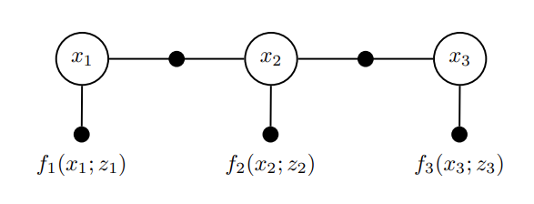

​		特别地，我们使用一元测量因子来处理外部测量。第2节中的示例对于真实机器人并不是非常有用，因为它仅包含与里程计测量相对应的因子。这些都是不完美的，并且会导致最后一个机器人姿态上的不确定性迅速累积，至少在没有任何外部测量的情况下（参见第2.5节）。上图显示了一个新的因子图，其中省略了先前的$f_0(x_1)$，而是添加了三个一元因子$f_1(x_1; z_1),f_2(x_2; z_2),f_3(x_3; z_3)$，分别为每个定位测量$z_t$。这样的一元因子适用于仅取决于当前机器人姿态的测量$z_t$，例如GPS读数，激光测距仪在预先存在的地图中的相关性，或者天花板灯的存在或缺失(请参阅Dellaert等人(1999)有趣的例子)。

### 3.2 定义自定义因子

​		在GTSAM中，您可以通过从内置类`NoiseModelFactor1 <T>`派生一个新类来创建自定义一元因子，该类实现了一个与高斯噪声模型的测量似然对应的一元因子:
$$
L(q ; m)=\exp \left\{-\frac{1}{2}\|h(q)-m\|_{\Sigma}^2\right\} \triangleq f(q)
$$
​		其中$m$是测量值，$q\in SE(2)$是未知变量，$h(q)$是测量函数，$\Sigma$是噪声协方差。请注意，上面认为$m$是已知的，并且似然$L(q; m)$只会作为$q$的函数进行评估，这就解释了为什么它是一元因子$f(q)$。根据测量值，我们可以确定未知变量$q$的可能性或不可能性。

**Note**:事实上，许多人都把这个概念弄反了，常常被条件密度符号$P(m|q)$误导。实际上，似然$L(q; m)$被定义为$1$与$P(m|q)$成比例的任何函数。

下列代码显示了一个关于如何定义自定义因子类`UnaryFactor`的示例补充一个“类 GPS”的可能性测量:

```c++
#include <gtsam/geometry/Pose2.h>
#include <gtsam/inference/Key.h>
#include <gtsam/slam/BetweenFactor.h>
#include <gtsam/nonlinear/NonlinearFactorGraph.h>
#include <gtsam/nonlinear/Values.h>
#include <gtsam/nonlinear/LevenbergMarquardtOptimizer.h>
#include <gtsam/nonlinear/Marginals.h>
#include <gtsam/nonlinear/NonlinearFactor.h>
using namespace std;
using namespace gtsam;
class UnaryFactor: public NoiseModelFactorN<Pose2> {
    double mx_, my_;

public:
    using NoiseModelFactor1<Pose2>::evaluateError;
    typedef std::shared_ptr<UnaryFactor> shared_ptr;
    UnaryFactor(Key j, double x, double y, const SharedNoiseModel& model):
            NoiseModelFactorN<Pose2>(model, j), mx_(x), my_(y) {}
    ~UnaryFactor() override {}
    Vector evaluateError(const Pose2& q, OptionalMatrixType H) const override {
        const Rot2& R = q.rotation();
        if (H) (*H) = (gtsam::Matrix(2, 3) << R.c(), -R.s(), 0.0, R.s(), R.c(), 0.0).finished();
        return (Vector(2) << q.x() - mx_, q.y() - my_).finished();
    }

    gtsam::NonlinearFactor::shared_ptr clone() const override {
        return std::static_pointer_cast<gtsam::NonlinearFactor>(
                gtsam::NonlinearFactor::shared_ptr(new UnaryFactor(*this))); }
};
```

​		在第11行定义派生类时，我们提供了模板参数`Pose2`来指示变量$q$的类型，而测量值则存储为实例变量`mx_`和`my_`在第12行定义。构造函数在第17-18行仅将变量键$j$和噪声模型传递给超类，并存储提供的测量值。每个因子类都必须实现的最重要的函数是`evaluateError`，它应该返回:
$$
E(q) \triangleq h(q)-m
$$
这一步在第23行完成。重要的是，因为我们想使用这个因子进行非线性优化(参见 Dellaert 和
Kaess 2006 了解详细信息)，只要提供可选参数 $H$，即矩阵参考，该函数应该将$h(q)$的雅可比矩阵赋值给它，其在$q$的提供值处进行评估。这是在第 22行针对此示例完成的。在这种情况下，二维函数 $h $的雅可比矩阵仅返回机器人的位置:
$$
h(q)=\left[\begin{array}{l}
q_x \\
q_y
\end{array}\right]
$$
关于三维位姿$q=(q_x,q_y,q_\theta)$，产生以下$2\times 3$的矩阵:
$$
H=\left[\begin{array}{ccc}
\cos \left(q_\theta\right) & -\sin \left(q_\theta\right) & 0 \\
\sin \left(q_\theta\right) & \cos \left(q_\theta\right) & 0
\end{array}\right]
$$
**重要提示**:许多用户在尝试创建自定义因子时，最初会对雅可比矩阵与他们的直觉不符感到惊讶。例如，您可能只期望一个2×3的单位矩阵。如果变量属于向量空间，这将是正确的。然而，在GTSAM中，我们更一般地定义雅可比矩阵为矩阵H:
$$
h(q \exp \hat{\xi}) \approx h(q)+H \xi
$$
其中，$\xi=(\var x,\var y,\var\theta)$是增量更新，$\exp\hat{\xi}$是我们要更新变量的指数映射，在这种情况下$q\in SE(2)$，其中$SE(2)$是一组2D刚性变换，由`Pose2`实现。$SE(2)$的指数映射可以近似为一阶为:
$$
\exp \hat{\xi} \approx\left[\begin{array}{ccc}
1 & -\delta \theta & \delta x \\
\delta \theta & 1 & \delta y \\
0 & 0 & 1
\end{array}\right]
$$
其中使用$3 \times 3$矩阵代表2D位姿，因此:
$$
h\left(q e^{\hat{\xi}}\right) \approx h\left(\left[\begin{array}{ccc}
\cos \left(q_\theta\right) & -\sin \left(q_\theta\right) & q_x \\
\sin \left(q_\theta\right) & \cos \left(q_\theta\right) & q_y \\
0 & 0 & 1
\end{array}\right]\left[\begin{array}{ccc}
1 & -\delta \theta & \delta x \\
\delta \theta & 1 & \delta y \\
0 & 0 & 1
\end{array}\right]\right)=\left[\begin{array}{c}
q_x+\cos \left(q_\theta\right) \delta x-\sin \left(q_\theta\right) \delta y \\
q_y+\sin \left(q_\theta\right) \delta x+\cos \left(q_\theta\right) \delta y
\end{array}\right]
$$
然后解释了$Jacobian\quad H$

​		李群与机器人领域非常相关，你可以阅读更多:

+ [LieGroups.pdf][https://github.com/borglab/gtsam/blob/develop/doc/LieGroups.pdf]

+ [math.pdf][https://github.com/borglab/gtsam/blob/develop/doc/math.pdf]

在某些情况下，您可能希望超越李群，使用更宽松的概念——流形，因为并非所有未知变量都像群一样表现，例如3D平面、2D直线、空间中的方向等。对于流形，我们并不总是拥有指数映射，但我们有一个回缩，它起到了相同的作用。这里有一些解释:

+ [GTSAM-Concepts][https://gtsam.org/notes/GTSAM-Concepts.html]

### 3.3 使用自定义因子

​		以下C++代码说明了如何创建自定义因子并将其添加到因子图中:

```c++
#include <gtsam/geometry/Pose2.h>
#include <gtsam/inference/Key.h>
#include <gtsam/slam/BetweenFactor.h>
#include <gtsam/nonlinear/NonlinearFactorGraph.h>
#include <gtsam/nonlinear/Values.h>
#include <gtsam/nonlinear/LevenbergMarquardtOptimizer.h>
#include <gtsam/nonlinear/Marginals.h>
#include <gtsam/nonlinear/NonlinearFactor.h>
using namespace std;
using namespace gtsam;
class UnaryFactor: public NoiseModelFactorN<Pose2> {
    double mx_, my_;

public:
    using NoiseModelFactor1<Pose2>::evaluateError;
    typedef std::shared_ptr<UnaryFactor> shared_ptr;
    UnaryFactor(Key j, double x, double y, const SharedNoiseModel& model):
            NoiseModelFactorN<Pose2>(model, j), mx_(x), my_(y) {}
    ~UnaryFactor() override {}
    Vector evaluateError(const Pose2& q, OptionalMatrixType H) const override {
        const Rot2& R = q.rotation();
        if (H) (*H) = (gtsam::Matrix(2, 3) << R.c(), -R.s(), 0.0, R.s(), R.c(), 0.0).finished();
        return (Vector(2) << q.x() - mx_, q.y() - my_).finished();
    }

    gtsam::NonlinearFactor::shared_ptr clone() const override {
        return std::static_pointer_cast<gtsam::NonlinearFactor>(
                gtsam::NonlinearFactor::shared_ptr(new UnaryFactor(*this))); }
};


int main(int argc, char** argv)
{
    NonlinearFactorGraph graph;
    auto odometryNoise = noiseModel::Diagonal::Sigmas(Vector3(0.2, 0.2, 0.1));
    graph.emplace_shared<BetweenFactor<Pose2> >(1, 2, Pose2(2.0, 0.0, 0.0), odometryNoise);
    graph.emplace_shared<BetweenFactor<Pose2> >(2, 3, Pose2(2.0, 0.0, 0.0), odometryNoise);

    auto unaryNoise =
            noiseModel::Diagonal::Sigmas(Vector2(0.1, 0.1));  // 10cm std on x,y
    graph.emplace_shared<UnaryFactor>(1, 0.0, 0.0, unaryNoise);
    graph.emplace_shared<UnaryFactor>(2, 2.0, 0.0, unaryNoise);
    graph.emplace_shared<UnaryFactor>(3, 4.0, 0.0, unaryNoise);
    // graph.print("\nFactor Graph:\n");  // print

    Values initialEstimate;
    initialEstimate.insert(1, Pose2(0.5, 0.0, 0.2));
    initialEstimate.insert(2, Pose2(2.3, 0.1, -0.2));
    initialEstimate.insert(3, Pose2(4.1, 0.1, 0.1));
    // initialEstimate.print("\nInitial Estimate:\n");  // print

    LevenbergMarquardtOptimizer optimizer(graph, initialEstimate);
    Values result = optimizer.optimize();
    result.print("Final Result:\n");

    Marginals marginals(graph, result);
    cout << "x1 covariance:\n" << marginals.marginalCovariance(1) << endl;
    cout << "x2 covariance:\n" << marginals.marginalCovariance(2) << endl;
    cout << "x3 covariance:\n" << marginals.marginalCovariance(3) << endl;

    return 0;
}
```

在代码中，我们在第39-40行创建了噪声模型，它现在指定了测量值$m_x$和$m_y $的两个标准差。
在第41-43行，我们创建了三个新创建的`UnaryFactor`实例的`shared_ptr`版本，并将它们添加到图中。 GTSAM 使用共享指针来引用因子，而`emplace_shared`是一种方便的方法，可以同时构造一个类并为其创建一个`shared_ptr `。我们得到了3.1节的因子图。

### 3.4 全后验推理

三个 GPS 因子足以完全约束所有未知姿势并将它们绑定到“全局”参考系，包括三个未知方向。否则，GTSAM 因奇异矩阵异常退出。可以完全按照第 2.5 节中的方式恢复边际值，解和边际协方差现在由下式给出：

```c++
Final Result:

Values with 3 values:
Value 1: (gtsam::Pose2)
(8.53538e-11, 2.35867e-12, 6.4637e-11)

Value 2: (gtsam::Pose2)
(2, -4.74793e-12, 5.98996e-11)

Value 3: (gtsam::Pose2)
(4, 2.38926e-12, 5.99195e-11)

x1 covariance:
  0.00828571  7.82228e-14 -2.06607e-13
 7.82228e-14   0.00944444  -0.00305556
-2.06607e-13  -0.00305556   0.00819444
x2 covariance:
 0.00714286 3.80267e-14 -5.3829e-14
3.80267e-14  0.00777778 -0.00111111
-5.3829e-14 -0.00111111  0.00819444
x3 covariance:
 0.00828571 6.60868e-14 1.73936e-13
6.60868e-14  0.00944444  0.00305556
1.73936e-13  0.00305556   0.0181944
```

将其与 2.5 节中的协方差矩阵进行比较，我们可以看到随着测量不确定性的累积，不确定性不再无限制地增长。相反，“GPS”测量或多或少地限制了姿势，正如预期的那样。

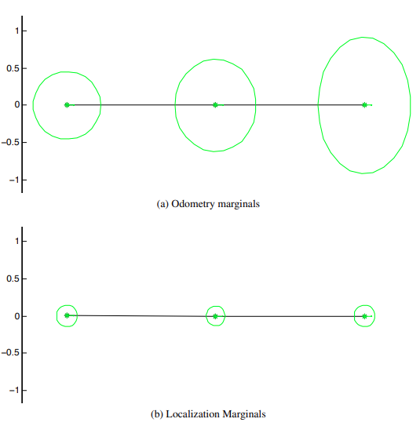

​		图形化地查看数据非常有帮助。在图中，显示了位置的边缘分布，作为包含99.9996％概率质量的5-sigma协方差椭圆。从图中可以立即看出，对于里程计边缘分布，(1)姿态上的不确定性持续增长，(2)角里程计上的不确定性转化为y上不确定性的增加。相比之下，定位边缘分布受一元因子约束，都要小得多。此外，尽管不太明显，但中间姿态的不确定性实际上更小，因为它受到两侧里程计的约束。

​		您可能想知道这些图形是如何生成的。答案是通过GTSAM的MATLAB接口。在下一节中，将演示如何使用GTSAM的MATLAB接口来生成这些图形。

## 4 位姿图

### 4.1 回环约束

​		SLAM问题的最简单实例化是PoseSLAM，它避免了构建环境的显式地图。SLAM的目标是在给定传入传感器测量值的情况下同时定位机器人并绘制环境地图(Durrant-Whyte和Bailey，2006)。除了车轮里程计外，对于在平面上移动的机器人来说，最受欢迎的传感器之一是2D激光测距仪，它提供了连续姿态之间的里程计约束，并在机器人重新访问先前探索过的环境部分时提供回环约束。

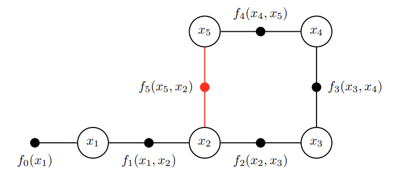

​		图中显示了PoseSLAM的因子图示例。随附在GTSAM中的以下C++代码作为示例，可以在代码中创建此因子图：

``` c++
#include <gtsam/geometry/Pose2.h>
#include <gtsam/inference/Key.h>
#include <gtsam/slam/BetweenFactor.h>
#include <gtsam/nonlinear/NonlinearFactorGraph.h>
#include <gtsam/nonlinear/Values.h>
#include <gtsam/nonlinear/LevenbergMarquardtOptimizer.h>
#include <gtsam/nonlinear/Marginals.h>
#include <gtsam/nonlinear/NonlinearFactor.h>
using namespace std;
using namespace gtsam;
int main(int argc, char** argv)
{
    NonlinearFactorGraph graph;
    noiseModel::Diagonal::shared_ptr priorNoise = noiseModel::Diagonal::Sigmas(Vector3(0.3,0.3,0.1));
    graph.addPrior(1,Pose2(0,0,0),priorNoise);

    noiseModel::Diagonal::shared_ptr model = noiseModel::Diagonal::Sigmas(Vector3(0.2,0.2,0.1));
    graph.add(BetweenFactor<Pose2>(1,2,Pose2(2,0,0),model));
    graph.add(BetweenFactor<Pose2>(2,3,Pose2(2,0,M_PI_2),model));
    graph.add(BetweenFactor<Pose2>(3,4,Pose2(2,0,M_PI_2),model));
    graph.add(BetweenFactor<Pose2>(4,5,Pose2(2,0,M_PI_2),model));

    graph.add(BetweenFactor<Pose2>(5,2,Pose2(2,0,M_PI_2),model));
    graph.print("Factor Graph:\n");
    return 0;
}
```

​		与之前一样，第13-15行创建了一个非线性因子图并添加了一元因子$f_0(x_1)$。当机器人穿过世界时，它会创建与里程计相对应的二元因子$f_t(x_t，x_{t+1})$，并在第17-21行中添加到图中(请注意，M_PI_2指的是pi/2)。但是第23行模拟了不同的事件:回环。例如，机器人可能使用视觉或激光测距仪识别相同的位置，并计算出它第一次访问该位置时的几何姿态约束。这在$x_5$和$x_2$的姿态中得到了说明，并生成了(红色)循环闭合因子$f_5(x_5，x_2)$。

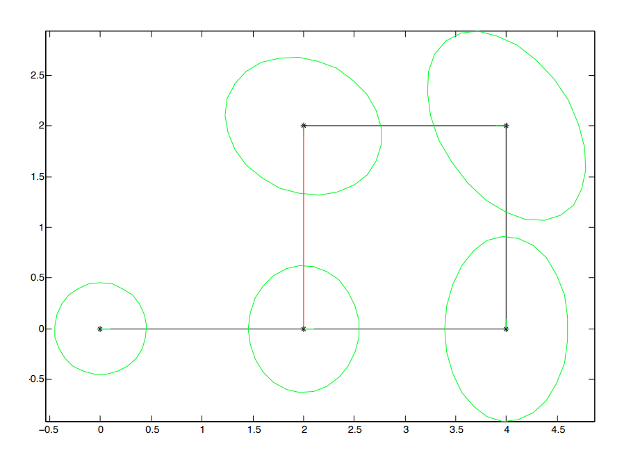

​		我们可以像以前一样优化这个因子图，方法是创建`Values`类型的初始估计，然后创建和运行优化器。结果以图形方式显示在图中，协方差椭圆以绿色显示。其中绿色的协方差椭圆表示2D中的5-sigma协方差椭圆，指示边缘位置，超过所有可能的方向，并显示包含99.9996％概率质量的区域。该图清楚地显示了$x_5$姿态的不确定性现在比仅有测距仪测量时要小得多。不确定性最高的姿态是$x_4$，它离一元约束$f_0(x_1)$最远，这是唯一将图与全局坐标系绑定的因素。

​		上图是使用允许您从内部使用 GTSAM 的界面创建的MATLAB，提供可视化和快速开发。我们接下来讨论这个。

### 4.2 使用MATLAB界面

可以通过 MATLAB中的包装类访问 GTSAM功能库。以下是与4.1节C++代码相同的matlab代码：

``` matlab
import gtsam.*
graph = NonlinearFactorGraph;
priorNoise= noiseModel.Diagonal.Sigmas([0.3;0.3;0.1]);
graph.add(PriorFactorPose2(1,Pose2(0,0,0),priorNoise));

model = noiseModel.Diagonal.Sigmas([0.2;0.2;0.1]);
graph.add(BetweenFactorPose2(1,2,Pose2(2,0,0),model));
graph.add(BetweenFactorPose2(2,3,Pose2(2,0,pi/2),model));
graph.add(BetweenFactorPose2(3,4,Pose2(2,0,pi/2),model));
graph.add(BetweenFactorPose2(4,5,Pose2(2,0,pi/2),model));

graph.add(BetweenFactorPose2(5,2,Pose2(2,0,pi/2),model));


initialEstimate = Values;
initialEstimate.insert(1, Pose2(0.5, 0.0,  0.2 ));
initialEstimate.insert(2, Pose2(2.3, 0.1, -0.2 ));
initialEstimate.insert(3, Pose2(4.1, 0.1,  pi/2));
initialEstimate.insert(4, Pose2(4.0, 2.0,  pi  ));
initialEstimate.insert(5, Pose2(2.1, 2.1, -pi/2));


optimizer = LevenbergMarquardtOptimizer(graph, initialEstimate);
result = optimizer.optimizeSafely();
```

请注意，代码几乎相同，尽管存在一些语法与命名上的差异：

+ 对象是通过调用构造函数创建的，而不是在堆上分配它们
+ 命名空间使用点符号完成，即C++中的`noiseModel::Diagonal::Sigmas`与MATALB中的`noiseModel.Diagonal.Sigmas`
+ C++ 中的向量和矩阵类只是MATLAB 中的向量/矩阵
+ 由于 MATLAB 中不存在模板化类，因此这些已在 GTSAM 接口中进行硬编码，例如， `PriorFactorPose2`对应于 C++ 类`PriorFactor<Pose2>`，等等

执行代码后，您可以在 MATLAB 命令提示符下调用 whos 来查看创建的对象。请注意，指示的类对应于包装的 C++ 类：

``` shell
>> whos
  Name                 Size            Bytes  Class                               

  graph                1x1                 8  gtsam.NonlinearFactorGraph                     
  initialEstimate      1x1                 8  gtsam.Values                                   
  model                1x1                 8  gtsam.noiseModel.Diagonal                      
  optimizer            1x1                 8  gtsam.LevenbergMarquardtOptimizer              
  priorNoise           1x1                 8  gtsam.noiseModel.Diagonal                      
  result               1x1                 8  gtsam.Values    
```

此外，可以详细检查任何 GTSAM 对象，产生与 C++ 相同的输出：

```shell
>> priorNoise
diagonal sigmas [0.3; 0.3; 0.1];

>> graph
size: 6

Factor 0: PriorFactor on 1
  prior mean:  (0, 0, 0)
  noise model: diagonal sigmas [0.3; 0.3; 0.1];

Factor 1: BetweenFactor(1,2)
  measured:  (2, 0, 0)
  noise model: diagonal sigmas [0.2; 0.2; 0.1];

Factor 2: BetweenFactor(2,3)
  measured:  (2, 0, 1.57079633)
  noise model: diagonal sigmas [0.2; 0.2; 0.1];

Factor 3: BetweenFactor(3,4)
  measured:  (2, 0, 1.57079633)
  noise model: diagonal sigmas [0.2; 0.2; 0.1];

Factor 4: BetweenFactor(4,5)
  measured:  (2, 0, 1.57079633)
  noise model: diagonal sigmas [0.2; 0.2; 0.1];

Factor 5: BetweenFactor(5,2)
  measured:  (2, 0, 1.57079633)
  noise model: diagonal sigmas [0.2; 0.2; 0.1];
```

它并不止于此:我们还可以调用为因子图定义的一些函数。例如:

``` shell
>> graph.error(initialEstimate)
ans =
   20.1086

>> graph.error(result)
ans =
   8.2191e-18
```

在优化前后计算均方根误差$\frac{1}{2} \sum_i\left\|h_i\left(X_i\right)-z_i\right\|_{\Sigma}^2$。

### 4.3 读取与优化位姿图

在MATLAB中使用GTSAM提供了更快的开发周期和轻松的图形输出。图中的优化轨迹是由下面的代码生成的，其中`load2D`读取TORO文件。

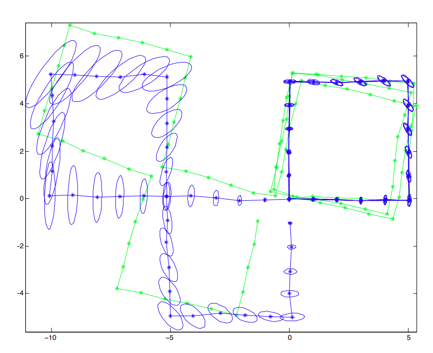

```matlab
import gtsam.*
datafile=findExampleDataFile('w100.graph');
model = noiseModel.Diagonal.Sigmas([0.05;0.05;5*pi/180]);
[graph,initial]=load2D(datafile,model);

priorMean=Pose2(0,0,0);
priorNoise=noiseModel.Diagonal.Sigmas([0.01;0.01;0.0;]);
graph.add(PriorFactorPose2(0,priorMean,priorNoise));
plot2DTrajectory(initial, 'g-*'); axis equal
optimizer = LevenbergMarquardtOptimizer(graph,initial);
result = optimizer.optimizeSafely;
marginals=Marginals(graph,result);

hold on; plot2DTrajectory(result, 'b-*');

P={};
for i=1:result.size()-1
    pose_i = result.atPose2(i);
    P{i}=marginals.marginalCovariance(i);
    plotPose2(pose_i,'b',P{i})
end
view(2)
axis tight; axis equal;
```

### 4.4 3D PoseSLAM

PoseSLAM 可以很容易地扩展到 3D 姿势，但需要注意更新 3D 旋转。GTSAM 支持四元数和$3\times 3$旋转矩阵来表示 3D 旋转。通过编译标志 `GTSAM_USE_QUATERNIONS `进行选择。

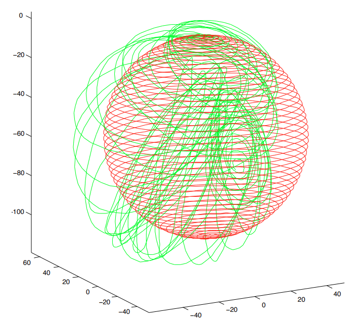

```matlab
import gtsam.*
datafile=findExampleDataFile('sphere2500.txt');
model = noiseModel.Diagonal.Sigmas([5*pi/180;5*pi/180;5*pi/180;0.05;0.05;0.05]);
[graph,initial]=load3D(datafile,model,true,2500);
plot3DTrajectory(initial,'g-', false);

graph=load3D(datafile,model,false,2500);
graph.add(NonlinearEqualityPose3(0,initial.atPose3(0)));
optimizer = LevenbergMarquardtOptimizer(graph, initial);
result = optimizer.optimizeSafely();
plot3DTrajectory(result,'r-',false);axis equal;
view(3); axis equal;
```

## 5 基于地标的SLAM

### 5.1 基础

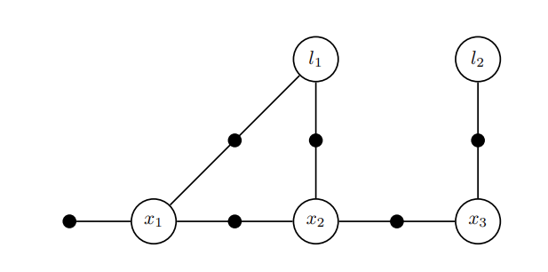

​		在**基于地标的SLAM**中，我们显式地构建了一个带有观察到的地标位置的地图，这在因子图中引入了除机器人位姿之外的第二种类型的变量。图中显示了一个基于地标的SLAM示例的因子图，它显示了典型的连接性：位姿在测距马尔科夫链中相互连接，而地标则从多个位姿观察到，诱导出二元因子。此外，位姿$x_1$具有通常的先验。

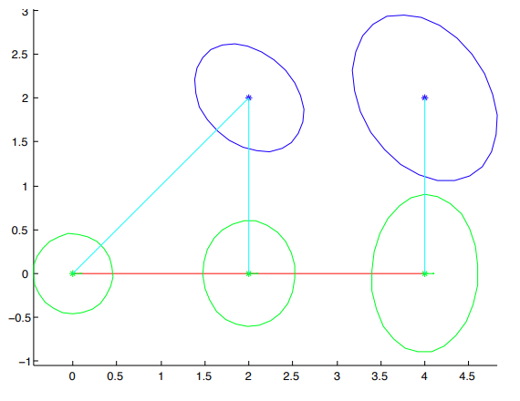

​		图中的因子图可以使用下面的MATLAB代码创建。与以前一样，在第2行我们创建了因子图，第8-18行创建了我们现在熟悉的先验/测距链。但是，第15-19行的代码是新的：它创建了三个测量因子，在这种情况下，从位姿到地标的“方位/距离”测量。

``` matlab
import gtsam.*
graph = NonlinearFactorGraph;
i1 = symbol('x',1); i2 = symbol('x',2); i3 = symbol('x',3);
j1 = symbol('l',1); j2 = symbol('l',2);

priorMean = Pose2(0.0, 0.0, 0.0);
priorNoise = noiseModel.Diagonal.Sigmas([0.3; 0.3; 0.1]);
graph.add(PriorFactorPose2(i1, priorMean, priorNoise));

odometry = Pose2(2.0, 0.0, 0.0);
odometryNoise = noiseModel.Diagonal.Sigmas([0.2; 0.2; 0.1]);
graph.add(BetweenFactorPose2(i1, i2, odometry, odometryNoise));
graph.add(BetweenFactorPose2(i2, i3, odometry, odometryNoise));

degrees = pi/180;
brNoise = noiseModel.Diagonal.Sigmas([0.1; 0.2]);
graph.add(BearingRangeFactor2D(i1, j1, Rot2(45*degrees), sqrt(8), brNoise));
graph.add(BearingRangeFactor2D(i2, j1, Rot2(90*degrees), 2, brNoise));
graph.add(BearingRangeFactor2D(i3, j2, Rot2(90*degrees), 2, brNoise));

graph.print(sprintf('\nFull graph:\n'));

initialEstimate = Values;
initialEstimate.insert(i1, Pose2(0.5, 0.0, 0.2));
initialEstimate.insert(i2, Pose2(2.3, 0.1,-0.2));
initialEstimate.insert(i3, Pose2(4.1, 0.1, 0.1));
initialEstimate.insert(j1, Point2(1.8, 2.1));
initialEstimate.insert(j2, Point2(4.1, 1.8));

initialEstimate.print(sprintf('\nInitial estimate:\n'));

optimizer = LevenbergMarquardtOptimizer(graph, initialEstimate);
result = optimizer.optimizeSafely();
result.print(sprintf('\nFinal result:\n'));

cla;hold on

marginals = Marginals(graph, result);
plot2DTrajectory(result, [], marginals);
plot2DPoints(result, 'b', marginals);

p_j1 = result.atPoint2(j1);
p_j2 = result.atPoint2(j2);

plot([result.atPose2(i1).x; p_j1(1)],[result.atPose2(i1).y; p_j1(2)], 'c-');
plot([result.atPose2(i2).x; p_j1(1)],[result.atPose2(i2).y; p_j1(2)], 'c-');
plot([result.atPose2(i3).x; p_j2(1)],[result.atPose2(i3).y; p_j2(2)], 'c-');
axis([-0.6 4.8 -1 1])
axis equal
view(2)
```

### 5.2 键与符号

​		唯一无法解释的代码在第 4‑6 行：这里我们使用符号函数为姿势和地标创建整数键。在 GTSAM 中，我们使用Key类型寻址所有变量，这只是`size_t`的类型定义。键不必连续编号，但它们在给定的因子图中必须是唯一的。对于具有不同类型变量的因子图，我们在 MATLAB 中提供符号函数，在 C++ 中提供符号类型，以帮助您创建(大的)整数键，这些键在可能的键空间中相距很远，因此您不必考虑以某个任意偏移量开始点编号。要创建符号键，您只需提供一个字符和一个整数索引。您可以使用基数 0 或 1，或使用任意索引：这无关紧要。在上面的代码中，我们使用“$x$”表示位姿，使用"$l$"表示地标。

​		代码中创建的因子图的优化结果显示在图中，很明显，具有两个测量值的地标$l_1$定位更好。在MATLAB中，我们也可以检查实际的数值，并且这样做揭示了更多的GTSAM魔法:

```shell
>> result
Values with 5 values:
Value l1: (Eigen::Matrix<double, -1, 1, 0, -1, 1>)
[
	2;
	2
]

Value l2: (Eigen::Matrix<double, -1, 1, 0, -1, 1>)
[
	4;
	2
]

Value x1: (gtsam::Pose2)
(-1.75178028e-16, 5.10058245e-17, -1.47500199e-17)

Value x2: (gtsam::Pose2)
(2, -4.84467264e-16, -4.80773687e-16)

Value x3: (gtsam::Pose2)
(4, -3.00360734e-15, -4.81992369e-16)
```

​		实际上，由 symbol 生成的键会被Values类中的print方法自动的检测到，并以人类方便阅读的形式呈现“$x1$”,“$l2$”等，而不是大而笨重的整数。这种魔力扩展到使用Key类型的大多数因子和其他类。

### 5.3 大的示例

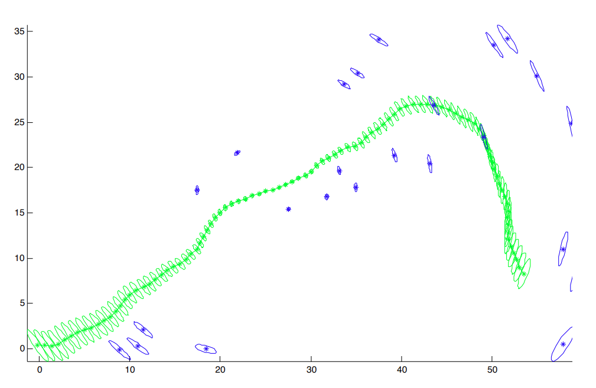

​		GTSAM附带了一个稍大的示例，如图所示。为了不使图形混乱，仅显示边缘，而不显示观测。这个例子有119个(多元)变量和517个因子，在不到10毫秒的时间内优化。

```matlab
import gtsam.*

datafile = findExampleDataFile('example.graph');

model = noiseModel.Diagonal.Sigmas([0.05; 0.05; 2*pi/180]);
[graph,initial] = load2D(datafile, model);

priorMean = initial.atPose2(40);
priorNoise = noiseModel.Diagonal.Sigmas([0.1; 0.1; 2*pi/180]);
graph.add(PriorFactorPose2(40, priorMean, priorNoise)); % add directly to graph

cla
plot2DTrajectory(initial, 'r-'); axis equal

optimizer = LevenbergMarquardtOptimizer(graph, initial);
tic
result = optimizer.optimizeSafely;
toc

cla;hold on
marginals = Marginals(graph, result);
plot2DTrajectory(result, 'g', marginals);
plot2DPoints(result, 'b', marginals);
axis tight
axis equal
view(2)
```

### 5.4 真实场景的示例

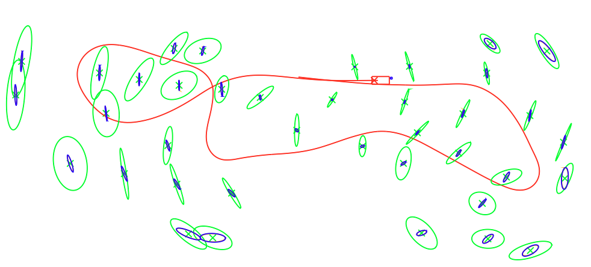

​		图显示了一个真实世界的例子，使用在悉尼维多利亚公园收集的著名数据集，该数据集使用装有激光测距仪的卡车收集。该图中的协方差矩阵非常高效地计算，详细解释见(Kaess和Dellaert，2009)。我们快速算法得到的精确协方差(蓝色，较小椭圆)与基于完全求逆的精确协方差(橙色，大多数被蓝色隐藏)重合。基于我们早期在(Kaess等人，2008)中的工作，得到了更大的保守协方差估计(绿色，大椭圆)。

## 6 Structure from Motion(SfM)

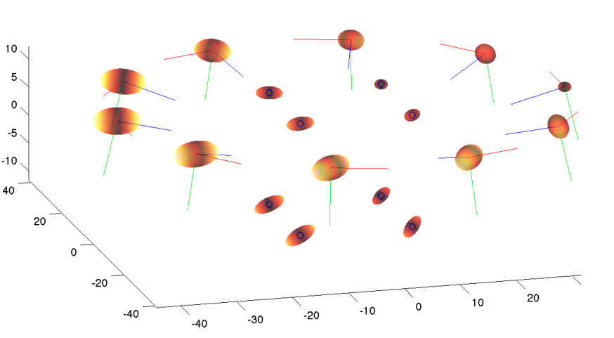

​		**Structure from Motion**(SFM)是一种从一组无序图像中的对应视觉特征恢复环境的3D重建的技术，见图。在GTSAM中，这是使用完全相同的因子图框架完成的，只是使用SFM特定的测量因子。特别地，有一个投影因子，它计算给定相机姿态$x_i$(`Pose3`)和点$p_j$(`Point3`)的重投影误差$f(x_i,p_j;z_{ij},K)$。该因子由2D测量$z_{ij}$(`Point2`)和已知校准参数$K$(类型为`Cal3_S2`)参数化。下面显示了如何创建因子图:

``` matlab
import gtsam.*

options.triangle = false;
options.nrCameras = 10;
options.showImages = false;

[data,truth] = VisualISAMGenerateData(options);

measurementNoiseSigma = 1.0;
pointNoiseSigma = 0.1;
poseNoiseSigmas = [0.001 0.001 0.001 0.1 0.1 0.1]';

graph = NonlinearFactorGraph;

measurementNoise = noiseModel.Isotropic.Sigma(2,measurementNoiseSigma);
for i=1:length(data.Z)
    for k=1:length(data.Z{i})
        j = data.J{i}{k};
        graph.add(GenericProjectionFactorCal3_S2(data.Z{i}{k}, measurementNoise, symbol('x',i), symbol('p',j), data.K));
    end
end

posePriorNoise  = noiseModel.Diagonal.Sigmas(poseNoiseSigmas);
graph.add(PriorFactorPose3(symbol('x',1), truth.cameras{1}.pose, posePriorNoise));
pointPriorNoise  = noiseModel.Isotropic.Sigma(3,pointNoiseSigma);
graph.add(PriorFactorPoint3(symbol('p',1), truth.points{1}, pointPriorNoise));

graph.print(sprintf('\nFactor graph:\n'));

initialEstimate = Values;
for i=1:size(truth.cameras,2)
    pose_i = truth.cameras{i}.pose.retract(0.1*randn(6,1));
    initialEstimate.insert(symbol('x',i), pose_i);
end
for j=1:size(truth.points,2)
    point_j = Point3(truth.points{j} + 0.1*randn(3,1));
    initialEstimate.insert(symbol('p',j), point_j);
end
initialEstimate.print(sprintf('\nInitial estimate:\n  '));

parameters = LevenbergMarquardtParams;
parameters.setlambdaInitial(1.0);
parameters.setVerbosityLM('trylambda');

optimizer = LevenbergMarquardtOptimizer(graph, initialEstimate, parameters);

for i=1:5
    optimizer.iterate();
end
result = optimizer.values();
result.print(sprintf('\nFinal result:\n  '));

marginals = Marginals(graph, result);
cla
hold on;

plot3DPoints(result, [], marginals);
plot3DTrajectory(result, '*', 1, 8, marginals);

axis([-40 40 -40 40 -10 20]);axis equal
view(3)
colormap('hot')
```

​		在代码中，假设已经创建了因子图，我们将测量因子添加到循环中。我们循环遍历具有索引$i$的图像，在这个示例中，数据作为两个单元数组给出:$Z \{ i \}$指定了图像$i$中的一组测量$z_k$，$J \{ i\}$指定了相应的点索引。我们使用的特定因子类型是`GenericProjectionFactorCal3_S2`，它是C++类`GenericProjectionFactor <Cal3_S2>`的MATLAB等效物，其中`Cal3_S2`是我们选择使用的相机校准类型(标准，无径向畸变，5参数校准矩阵)。与以前基于地标的SLAM(第5节)一样，这里我们使用符号键，只是现在我们使用字符"$p$表示点，而不是用"$l$"表示地标。

​		重要提示：使SFM工作的非常棘手和困难的部分是(a)数据关联和(b)初始化。 GTSAM不会为您做这些事情：它只提供BA优化。在示例中，我们只是假设已知数据关联(它在$J$集合中编码)，并使用真值进行初始化，因为示例的目的仅仅是向您展示如何设置优化问题。

## 7 iSAM:增量平滑与建图

​		GTSAM提供了一种基于更高级图形模型的增量推理算法，即Bayes树，该树由iSAM算法(增量平滑和建图，有关深入处理，请参阅Kaess等人(2008、2012))保持最新。对于实时运行的移动机器人来说，一旦新的传感器测量值进入，就能够访问更新后的地图非常重要。 iSAM以高效的方式保持地图最新。

​		代码显示了如何在简单的视觉SLAM示例中使用iSAM。在第18-19行中，我们创建了一个`NonlinearISAM`对象，它将每3步重新线性化和重新排序变量。此参数的正确值取决于您的问题有多非线性以及您希望在每个步骤中接近黄金标准解决方案的程度。在iSAM 2.0中，不需要此参数，因为iSAM2会自动确定何时需要线性化以及哪些变量。

​		该示例涉及从八个连续相机姿态看到的八个3D点。因此，在第一步中这里省略了所有八个地标和第一个姿态都被正确初始化。在代码中，这是通过扰动已知的地面实况完成的，但在实际应用中需要非常小心地正确初始化姿态和地标，特别是在单目序列中。

```c++
#include <gtsam/geometry/Point2.h>
#include <gtsam/inference/Symbol.h>
#include <gtsam/slam/BetweenFactor.h>
#include <gtsam/slam/ProjectionFactor.h>
#include <gtsam/nonlinear/NonlinearISAM.h>
#include <gtsam/nonlinear/Values.h>
#include <gtsam/nonlinear/NonlinearFactorGraph.h>
#include "SFMdata.h"
using namespace std;
using namespace gtsam;
int main(int argc, char** argv)
{
    Cal3_S2::shared_ptr K(new Cal3_S2(50.0,50.0,0.0,50.0,50.0));
    auto noise = noiseModel::Isotropic::Sigma(2,1.0);
    vector<Point3> points=createPoints();
    vector<Pose3> poses= createPoses();

    int relinearInterval = 3;
    NonlinearISAM isam(relinearInterval);
    NonlinearFactorGraph graph;
    Values initialEstimate;

    for(size_t i=0;i<poses.size();++i)
    {
        for(size_t j=0;j<points.size();++j)
        {
            PinholeCamera<Cal3_S2> camera(poses[i],*K);
            Point2  mesurement=camera.project(points[j]);

            graph.emplace_shared<GenericProjectionFactor<Pose3,Point3,Cal3_S2>>(mesurement,noise,Symbol('x',i),Symbol('l',j),K);
        }
        Pose3 noise(Rot3::Rodrigues(-0.1, 0.2, 0.25), Point3(0.05, -0.10, 0.20));
        Pose3 initial_xi=poses[i].compose(noise);
        initialEstimate.insert(Symbol('x',i),initial_xi);
        if(i==0)
        {
            auto poseNoise=noiseModel::Diagonal::Sigmas((Vector(6) << Vector3::Constant(0.1), Vector3::Constant(0.3)).finished());
            graph.addPrior(Symbol('x',0),poses[0],poseNoise);

            auto pointNoise =noiseModel::Isotropic::Sigma(3, 0.1);
            graph.addPrior(Symbol('l', 0), points[0], pointNoise);
            Point3 noise(-0.25, 0.20, 0.15);
            for (size_t j = 0; j < points.size(); ++j)
            {
                Point3 initial_lj = points[j] + noise;
                initialEstimate.insert(Symbol('l', j), initial_lj);
            }
        }
        else {
            isam.update(graph, initialEstimate);
            Values currentEstimate = isam.estimate();
            cout << "****************************************************" << endl;
            cout << "Frame " << i << ": " << endl;
            currentEstimate.print("Current estimate: ");

            graph.resize(0);
            initialEstimate.clear();
        }
    }
    return 0;
}
```

代码的其余部分说明了一个典型的 iSAM 循环：

+ 为新测量创建因子。此处，在第 23-31行中，创建了一个小型`NonlinearFactorGraph`来保存`GenericProjectionFactor<Pose3, Point3, Cal3_S2>`类型的新因子。
+ 为所有新引入的变量创建初始估计。在这个小例子中，所有地标都已在帧1中观察到，因此每个时间步骤中需要初始化的唯一新变量是新姿态。这是在第34行完成的。请注意，我们假设初始估计可用作`initial_x [i]`。
+ 最后，我们调用 `isam.update()`，它获取因子和初始估计，并增量更新解决方案，如果需要，可通过方法`isam.estimate()` 获得。

## 8 更多的应用

​		虽然详细讨论您可以使用 GTSAM 做的所有事情会让我们走得太远，但下面是对您可以期望做的事情以及我们使用 GTSAM 所做的事情的一个小调查。

### 8.1 共轭梯度优化

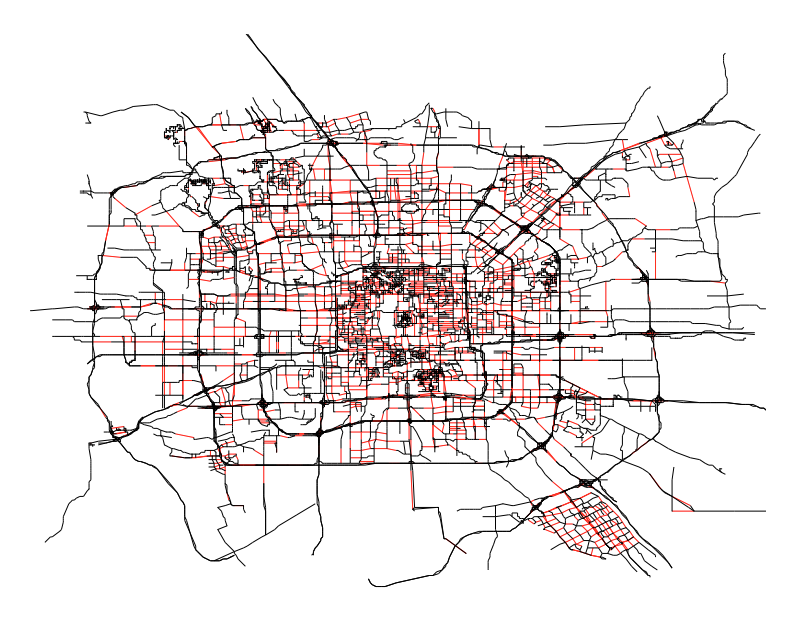

​		GTSAM还包括高效的预处理共轭梯度(PCG)方法，用于解决大规模SLAM问题。尽管直接方法在文献中很受欢迎，具有二次收敛性，并且对于稀疏问题非常有效，但它们通常需要大量的存储空间和高效的消除顺序。相比之下，迭代优化方法仅需要访问梯度，并且具有较小的内存占用，但可能会受到收敛性不佳的影响。我们的方法，子图预处理，在Dellaert等人(2010);Jian等人(2011)中详细解释，通过识别可以使用直接方法轻松解决的子问题，并使用PCG解决剩余部分，将直接和迭代方法的优点结合起来。简单的子问题对应于生成树、平面子图或任何其他可以高效解决的子结构。这样一个子图的示例显示在图中。

### 8.2 视觉里程计

​		视觉里程计(缩写为VO，参见Nistér等人(2004))是一种基于视觉感知的温和介绍，它通过跟踪或关联相机拍摄的连续图像中的视觉特征，提供了连续机器人姿态之间的姿态约束。GTSAM包括C++和MATLAB示例代码以及VO特定因子，以帮助您入门。

### 8.3 视觉SLAM

​		视觉SLAM(参见Davison(2003))是一种SLAM变体，其中3D点通过相机观察，当相机移动时，无论是安装在机器人上还是手动移动。 GTSAM，特别是iSAM(见下文)，可以轻松地调整为在这种情况下用作后端优化器。

### 8.4 固定滞后平滑与滤波

​		GTSAM可以轻松执行递归估计，其中仅保留因子图中的一部分姿态，而其余姿态被边缘化。在上面的所有示例中，我们都使用所有可用的测量值显式地针对所有变量进行优化，这称为平滑，因为轨迹被“平滑”了，并且这就是GTSAM得名的地方(GT平滑和建图)。相反，当仅保留图中最后几个姿态时，称为固定滞后平滑。最后，当仅保留单个最近的姿态时，称为滤波，并且实际上SLAM的原始公式是基于过滤器的(Smith等人，1988)。

### 8.5 离散变量与隐马尔可夫

​		最后，因子图不仅限于连续变量：GTSAM也可以用于建模和解决离散优化问题。例如，隐马尔科夫模型(HMM)具有与第2节中的机器人定位问题相同的图形模型结构，只是在HMM中变量是离散的。 GTSAM可以优化并执行离散模型的推理。

