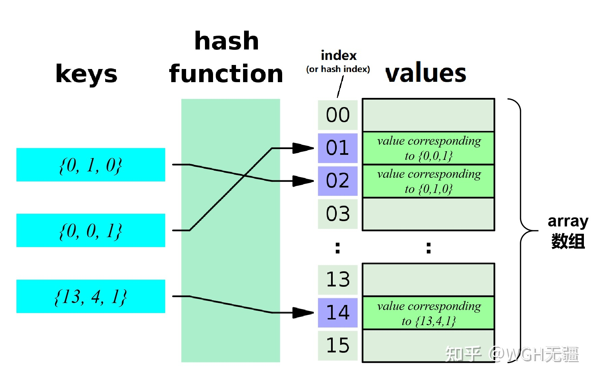

# Fast-LIO系列
## 1.概述
+ 高计算效率，高鲁邦性的激光里程计
+ 紧耦合迭代扩展卡尔曼滤波
+ 不再提取特征点(应对退化问题，提高计算速度)
+ 新的kd树--ikd树(提高搜索效率)
+ Faster-LIO提出新的数据结构iVOX(提高搜索效率)
+ 参考代码[使用Sophus的Fast-LIO][https://github.com/zlwang7/S-FAST_LIO]
## 2.激光里程计
### 2.1 系统架构

+ IMU输入进行前向传播(通过预积分计算位姿)
+ 激光点云输入，通过反向传播进行运动补偿
+ 计算点云的残差，利用迭代卡尔曼滤波估计位姿变换，直到收敛
+ 根据位姿构建地图
### 2.2 系统描述
#### 2.2.1 $\boxplus$与$\boxminus$

$$
\boxplus:\mathcal{M}\times\mathbb{R}^n\rightarrow\mathcal{M};\ \boxminus:\mathcal{M}\times\mathcal{M}\rightarrow\mathbb{R}^n\\
\mathcal{M}=\mathrm{SO(3)}:\mathrm{R}\boxplus\mathrm{r}=\mathrm{RExp(r)};\ \mathrm{R_1}\boxminus\mathrm{R_2}=\mathrm{Log(R_2^T R_1)}\\
\mathcal{M}=\mathbb{R}^n:\mathrm{a}\boxplus\mathrm{b}=\mathrm{a+b};\ \mathrm{a}\boxminus\mathrm{b}=\mathrm{a-b}
$$

​		$\mathcal{M}$表示一种n维的流形，$\times$表示运算。如$\mathcal{M}$上的元素与$\mathbb{R}^n$上的向量进行$\boxplus$运算，其结果仍然为$\mathcal{M}$上的元素，$\boxminus$同理。

​		**流形**(Manifold)：**局部具有欧几里得空间性质的空间。**例如：在平面上有一个单位圆，建立直角坐标系，(1,0)，(0,1)都是单位圆上的点，但是这种表达方法非常冗余，因为直角坐标系大多数点都不在单位圆上。我们希望建立一种描述方法，让这种描述方法所确定的集合都能在圆上，甚至能连续不断地表示圆上的点，采用极坐标的方式，只需要给定半径$\mathrm{R}$就能够产生连续不断的圆上的点，因此，二维空间中，圆是一种一维流形。又如：在三维球面，如果用(x,y,z)表述这个空间会产生冗余，因此可以用经纬或球面极坐标系来描述，因此，三维空间中球面是一个二维流形。


​		流形学的观点认为：**我们所能够观察到的数据实际上是由一个低维流形映射到高维空间上的，即这些数据所在的空间是“嵌入在高维空间的低维流形”。**由于数据内部特征的限制，一些高维的数据产生维度上的冗余，实际上只需要较低维度就能够唯一地表示。**流形是一个“空间”，而不是一个“形状”。**

​		在论文中，经常出现局部同胚(locally homeomorphic)。一种非正式的解释，设流形为$\mathcal{M}$，对于$\forall$$\mathcal{x}$$\in$$\mathcal{M}$和一个包含$x$的开子集$\mathrm{U} \in \mathcal{M}$，存在一个双映射函数(又叫同胚)$\varphi$，它可以把$\mathrm{U}$中的点映射到$\mathbb{R}^n$上的一个开子集。


$$
\boxplus:\mathcal{M}\times\mathbb{R}^n\rightarrow\mathcal{M}\quad x\boxplus _\mathcal{M}u=\mathcal{M}_{\varphi_x^{-1}(u)}\\
\boxminus:\mathcal{M}\times\mathcal{M}\rightarrow\mathbb{R}^n\quad y\boxminus _\mathcal{M}x=\mathcal{M}_{\varphi_x(y)}
$$
​		其中，$\forall x,y \in \mathcal{M}$，$u \in \mathbb{R}^n$。$\boxplus$的物理含义可以表示为在$x \in \mathcal{M}$处添加一个小的扰动$u \in \mathbb{R}^n$，逆运算$\boxminus$则是确定扰动$u$。当$\mathcal{M}$为李群时(如$\mathcal{M}=\mathrm{SO(3)}$)，此时$\boxplus$，$\boxminus$定义为
$$
x\boxplus _\mathcal{M}u=x \cdot Exp(u); \quad y\boxminus _\mathcal{M}x=Log(x^{-1}\cdot y)
$$
​		也就是说，此时$\mathcal{M}_{\varphi_x}$为对数映射，$\mathcal{M}_{\varphi_x^{-1}}$为指数映射。$x\boxplus _\mathcal{M}u$可以理解为$x$乘上扰动$u$的指数映射，相当于矩阵$x$上添加了一个李代数上的扰动$u$，而$y\boxminus _\mathcal{M}x$是求李代数上的扰动。论文中所采用的的符合流形的运算：
$$
\left[\begin{matrix}R\\a\end{matrix}\right]\boxplus\left[\begin{matrix}r\\b\end{matrix}\right]=\left[\begin{matrix}{R\boxplus r}\\a+b\end{matrix}\right];\quad \left[\begin{matrix}R_1\\a\end{matrix}\right]\boxminus\left[\begin{matrix}R_2\\b\end{matrix}\right]=\left[\begin{matrix}R_1\boxminus R_2\\a-b\end{matrix}\right]
$$
以及以下易于证明的结论：
$$
(x \boxplus u)\boxminus x=u;\quad x\boxplus(y\boxminus x)=y; \quad \forall x,y \in \mathcal{M},\forall u \in \mathbb{R}^n
$$

```c++
state_ikfom boxplus(state_ikfom x, Eigen::Matrix<double, 24, 1> f_)
{
	state_ikfom x_r;
	x_r.pos = x.pos + f_.block<3, 1>(0, 0);

	x_r.rot = x.rot * Sophus::SO3::exp(f_.block<3, 1>(3, 0) );
	x_r.offset_R_L_I = x.offset_R_L_I * Sophus::SO3::exp(f_.block<3, 1>(6, 0) );

	x_r.offset_T_L_I = x.offset_T_L_I + f_.block<3, 1>(9, 0);
	x_r.vel = x.vel + f_.block<3, 1>(12, 0);
	x_r.bg = x.bg + f_.block<3, 1>(15, 0);
	x_r.ba = x.ba + f_.block<3, 1>(18, 0);
	x_r.grav = x.grav + f_.block<3, 1>(21, 0);

	return x_r;
}
vectorized_state boxminus(state_ikfom x1, state_ikfom x2 )
{
	vectorized_state x_r = vectorized_state::Zero();

	x_r.block<3, 1>(0, 0) = x1.pos - x2.pos;

	x_r.block<3, 1>(3, 0) = Sophus::SO3( x2.rot.matrix().transpose() * x1.rot.matrix() ).log() ;
	x_r.block<3, 1>(6, 0) = Sophus::SO3( x2.offset_R_L_I.matrix().transpose() * x1.offset_R_L_I.matrix() ).log() ;

	x_r.block<3, 1>(9, 0) = x1.offset_T_L_I - x2.offset_T_L_I;
	x_r.block<3, 1>(12, 0) = x1.vel - x2.vel;
	x_r.block<3, 1>(15, 0) = x1.bg - x2.bg;
	x_r.block<3, 1>(18, 0) = x1.ba - x2.ba;
	x_r.block<3, 1>(21, 0) = x1.grav - x2.grav;

	return x_r;
}
```


#### 2.2.2 IMU模型

​		IMU坐标系记为$I$，雷达坐标系记为$L$，IMU与雷达之间的外参定义为$^IT_L=(^IR_L,^Ip_L)$。IMU的运动模型如下(第一帧的坐标系，定义为全局坐标系$G$)：
$$
^G\dot{R}_I{=}{{^G}R}_I\lfloor \omega_m-b_\omega-n_\omega \rfloor _\wedge\\
^G\dot{p}_I {=} ^Gv_I\\
^G\dot{v}_I{=}^GR_I(a_m-b_a-n_a)+{^Gg}\\
\dot{b}_\omega=n_{b\omega},\quad \dot{b}_a=n_{ba}\\
^G\dot{g}=0, \quad ^I\dot{R}_L=0, \quad ^I\dot{p}_L=0
$$
​		其中${^Gg}$为重力矢量，我们认为其不随时间变化而变化，因此认为其导数为0。$n_a$和$n_\omega$是IMU测量值的白噪声。$b_a$和$b_\omega$为IMU的零偏，我们认为其符合随机游走模型，即其导数服从高斯分布。要理解其他几个量，需要知道IMU测量值与真值之间的关系：
$$
a_m=a+b_a+n_a-{^IR_G}{^Gg}\\
\omega_m=\omega+b_\omega +n_\omega
$$
​		其中，$a$和$\omega$表示加速度与角速度的真值，测量值=真值+零偏+噪声。需要注意的是加速度测量有重力分量，其不随时间变换而变换，只需要将第一帧的重力分量转化到当前IMU坐标系当中即可。$^Gp_I$，$^Gv_I$，$^GR_I$分别是全局坐标系的位置、速度和姿态。其中位置导数是速度，速度导数是加速度。关于$^GR_I$的导数推导如下：

​		考虑一个从远点出发的向量$r$绕单位轴$u$旋转，角速度大小为$\dot{\theta}$，角速度可以表示为$\omega=\dot{\theta} u$，则$r$的导数为：
$$
\frac{dr}{dt}=\omega \times r
$$


​		现考虑系$B$绕单位轴$u$旋转，其三个单位轴的时间一阶导为：
$$
\frac{di_B}{dt}=\omega \times i_B, \quad \frac{dj_B}{dt}=\omega\times j_B,\quad  \frac{dk_B}{dt}=\omega\times k_B
$$
​		实际上，$[i_B,j_B,k_B]$是一组正交基，它和原坐标系的基的内积就是旋转矩阵。而原坐标系的基就是单位阵，因此$[i_B,j_B,k_B]$实际上就是坐标系$B$相对于原坐标系的旋转矩阵$R$，因此有：
$$
\dot R=[\omega \times i_B\quad\omega\times j_B\quad\omega\times k_B]=\omega\times R=\omega^\wedge R
$$
​		其中$\wedge$表示向量对应的反对称矩阵。这里的角速度是原坐标系下的，对应论文中的Global坐标系；而变换后的坐标系对应IMU坐标系。已知$^G\omega={^GR_I}\cdot{^I\omega}$，以及对任意旋转矩$R$和三维向量$p$都有$(Rp)^{\wedge}=Rp^\wedge R^T$，于是有：
$$
^G\dot{R}_I=(^GR_I\cdot ^I\omega)^\wedge{^GR_I}={^GR_I}(^I\omega)^\wedge
$$

#### 2.2.3 离散模型

​		通过前文的求导，可以得到如下的离散模型：
$$
x_{i+1}=x_i\boxplus(\vartriangle tf(x_i,u_i,w_i))
$$
​		这个公式就代表了前文提到的前向传播(Forward Propagation)，其中$i$是IMU测量的序列，其他定义如下：
$$
\mathcal{M}\triangleq \mathrm{SO(3)}\times\mathbb{R}^{15}\times\mathrm{SO(3)}\times\mathbb{R}^{3};dim(\mathcal{M})=24\\
x\triangleq [^GR_I^T\quad ^Gp_I^T\quad ^Gv_I^T\quad b_\omega^T\quad b_a^T\quad ^Gg^T\quad ^IR_L^T\quad ^Ip_L^T]^T \in \mathcal{M}\\
u \triangleq[\omega_m^T\quad a^T_m]^T,\quad w \triangleq[n_\omega^T\quad n_a^T\quad n_{b\omega}^T\quad n_{ba}^T]^T\\
f(x,u,w) \triangleq\left[\begin{matrix}{\omega_m-b_\omega-n_\omega}\\^Gv_I\\^GR_I(a_m-b_a-n_a)+{^Gg}\\n_{b\omega}\\n_{ba}\\0_{3\times1}\\0_{3\times1}\\0_{3\times1}\end{matrix}\right]
$$
```c++
struct state_ikfom
{
	Eigen::Vector3d pos = Eigen::Vector3d(0,0,0);
	Sophus::SO3 rot = Sophus::SO3(Eigen::Matrix3d::Identity());
	Sophus::SO3 offset_R_L_I = Sophus::SO3(Eigen::Matrix3d::Identity());
	Eigen::Vector3d offset_T_L_I = Eigen::Vector3d(0,0,0);
	Eigen::Vector3d vel = Eigen::Vector3d(0,0,0);
	Eigen::Vector3d bg = Eigen::Vector3d(0,0,0);
	Eigen::Vector3d ba = Eigen::Vector3d(0,0,0);
	Eigen::Vector3d grav = Eigen::Vector3d(0,0,-G_m_s2);
};
struct input_ikfom
{
	Eigen::Vector3d acc = Eigen::Vector3d(0,0,0);
	Eigen::Vector3d gyro = Eigen::Vector3d(0,0,0);
};
Eigen::Matrix<double, 24, 1> get_f(state_ikfom s, input_ikfom in)	
{
	// 对应顺序为速度(3)，角速度(3),外参T(3),外参旋转R(3)，
    //加速度(3),角速度偏置(3),加速度偏置(3),位置(3)，与论文公式顺序不一致
	Eigen::Matrix<double, 24, 1> res = Eigen::Matrix<double, 24, 1>::Zero();
	// 输入的imu的角速度(也就是实际测量值) - 估计的bias值(对应公式的第1行)
    Eigen::Vector3d omega = in.gyro - s.bg;
    //  输入的imu的加速度，先转到世界坐标系（对应公式的第3行）
	Eigen::Vector3d a_inertial = s.rot.matrix() * (in.acc - s.ba);		

	for (int i = 0; i < 3; i++)
	{
        //速度（对应公式第2行）
		res(i) = s.vel[i];
        //角速度（对应公式第1行）
		res(i + 3) = omega[i];
        //加速度（对应公式第3行）
		res(i + 12) = a_inertial[i] + s.grav[i];		
	}

	return res;
}
```

​		可以看出需要实时估计的是一个24维的量$x$，包含位姿、速度、姿态、IMU参数以及外参，因此是一个紧耦合的框架。

#### 2.2.4 激光雷达观测模型

##### 1. 点到面元残差

​		激光雷达数据的处理，由于采用的是固态激光雷达，因此对数据做以下说明：

+ 原始点的采用频率很高，因此通常累计一定时间的点做一次scan
+ 本文不再提取特征点，而是通过计算点到面元的距离构建残差，计算此点最近的5个点构成平面，计算点到平面的距离作为残差来构建观测


```c++
void h_share_model(dyn_share_datastruct &ekfom_data, PointCloudXYZI::Ptr &feats_down_body,KD_TREE<PointType> &ikdtree, vector<PointVector> &Nearest_Points, bool extrinsic_est)
{
	int feats_down_size = feats_down_body->points.size();
	laserCloudOri->clear();
	corr_normvect->clear();

	#ifdef MP_EN
    	omp_set_num_threads(MP_PROC_NUM);
	#pragma omp parallel for
	#endif  
	//遍历所有的特征点
	for (int i = 0; i < feats_down_size; i++) 
	{
		PointType &point_body = feats_down_body->points[i];
		PointType point_world;

		V3D p_body(point_body.x, point_body.y, point_body.z);
		//把Lidar坐标系的点先转到IMU坐标系，再根据前向传播估计的位姿x，转到世界坐标系
		V3D p_global(x_.rot * (x_.offset_R_L_I * p_body + x_.offset_T_L_I) + x_.pos);
		point_world.x = p_global(0);
		point_world.y = p_global(1);
		point_world.z = p_global(2);
		point_world.intensity = point_body.intensity;

		vector<float> pointSearchSqDis(NUM_MATCH_POINTS);
        // Nearest_Points[i]打印出来发现是按照离point_world距离，从小到大的顺序的vector
		auto &points_near = Nearest_Points[i]; 

		double ta = omp_get_wtime();
		if (ekfom_data.converge)
		{
			//寻找point_world的最近邻的平面点
			ikdtree.Nearest_Search(point_world, NUM_MATCH_POINTS, points_near, pointSearchSqDis);
			//判断是否是有效匹配点，与loam系列类似，要求特征点最近邻的地图点数量>阈值，距离<阈值  满足条件的才置为true
			point_selected_surf[i] = points_near.size() < NUM_MATCH_POINTS ? false : pointSearchSqDis[NUM_MATCH_POINTS - 1] > 5 ? false: true;
		}
		if (!point_selected_surf[i])
            //如果该点不满足条件  不进行下面步骤
			continue; 
		//平面点信息
		Matrix<float, 4, 1> pabcd;	
        //将该点设置为无效点，用来判断是否满足条件
		point_selected_surf[i] = false; 
		//拟合平面方程ax+by+cz+d=0并求解点到平面距离
		if (esti_plane(pabcd, points_near, 0.1f))
		{
            //当前点到平面的距离
			float pd2 = pabcd(0) * point_world.x + pabcd(1) * point_world.y + pabcd(2) * point_world.z + pabcd(3); 
            //如果残差大于经验阈值，则认为该点是有效点  简言之，距离原点越近的lidar点  要求点到平面的距离越苛刻
			float s = 1 - 0.9 * fabs(pd2) / sqrt(p_body.norm()); 
			//如果残差大于阈值，则认为该点是有效点
			if (s > 0.9) 
			{
				point_selected_surf[i] = true;
                //存储平面的单位法向量  以及当前点到平面距离
				normvec->points[i].x = pabcd(0); 
				normvec->points[i].y = pabcd(1);
				normvec->points[i].z = pabcd(2);
				normvec->points[i].intensity = pd2;
			}
		}
	}
	//有效特征点的数量
	int effct_feat_num = 0; 
	for (int i = 0; i < feats_down_size; i++)
	{
        /对于满足要求的点
		if (point_selected_surf[i]) /
		{
            //把这些点重新存到laserCloudOri中
			laserCloudOri->points[effct_feat_num] = feats_down_body->points[i]; 
            //存储这些点对应的法向量和到平面的距离
			corr_normvect->points[effct_feat_num] = normvec->points[i];			
			effct_feat_num++;
		}
	}

	if (effct_feat_num < 1)
	{
		ekfom_data.valid = false;
		ROS_WARN("No Effective Points! \n");
		return;
	}

	// 雅可比矩阵H和残差向量的计算
	ekfom_data.h_x = MatrixXd::Zero(effct_feat_num, 12);
	ekfom_data.h.resize(effct_feat_num);

	for (int i = 0; i < effct_feat_num; i++)
	{
		V3D point_(laserCloudOri->points[i].x, laserCloudOri->points[i].y, laserCloudOri->points[i].z);
		M3D point_crossmat;
		point_crossmat << SKEW_SYM_MATRX(point_);
		V3D point_I_ = x_.offset_R_L_I * point_ + x_.offset_T_L_I;
		M3D point_I_crossmat;
		point_I_crossmat << SKEW_SYM_MATRX(point_I_);

		// 得到对应的平面的法向量
		const PointType &norm_p = corr_normvect->points[i];
		V3D norm_vec(norm_p.x, norm_p.y, norm_p.z);

		// 计算雅可比矩阵H
		V3D C(x_.rot.matrix().transpose() * norm_vec);
		V3D A(point_I_crossmat * C);
		if (extrinsic_est)
		{
			V3D B(point_crossmat * x_.offset_R_L_I.matrix().transpose() * C); 
			ekfom_data.h_x.block<1, 12>(i, 0) << norm_p.x, norm_p.y, norm_p.z, VEC_FROM_ARRAY(A), VEC_FROM_ARRAY(B), VEC_FROM_ARRAY(C);
		}
		else
		{
			ekfom_data.h_x.block<1, 12>(i, 0) << norm_p.x, norm_p.y, norm_p.z, VEC_FROM_ARRAY(A), 0.0, 0.0, 0.0, 0.0, 0.0, 0.0;
		}

		//残差：点面距离
		ekfom_data.h(i) = -norm_p.intensity;

	}

}
```

##### 2. 激光雷达特征提取与匹配

*** 边缘线特征***

对当前帧点云的每一个角点，边缘线特征匹配的流程如下：

+ 利用初始位姿估计，将点转换至局部地图所处的坐标系下：
  + 如果匹配的是上一帧点云，则转换至上一帧 Lidar 坐标系下
  + 如果匹配的是全局地图，则转换至世界坐标系下
+ 在局部地图中寻找到当前点所处的边缘线特征，不同论文中方法也有细微差别：
  + 直接寻找最近的两个点构造直线（相当于得到两点式方程）
  + 寻找最近的若干个点，计算中心值，对该点集进行简单的 PCA 求出最大特征值对应的特征向量作为直线方向（相当于得到点斜式方程），通常这样得到的直线会更准一些，因为借助 PCA 的思路我们还能对这些点集的共线性作一个判断
+ 计算该点和线特征的残差与雅克比

*** 边缘线特征残差构建***

上一部分中提到了怎么获取目标线特征，这一部分主要是整理如何建立当前点对该线特征的残差。思路很简单，求点到线的距离即可。论文中介绍的方式如下：

+ 在直线上取两点$A = (x_1, y_1, z_1)$，$B = (x_2, y_2, z_2)$，设当前点为$P_w = (x_0, y_0, z_0)$
+ 计算$\triangle ABP$面积，除以$AB$即可。（实际上相差一个 0.5 的系数，不过关系不大）

$\triangle ABP$的面积计算方式为：先计算出三个点形成的平行面积的$|\overrightarrow{PA} \times \overrightarrow{PB}|$，这个面积会正比于三角形面积，所以可以作为残差使用，如下所示：
$$
\begin{aligned}
    S_{\triangle ABP} \propto& |\overrightarrow{PA} \times \overrightarrow{PB}|\\
    \overrightarrow{PA} \times \overrightarrow{PB} =& 
    \left|
    \begin{matrix}
        i & j & k\\
        x_1 - x_0 & y_1 - y_0 & z_1 - z_0\\
        x_2 - x_0 & y_2 - y_0 & z_2 - z_0\\
    \end{matrix}
    \right|\\
    =& 
    \begin{bmatrix}
        (y_1 - y_0)(z_2 - z_0) - (z_1 - z_0)(y_2 - y_0)\\
        (z_1 - z_0)(x_2 - x_0) - (x_1 - x_0)(z_2 - z_0)\\
        (x_1 - x_0)(y_2 - y_0) - (y_1 - y_0)(x_2 - x_0)
    \end{bmatrix}\\
    |\overrightarrow{PA} \times \overrightarrow{PB}| &= (\overrightarrow{PA} \times \overrightarrow{PB})^T(\overrightarrow{PA} \times \overrightarrow{PB})\\
    &= ((y_1 - y_0)(z_2 - z_0) - (z_1 - z_0)(y_2 - y_0))^2 \\
    &+ ((z_1 - z_0)(x_2 - x_0) - (x_1 - x_0)(z_2 - z_0))^2 \\
    &+ ((x_1 - x_0)(y_2 - y_0) - (y_1 - y_0)(x_2 - x_0))^2
\end{aligned}
$$
这里注意，我们关注的是实际上只是叉乘向量的大小，因此向量叉乘的顺序($\overrightarrow{PA} \times \overrightarrow{PB}$或者$\overrightarrow{PB} \times \overrightarrow{PA}$)以及向量本身的方向($\overrightarrow{PA}$或者$\overrightarrow{AO}$)实际对结果没有影响，注意叉乘公式使用时统一一种即可。

LOAM 系列中关于这部分面积的计算如下所示：

```c++
float a012 = sqrt(((x0 - x1)*(y0 - y2) - (x0 - x2)*(y0 - y1)) * ((x0 - x1)*(y0 - y2) - (x0 - x2)*(y0 - y1))     // k^2
                + ((x0 - x1)*(z0 - z2) - (x0 - x2)*(z0 - z1)) * ((x0 - x1)*(z0 - z2) - (x0 - x2)*(z0 - z1))     // j^2
                + ((y0 - y1)*(z0 - z2) - (y0 - y2)*(z0 - z1)) * ((y0 - y1)*(z0 - z2) - (y0 - y2)*(z0 - z1)));   // i^2

```

比较一下可以发现和上面推导的结果是一致的（向量的系数有符号上的区别，不过不影响大小）。

因此残差为：
$$
e_{c} = \frac{|\overrightarrow{PA} \times \overrightarrow{PB}|}{|AB|}
$$
*** 边缘线特征雅克比推导***

在这一步中，我们需要推导残差关于关键帧位姿下降的方向。第一种通常的思路是求解雅可比，雅可比的推导利用链式求导法则分两步，先对该点求导，再对位姿求导，对于平面点和边缘线点，点对位姿求导的过程是一样的，因此这里只进行第一步，点对位姿求导放在最后推导：
$$
J = \frac{\partial e_c}{\partial T_{wb}} = \frac{\partial e_c}{\partial \boldsymbol{p}^w} \frac{\partial \boldsymbol{p}^w}{\partial \boldsymbol{T}_{wb}}
$$
先看第一步，残差对点求导，为了表达简洁，设$\boldsymbol{p}_m =\overrightarrow{PM} = \overrightarrow{PA} \times \overrightarrow{PB}$，且由于$|AB|$和$P_w$不相关，所以这里把它作为常系数，对梯度方向没有影响，之后就不写出来了。残差为：
$$
\begin{aligned}
e_c \propto& \sqrt{}((y_1 - y_0)(z_2 - z_0) - (z_1 - z_0)(y_2 - y_0))^2 \\
    &+ ((z_1 - z_0)(x_2 - x_0) - (x_1 - x_0)(z_2 - z_0))^2 \\
    &+ ((x_1 - x_0)(y_2 - y_0) - (y_1 - y_0)(x_2 - x_0))^2\\
    =& \sqrt{\boldsymbol{p}_m^T\boldsymbol{p}_m}\\
    =& \sqrt{(p_{mx}^2 + p_{my}^2 + p_{mz}^2)}
\end{aligned}
$$
对点的求导为分别对$x_0, y_0, z_0$求导：
$$
\begin{aligned}
\frac{\partial e_c}{\partial \boldsymbol{p}^w} &=
\begin{bmatrix}
    \frac{\partial e_c}{\partial x_0}\\
    \frac{\partial e_c}{\partial y_0}\\
    \frac{\partial e_c}{\partial z_0}\\
\end{bmatrix}^T\\
&\propto\frac{1}{2}
\begin{bmatrix}
    2p_{my}((z_2 - z_0)-(z_1 - z_0)) + 2p_{mz}((y_1 - y_0)-(y_2 - y_0))\\
    2p_{mz}((x_2 - x_0)-(x_1 - x_0)) + 2p_{mx}((z_1 - z_0)-(z_2 - z_0))\\
    2p_{mx}((y_2 - y_0)-(y_1 - y_0)) + 2p_{my}((x_1 - x_0)-(x_2 - x_0))
\end{bmatrix}^T\\
&=
\begin{bmatrix}
p_{my}(z_2-z_1) + p_{mz}(y_1 - y_2)\\
p_{mz}(x_2 - x_1) + p_{mx}(z_1-z_2)\\
p_{mx}(y_2-y_1) + p_{my}(x_1 - x_2)
\end{bmatrix}^T
\end{aligned}
$$
根据这种求法得到的雅可比和代码中是一致的，如下所示，代码中对向量除$|AB||PM|$是为了进行单位化：

```c++
// 计算 AB 模长
float l12 = sqrt((x1 - x2)*(x1 - x2) + (y1 - y2)*(y1 - y2) + (z1 - z2)*(z1 - z2));

// 计算残差下降方向 且单位化
float la = ((y1 - y2)*((x0 - x1)*(y0 - y2) - (x0 - x2)*(y0 - y1)) 
            + (z1 - z2)*((x0 - x1)*(z0 - z2) - (x0 - x2)*(z0 - z1))) / a012 / l12;

float lb = -((x1 - x2)*((x0 - x1)*(y0 - y2) - (x0 - x2)*(y0 - y1)) 
            - (z1 - z2)*((y0 - y1)*(z0 - z2) - (y0 - y2)*(z0 - z1))) / a012 / l12;

float lc = -((x1 - x2)*((x0 - x1)*(z0 - z2) - (x0 - x2)*(z0 - z1)) 
            + (y1 - y2)*((y0 - y1)*(z0 - z2) - (y0 - y2)*(z0 - z1))) / a012 / l12;

```

我们还可以从几何角度来直接推导残差关于该点全局坐标下降的方向，如下图所示：


​		在第一步中，我们通过 $\overrightarrow{PA} \times \overrightarrow{PB}$并利用 $|PM|/|AB|$ 求出 $h$ 的大小（含常数系数），在 $\partial e_c/\partial P_w$ 我们实际想求的使 $|h|$ 下降的方向，即图中所示的 $h$ 的方向即：$h = \overrightarrow{AB}\times\overrightarrow{PM}$，证明过程也很简单，叉乘结果首先垂直于 $PM$ 因此和平面 $PAB$ 共面，其次和 $AB$ 垂直，将 $\overrightarrow{AB}$ 起点移至 $P$。因此该向量是一条起点在 $P$ 指向且垂直于 $AB$ 的向量，显然为图中 $h$ 的方向。

​		最后我们想要获得一个单位向量便于控制迭代步长，因此可以除以 |PM||AB|来进行单位化。因为：$\overrightarrow{AB}\times\overrightarrow{PM} = |PM||AB|\sin{\theta}$ 由于 $|PM|, |AB|$ 互相垂直，因此 $\overrightarrow{AB}\times\overrightarrow{PM} = |PM||AB|$。叉乘求解过程为：
$$
\begin{aligned}
\overrightarrow{AB}\times\overrightarrow{PM} &=
\left|
\begin{matrix}
    i & j & k\\
    x_2 - x_1 & y_2 - y_1 & z_2 - z_1\\
    p_{mx} & p_{my} & p_{mz}
\end{matrix}
\right|\\
&=
\begin{bmatrix}
    (y_2 - y_1)p_{mz} - (z_2 - z_1)p_{my}\\
    (z_2 - z_1)p_{mx} - (x_2 - x_1)p_{mz}\\
    (x_2 - x_1)p_{my} - (y_2 - y_1)p_{mx}
\end{bmatrix}
\end{aligned}
$$
​		这里我们发现，通过几何推导出的下降方向向量恰好和直接对点求雅可比得到的向量方向相反。这个很好理解，通过推导可以知道沿着**雅可比负方向**实际上才是残差减小的路线。这里代码的目的实际上是求雅可比(为了后面构建正则方程$\boldsymbol{J}^T\boldsymbol{J}\Delta\boldsymbol{x} = -\boldsymbol{J}^T\boldsymbol{e}$)，所以如果按照几何方式推导的结果需要乘上一个负号。

*** 平面特征***

对当前帧点云的每一个角点，平面特征匹配的流程如下：

+ 利用初始位姿估计，将点转换至局部地图所处的坐标系下：
  + 如果匹配的是上一帧点云，则转换至上一阵 Lidar 坐标系下
  + 如果匹配的是全局地图，则转换至世界坐标系下
+ 在局部地图中寻找到当前点所处的平面特征，不同论文和代码也有细微差别：
  + 直接寻找最近的若干个平面点构造平面，通过建立超定方程求解得到平面的一般式方程$Ax + By + Cz + d = 0$，法向量为 $(A, B, C)$
  + 直接寻找最近的三个点 A, B, C 构建两个向量 AB 和 AC，通过叉乘得到法向量建立点法式方程$A(x - x_0) + B(y - y_0) + C(z - z_0) = 0$
  + 寻找最近的若干个平面点，计算中心值，对该点集进行简单的 PCA 求出最小特征值对应的特征向量作为平面法向量方向，再利用中心点也可以得到点法式方程
+ 计算该点和面特征的残差和雅可比

*** 平面特征残差构建***

​		LOAM 系列的代码为了求解距离方便，采取了第一种方法构建平面，即通过搜索 5 个最近的平面点建立超定方程，过程为假设$d = 1$，建立超定方程：$A'x_i + B'y_i + C'z_i = -1$求解得到系数$(A', B', C')$即可。为了后续方便计算，将系数归一化，即：
$$
\begin{aligned}
    s &= A'^2 + B'^2 + C'^2\\
    A &= \frac{A'}{s}, B = \frac{B'}{s}, C = \frac{C'}{s}, D = \frac{1}{s}\\
\end{aligned}
$$
用点到的平面的距离作为残差，则计算方式为：
$$
e_s = \frac{|Ax_0 + By_0 + Cz_0 + D|}{\sqrt{A^2 + B^2 + C^2}} = |Ax_0 + By_0 + Cz_0 + D|
$$
代码中距离计算方式如下：

```c++
// P 到 AB 的距离
float ld2 = a012 / l12;
```

注意这里并没有取绝对值，用意在雅可比推导部分说明。

*** 平面特征雅克比计算***

​		这里由于代码不是像线特征一样用一系列点来表示距离，因此直接对点求雅可比有点不直观（注：如果是像论文一样利用叉乘得到法向量计算距离的话是可以求雅可比的）。但是和线特征一样，我们可以思考雅可比的几何意义，是残差增大最快的方向。因此显然知道是沿法向量方向，但是是正方向还是负方向没办法确定。这里我们可以将平面公式利用起来，参考下图：


可以发现，如果点和法向量（正方向）在同一侧时，雅可比为法向量的正方向；如果点和法向量在不同侧时，雅可比为法向量的负方向。即：
$$
\frac{\partial e_s}{\partial \boldsymbol{p}^w} =
\left\{
\begin{aligned}
    \boldsymbol{n}^T &\qquad \text{点和法向量正方向在同一侧}\\
    -\boldsymbol{n}^T &\qquad\text{点和法向量正方向在不同侧}
\end{aligned}
\right.
$$
而根据投影公式，我们知道点和法向量在不在同一侧是由 $Ax_0 + By_0 + Cz_0 + D$的符号决定的。因此在残差的部分中，我们保留了计算的符号。可以验证一下对之后的高斯牛顿法迭代的正则方程有没有影响：对 $\boldsymbol{H} = \boldsymbol{J}^T\boldsymbol{J}$，雅可比的符号没有影响。对信息向量$\boldsymbol{b} = \boldsymbol{J}^T\boldsymbol{e}$，只需要确保 $\boldsymbol{J}^T\boldsymbol{e}$的符号正确即可，因此将符号放在哪一部分都可以。这就是为什么代码可以将符号留在残差$e$里面。LOAM 系列中这部分的代码如下所示：

```c++
// 用点到的平面的距离作为残差（带符号）
float pd2 = pa * pointSel.x + pb * pointSel.y + pc * pointSel.z + pd;

// 核函数进行权重分配，这里由于加入点本身的坐标（通常比较大），实际上相当于人为将所有点的权重都增加了
float s = 1 - 0.9 * fabs(pd2) / sqrt(sqrt(pointSel.x * pointSel.x
        + pointSel.y * pointSel.y + pointSel.z * pointSel.z));

// 用法向量作为雅可比，方向由 pd2 间接决定
coeff.x = s * pa;
coeff.y = s * pb;
coeff.z = s * pc;
coeff.intensity = s * pd2;
```

*** 点对位姿的雅克比***

​		在上面的推导过程中，我们已经推导了残差雅可比的一部分，即残差对世界坐标下的点的求导，这里我们进行世界坐标系下的点对位姿矩阵的求导。设 Lidar 相对于世界坐标系旋转矩阵为$R$，平移（位置）为$t$。将 Lidar 坐标系下的点转为世界坐标系的过程为：
$$
\boldsymbol{p}^w = \boldsymbol{R}\boldsymbol{p} + \boldsymbol{t}
$$
*** 对平移雅克比的推导***

​		对平移的推导很简单：
$$
\frac{\partial \boldsymbol{p}^w}{\partial\boldsymbol{t}} = \frac{\partial \boldsymbol{R}\boldsymbol{p} + \boldsymbol{t}}{\partial\boldsymbol{t}} = \boldsymbol{I}
$$
因此残差的平移的雅可比即为残差对全局坐标下的点的雅可比。LOAM 中这部分的代码如下，验证了我们的推导：

```c++
matA(i, 3) = coeff.x;   // x
matA(i, 4) = coeff.y;   // y
matA(i, 5) = coeff.z;   // z
```

*** 对旋转角雅克比的推导***

​		旋转的表示方法有很多中，常见的有旋转矩阵，四元数等。基于 LOAM 的代码中使用欧拉角来表示姿态，因此我们需要使用欧拉角来构造旋转矩阵。基于欧拉角的旋转方式有很多种，这里我们用$\alpha,\beta,\gamma$来分别作为绕 x, y, 轴的旋转。LOAM 原作者选择的是 ZXY 外旋（沿固定 Z 轴旋转-> 沿固定 X 轴旋转 -> 沿固定 Y 轴旋转）表示，由于外旋的旋转矩阵顺序为作乘，因此 ZXY 内旋的旋转矩阵的计算方式为：$\boldsymbol{R} = \boldsymbol{R}_y\boldsymbol{R}_x\boldsymbol{R}_z$，即：
$$
\begin{aligned}
    \boldsymbol{R} &= \boldsymbol{R}_y\boldsymbol{R}_x\boldsymbol{R}_z\\
    &= 
    \begin{bmatrix}
        \cos{\beta} & 0 & \sin{\beta}\\
        0 & 1 & 0\\
        -\sin{\beta} & 0 & \cos{\beta}
    \end{bmatrix}
    \begin{bmatrix}
        1 & 0 & 0\\
        0 & \cos{\alpha} & -\sin{\alpha}\\
        0 & \sin{\alpha} & \cos{\alpha}
    \end{bmatrix}
    \begin{bmatrix}
    \cos{\gamma} & -\sin{\gamma} & 0\\
    \sin{\gamma} &  \cos{\gamma} & 0\\
    0 & 0 & 1
    \end{bmatrix}\\
    &=
    \begin{bmatrix}
        \cos{\beta}\cos{\gamma} + \sin{\beta}\sin{\alpha}\sin{\gamma} & \cos{\gamma}\sin{\beta}\sin{\alpha}-\cos{\beta}\sin{\gamma} & \cos{\alpha}\sin{\beta}\\
        \cos{\alpha}\sin{\gamma} & \cos{\alpha}\cos{\gamma} & -\sin{\alpha}\\
        \cos{\beta}\sin{\alpha}\sin{\gamma}-\cos{\gamma}\sin{\beta} & \cos{\beta}\cos{\gamma}\sin{\alpha}+\sin{\beta}\sin{\gamma} & \cos{\beta}\cos{\alpha}
    \end{bmatrix}
\end{aligned}
$$
下面对雅可比进行推导，由于平移和旋转角没关系，下面我们省略平移，因此全局坐标点为：
$$
\begin{aligned}
\boldsymbol{R}\boldsymbol{p} &= \boldsymbol{R}_y\boldsymbol{R}_x\boldsymbol{R}_z\boldsymbol{p}\\
&=  
\begin{bmatrix}
    (\cos{\beta}\cos{\gamma} + \sin{\beta}\sin{\alpha}\sin{\gamma})p_x + (\cos{\gamma}\sin{\beta}\sin{\alpha}-\cos{\beta}\sin{\gamma})p_y + (\cos{\alpha}\sin{\beta})p_z\\
    (\cos{\alpha}\sin{\gamma})p_x + (\cos{\alpha}\cos{\gamma})p_y + (-\sin{\alpha})p_z\\
    (\cos{\beta}\sin{\alpha}\sin{\gamma}-\cos{\gamma}\sin{\beta})p_x + (\cos{\beta}\cos{\gamma}\sin{\alpha}+\sin{\beta}\sin{\gamma})p_y + (\cos{\beta}\cos{\alpha})p_z
\end{bmatrix}
\end{aligned}
$$
点对 $\alpha$求雅可比有：
$$
\frac{\partial(\boldsymbol{Rp})}{\partial\alpha} =
\begin{bmatrix}
    (\sin{\beta}\cos{\alpha}\sin{\gamma})p_x + (\cos{\gamma}\sin{\beta}\cos{\alpha})p_y - (\sin{\alpha}\sin{\beta})p_z\\
    -(\sin{\alpha}\sin{\gamma})p_x - (\sin{\alpha}\cos{\gamma})p_y - (\cos{\alpha})p_z\\
    (\cos{\beta}\cos{\alpha}\sin{\gamma})p_x + (\cos{\beta}\cos{\gamma}\cos{\alpha})p_y - (\cos{\beta}\sin{\alpha})p_z
\end{bmatrix}
$$
因此残差对 $\alpha$ 的雅可比为：
$$
\begin{aligned}
\boldsymbol{J}_{\alpha} &= \frac{\partial e_c}{\partial \alpha} = \frac{\partial e_c}{\partial \boldsymbol{p}^w} \frac{\partial \boldsymbol{p}^w}{\partial \alpha}\\
&= (\frac{\partial e_c}{\partial \boldsymbol{p}^w})_x(\frac{\partial \boldsymbol{p}^w}{\partial \alpha})_x + (\frac{\partial e_c}{\partial \boldsymbol{p}^w})_y(\frac{\partial \boldsymbol{p}^w}{\partial \alpha})_y + (\frac{\partial e_c}{\partial \boldsymbol{p}^w})_z(\frac{\partial \boldsymbol{p}^w}{\partial \alpha})_z
\end{aligned}
$$
对应到 LOAM 中的代码为：

```c++
float arx = (crx*sry*srz*pointOri.x + crx*crz*sry*pointOri.y - srx*sry*pointOri.z) * coeff.x
            + (-srx*srz*pointOri.x - crz*srx*pointOri.y - crx*pointOri.z) * coeff.y
            + (crx*cry*srz*pointOri.x + crx*cry*crz*pointOri.y - cry*srx*pointOri.z) * coeff.z;
```

其中，`(sr/cr)(x/y/z)` 表示 `(sin/cos)(alpha/beta/gamma)`。`pointOri.x/y/z` 对应 Lidar 坐标系下的 `x/y/z` 坐标，比较可以发现和我们推导结果一致。

点对 $\beta$的雅可比为：
$$
\frac{\partial(\boldsymbol{Rp})}{\partial\beta} =
\begin{bmatrix}
    (-\sin{\beta}\cos{\gamma} + \cos{\beta}\sin{\alpha}\sin{\gamma})p_x + (\cos{\gamma}\cos{\beta}\sin{\alpha}+\sin{\beta}\sin{\gamma})p_y + (\cos{\alpha}\cos{\beta})p_z\\
    0\\
    (-\sin{\beta}\sin{\alpha}\sin{\gamma}-\cos{\gamma}\cos{\beta})p_x + (-\sin{\beta}\cos{\gamma}\sin{\alpha}+\cos{\beta}\sin{\gamma})p_y - (\sin{\beta}\cos{\alpha})p_z
\end{bmatrix}
$$
残差对 $\beta$ 的雅可比为：
$$
\begin{aligned}
\boldsymbol{J}_{\beta} &= \frac{\partial e_c}{\partial \beta} = \frac{\partial e_c}{\partial \boldsymbol{p}^w} \frac{\partial \boldsymbol{p}^w}{\partial \beta}\\
&= (\frac{\partial e_c}{\partial \boldsymbol{p}^w})_x(\frac{\partial \boldsymbol{p}^w}{\partial \beta})_x + (\frac{\partial e_c}{\partial \boldsymbol{p}^w})_z(\frac{\partial \boldsymbol{p}^w}{\partial \beta})_z
\end{aligned}
$$
对应到 LOAM 中的代码为：

```c++
float ary = ((cry*srx*srz - crz*sry)*pointOri.x 
            + (sry*srz + cry*crz*srx)*pointOri.y + crx*cry*pointOri.z) * coeff.x
            + ((-cry*crz - srx*sry*srz)*pointOri.x 
            + (cry*srz - crz*srx*sry)*pointOri.y - crx*sry*pointOri.z) * coeff.z;
```

点对 $\gamma$ 的雅可比为：
$$
\frac{\partial(\boldsymbol{Rp})}{\partial\gamma} =
\begin{bmatrix}
    (-\cos{\beta}\sin{\gamma} + \sin{\beta}\sin{\alpha}\cos{\gamma})p_x + (-\sin{\gamma}\sin{\beta}\sin{\alpha}-\cos{\beta}\cos{\gamma})p_y\\
    (\cos{\alpha}\cos{\gamma})p_x - (\cos{\alpha}\sin{\gamma})p_y\\
    (\cos{\beta}\sin{\alpha}\cos{\gamma}+\sin{\gamma}\sin{\beta})p_x + (-\cos{\beta}\sin{\gamma}\sin{\alpha}+\sin{\beta}\cos{\gamma})p_y
\end{bmatrix}
$$
残差对$\gamma$的雅可比为：
$$
\begin{aligned}
\boldsymbol{J}_{\gamma} &= \frac{\partial e_c}{\partial \gamma} = \frac{\partial e_c}{\partial \boldsymbol{p}^w} \frac{\partial \boldsymbol{p}^w}{\partial \gamma}\\
&= (\frac{\partial e_c}{\partial \boldsymbol{p}^w})_x(\frac{\partial \boldsymbol{p}^w}{\partial \gamma})_x + (\frac{\partial e_c}{\partial \boldsymbol{p}^w})_y(\frac{\partial \boldsymbol{p}^w}{\partial \gamma})_y + (\frac{\partial e_c}{\partial \boldsymbol{p}^w})_z(\frac{\partial \boldsymbol{p}^w}{\partial \gamma})_z
\end{aligned}
$$
对应到 LOAM 中的代码为：

```c++
float arz = ((crz*srx*sry - cry*srz)*pointOri.x + (-cry*crz-srx*sry*srz)*pointOri.y)*coeff.x
            + (crx*crz*pointOri.x - crx*srz*pointOri.y) * coeff.y
            + ((sry*srz + cry*crz*srx)*pointOri.x + (crz*sry-cry*srx*srz)*pointOri.y)*coeff.z;
```

*** LOAM中雅克比推导结果需要注意的问题***

​		事实上上由于欧拉角有万向锁的问题，**大部分新的代码框架不会选择用欧拉角来表示旋转状态**。即便是在使用欧拉角的场合，大多数情况下都是采取外旋 XYZ （内旋 ZYX）方式，即常说的 roll, pitch, yaw 角的定义关系。这里由于 LOAM 的原作者在论文中只用了欧拉角一种旋转表示方式，因此旋转方式的影响不大（但是在引入 imu 等具有固定的旋转定义时也需要额外注意）。但是在后续的基于 LOAM 代码中，例如 LeGO-LOAM，LIO-SAM 这些使用了旋转矩阵或者四元数来表示旋转的时候，而且使用了第三方库如 TF、PCL、Eigen 时要注意。有一些库（Eigen, TF）可以指定旋转方式，有一些库（PCL）则默认使用外旋 XYZ 方式，例如 LIO-SAM 中使用了 PCL 的接口来对 RPY 角和其他旋转格式之间转换，如下所示：

```c++
pcl::getTranslationAndEulerAngles(transBetween, x, y, z, roll, pitch, yaw);
```

这个函数将位姿变换矩阵转化为三维平移（对应 `x, y, z`）和三维旋转（对应 `roll, pitch, yaw`）。而 PCL 中关于这个 RPY 的定义是在内旋 ZYX （外旋 XYZ），此时如果我们直接将$\alpha,\beta,\gamma$对应到 roll, pitch, yaw 中会出现问题。针对以上问题有以下解决方法：

+ 自己定义转换方程，这样做可以自己选择任意欧拉角旋转方式，但这么做没有必要
+ 使用外旋 XYZ，重新推导一次上述雅可比结果，这么做比较稳妥，但用欧拉角涉及到很多三角函数的运算，推导实在很繁琐
+ (LIO-SAM 中使用的方法)在其他地方使用 RPY 角作为状态表示，在计算点对姿态角的残差雅可比时建立两种表示方法的映射，将 RPY 角(以及对应的坐标轴)转为 LOAM 定义的方式，然后可以直接用 LOAM 的推导结果
+ 可以使用 RPY 角，但在计算雅可比时可以先将 RPY 转为旋转矩阵，通过左右扰动求点对旋转矩阵的雅可比。更新完成后再将旋转矩阵转为 RPY 角即可
+ 从头到尾不适用 RPY 角，而使用其他旋转表示方式

关于 LIO-SAM 中使用的这种映射方式，可以用下图说明：


因此，通过上图中的坐标旋转，我们找到 ZXY 外旋和 XYZ 外旋的对应关系，如下所示：

+ (LOAM) X 轴 – (RPY) Y 轴
+ (LOAM) Y 轴 – (RPY) Z 轴
+ (LOAM) Z 轴 – (RPY) X 轴
+ (LOAM) $\alpha$– (RPY) pitch
+ (LOAM) $\beta$– (RPY) yaw
+ (LOAM) $\gamma$– (RPY) roll

LIO-SAM 中的代码也有类似的介绍（虽然不是很清楚为什么要提 Camera），整个转换过程的代码如下:

```c++
bool LMOptimization(int iterCount)
{
    // LOAM 原始代码的旋转是基于 ZXY 外旋，需要建立和 RPY 使用的 XYZ 外旋建立映射关系 
    // This optimization is from the original loam_velodyne by Ji Zhang, need to cope with coordinate transformation
    // lidar <- camera      ---     camera <- lidar
    // x = z                ---     x = y
    // y = x                ---     y = z
    // z = y                ---     z = x
    // roll = yaw           ---     roll = pitch
    // pitch = roll         ---     pitch = yaw
    // yaw = pitch          ---     yaw = roll


    // 使用 ZXY 定义计算 (sin/cos)(alpha/beta/gamma) 
    float srx = sin(transformTobeMapped[1]); // Lidar: sin(pitch) --> Camera: sin(roll) 
    float crx = cos(transformTobeMapped[1]); // Lidar: cos(pitch) --> Camera: cos(roll) 
    float sry = sin(transformTobeMapped[2]); // Lidar: sin(yaw) --> Camera: sin(pitch) 
    float cry = cos(transformTobeMapped[2]); // Lidar: cos(yaw) --> Camera: cos(pitch) 
    float srz = sin(transformTobeMapped[0]); // Lidar: sin(roll) --> Camera: sin(yaw) 
    float crz = cos(transformTobeMapped[0]); // Lidar: cos(roll) --> Camera: cos(yaw) 

    ...

    PointType pointOri, coeff; // ZXY 外旋定义坐标系下的表示
    

    for (int i = 0; i < laserCloudSelNum; i++) {
        // lidar -> camera -- 根据上面映射将点的坐标映射至 ZXY 外旋定义坐标系
        pointOri.x = laserCloudOri->points[i].y;
        pointOri.y = laserCloudOri->points[i].z;
        pointOri.z = laserCloudOri->points[i].x;
        // lidar -> camera -- 根据上面映射将残差对点的雅可比映射至 ZXY 外旋定义坐标系
        coeff.x = coeffSel->points[i].y;
        coeff.y = coeffSel->points[i].z;
        coeff.z = coeffSel->points[i].x;
        coeff.intensity = coeffSel->points[i].intensity;
        // in camera -- 进行 ZXY 外旋定义坐标系下的雅可比计算
        float arx = (crx*sry*srz*pointOri.x + crx*crz*sry*pointOri.y - srx*sry*pointOri.z) * coeff.x
                    + (-srx*srz*pointOri.x - crz*srx*pointOri.y - crx*pointOri.z) * coeff.y
                    + (crx*cry*srz*pointOri.x + crx*cry*crz*pointOri.y - cry*srx*pointOri.z) * coeff.z;

        float ary = ((cry*srx*srz - crz*sry)*pointOri.x 
                    + (sry*srz + cry*crz*srx)*pointOri.y + crx*cry*pointOri.z) * coeff.x
                    + ((-cry*crz - srx*sry*srz)*pointOri.x 
                    + (cry*srz - crz*srx*sry)*pointOri.y - crx*sry*pointOri.z) * coeff.z;

        float arz = ((crz*srx*sry - cry*srz)*pointOri.x + (-cry*crz-srx*sry*srz)*pointOri.y)*coeff.x
                    + (crx*crz*pointOri.x - crx*srz*pointOri.y) * coeff.y
                    + ((sry*srz + cry*crz*srx)*pointOri.x + (crz*sry-cry*srx*srz)*pointOri.y)*coeff.z;
        // lidar -> camera -- 将 ZXY 外旋定义坐标系下的计算结果重新映射为 XYZ 外旋代入雅可比矩阵中
        matA.at<float>(i, 0) = arz;
        matA.at<float>(i, 1) = arx;
        matA.at<float>(i, 2) = ary;
        matA.at<float>(i, 3) = coeff.z;
        matA.at<float>(i, 4) = coeff.x;
        matA.at<float>(i, 5) = coeff.y;
        matB.at<float>(i, 0) = -coeff.intensity;
    }

    ...
}
```

### 2.3 状态估计

​		首先明确定义：

+ $x$表示真值
+ $\overline{x}$表示滤波算法结束后得到的最右估计
+ $\hat{x}$表示滤波算法过程中得到的估计值
+ $\widetilde{x}$表示误差

​		假设我们准备对第$k$帧的状态估计，那么第$k-1$帧的估计是已经完成的，因此定义误差量：
$$
\widetilde{x}_{k-1} \triangleq x_{k-1}\boxminus\overline{x}_{k-1}=[\delta\theta^T\quad ^G\widetilde{p}^T_I\quad ^G\widetilde{v}^T_I\quad \widetilde{b}^T_\omega\quad ^G\widetilde{b}^T_a\quad ^G\widetilde{g}^T \quad\delta^I\theta_L^T\quad ^I\widetilde{p}^T_L]^T
$$
​		这里由于第$k-1$帧的估计是已经完成的，因此该式中误差使用的是$\overline{x}_{k-1}$而不是后文使用的$\hat{x}_{k-1}$，此处容易混淆。其中$\delta\theta=Log(^G\overline{R}^T_I{^GR_I})$表示真实姿态和估计姿态之间的小偏差，$\delta^I\theta_L=Log(^I\overline{R}^T_L{^IR_L})$表示估计外参旋转矩阵与真实外参旋转矩阵之间的小偏差，其他误差都是向量空间的，直接相减即可，此外，定义协方差矩阵为$\overline{P}_{k-1}$。

#### 2.3.1 前向传播

​		前向传播有两个内容：一个是通过IMU预积分计算一个粗略的状态量$\hat{x}_k$，这个状态量会用于后续的反向传播来补偿运动失真。公式如下：
$$
\hat{x}_{i+1}=\hat{x}_i\boxplus(\vartriangle tf(\hat{x}_i,u_i,0));\quad\hat{x}_0=\overline{x}_{k-1}
$$
其中$\vartriangle t=\tau_{i+1}-\tau_i$，表示相邻两帧IMU之间的时间差。这里噪声量$w_i=0$是因为我们并不知道噪声的实际大小，因此在传播过程中设为零(噪声实际上会在后续误差状态方程中考虑)。这个公式和离散模型的公式是一致的。我们每接收一个IMU都会进行一次计算，直到最后一个IMU帧为止。

​		另一个内容是传播误差量，并计算对应的协方差矩阵。这里会有疑问：我们并不知道真值，如何计算误差？实际上，计算的误差量，也是一个近似值，因此才会有对应的协方差矩阵来评判置信度。本文所采用的是误差状态卡尔曼滤波。也就是说，现在估计的是误差量$\widetilde{x}$，而不是直接估计状态$x$。而有了误差量的估计，加上状态量的估计就是我们求得的最优估计($\widetilde{x}_{k-1} \triangleq x_{k-1}\boxminus\overline{x}_{k-1}$)。这将带来以下好处：

+ 在旋转的处理上，ESKF的状态变量可以采用最小化参数表达，也就是使用三维变量来表达旋转的增量，而传统KF需要用四元数(四维)、旋转矩阵(九维)或者采用带有奇异性的欧拉角。
+ ESKF总是在原点附近，离奇异点较远，并且也不会由于离工作点太远导致线性化近似不够的问题
+ ESKF的状态量为小量，其二阶变量相对来说可以忽略。同时大多数雅克比矩阵在小量的情况下变得非常简单，甚至可以用单位阵代替。
+ 误差状态的运动学也相比原状态量要来得更小，因此可以把大量更新部分放到原状态变量中。

​		了解ESKF后，需要进行线性化，对于运动方程，误差模型如下：
$$
\widetilde{x}_{i+1}=x_{i+1}\boxminus\hat{x}_{i+1}=(x_i\boxplus\vartriangle tf(\hat{x}_i,u_i,w_i))\boxminus(\hat{x}_i\boxplus\vartriangle tf(\hat{x}_i,u_i,0))\simeq F_{\widetilde{x}}\widetilde{x}_i+F_ww_i
$$
这里$F_{\widetilde{x}}$与$F_w$是两个大的稀疏矩阵，假设白噪声$w$的协方差矩阵为$Q$，则可以按照如下的形式传播协方差：
$$
\hat{P}_{i+1}=F_{\widetilde{x}}\hat{P}_{i}F_{\widetilde{x}}^T+F_wQF_w^T;\quad \hat{P}_0=\overline{P}_{k-1}
$$
##### 1.基于一阶泰勒展开的误差传递方法

​		非线性系统$x_k=f(x_{k-1},u_{k-1})$的状态误差的线性递推关系如下：
$$
x_k=f(x_{k-1},u_{k-1},w_{k-1})\\
\rightarrow \hat{x}_k+\delta x_k=f(\hat{x}_{k-1}+\delta x_{k-1},u_{k-1},w_{k-1})\\
\stackrel{Taylor}{\longrightarrow}\hat{x}_k+\delta x_k=f(\hat{x}_{k-1},u_{k-1},0)+F\delta x_{k-1}+Gw_{k-1}\\
\rightarrow \delta x_k=F\delta x_{k-1}+Gw_{k-1}
$$
其中，$F$是状态量$x_k$对状态量$x_{k-1}$的雅克比矩阵，$G$是状态量$x_k$对噪声$w_{k-1}$的雅克比矩阵。在论文中，$F_{\widetilde{x}}$对应于$F$，$F_w$对应于$G$，并且已知：

+ $\widetilde{x}_{i+1}=x_{i+1}\boxminus\hat{x}_{i+1}=(x_i\boxplus\vartriangle tf(\hat{x}_i,u_i,w_i))\boxminus(\hat{x}_i\boxplus\vartriangle tf(\hat{x}_i,u_i,0))$
+ $x_i=\hat{x}_i\boxplus\widetilde{x}_i$
+ 定义$g(\widetilde{x}_i,w_i)=\vartriangle tf(x_i,u_i,w_i)=\vartriangle tf(\hat{x}_i\boxplus\widetilde{x}_i,u_i,w_i)$

则可以将公式改写为
$$
\widetilde{x}_{i+1}=((\hat{x}_i\boxplus\widetilde{x}_i)\boxplus g(\widetilde{x}_i,w_i))\boxminus(\hat{x}_i\boxplus g(0,0))\stackrel{\mathrm{def}}{=}G(\widetilde{x}_{i},g(\widetilde{x}_i,w_i))
$$
为了简化推导，在后续中省略下标$i$。我们需要求的是$G(\widetilde{x}_{i},g(\widetilde{x}_i,w_i))$对$\widetilde{x}$和$w$的偏导。这是一个复合函数，因此有：
$$
\left.F_{\widetilde{x}}=\frac{\partial G(\widetilde{x},g(0,0))}{\partial \widetilde{x}}+\frac{\partial G(0,g(\widetilde{x},0))}{\partial g(\widetilde{x},0)}\frac{\partial g(\widetilde{x},0))}{\partial \widetilde{x}}\right|_{\widetilde{x}=0}\stackrel{\mathrm{simplify}}{=}\left.\frac{\partial G}{\partial \widetilde{x}}+\frac{\partial }{\partial g}\frac{\partial g}{\partial \widetilde{x}}\right|_{\widetilde{x}=0}\\
\left.F_{w}=\frac{\partial G(0,g(0,w))}{\partial g(0,w)}\frac{\partial g(0,w))}{\partial w}\right|_{w=0}\stackrel{\mathrm{simplify}}{=}\left.\frac{\partial G}{\partial g}\frac{\partial g}{\partial w}\right|_{w=0}
$$
接下来，考虑一个流形的偏导数。对应流形$E=((a\boxplus b)\boxplus c)\boxminus d$，有以下结论：
$$
\frac{\partial E}{\partial b}=\frac{\partial E}{\partial c}=I_{n \times n} \quad a,b,c,d\in\mathbb{R}^n\\
\frac{\partial E}{\partial b}=A(E)^{-T}Exp(-c)A(b)^{T},\frac{\partial E}{\partial c}=A(E)^{-T}A(c)^T,a,d\in SO(3),b,c\in\mathbb{R}^n\\
A(u)^{-1}=I-\frac{1}{2}\lfloor u \rfloor_{\wedge}+(1-\alpha(\|u\|))\frac{\lfloor u \rfloor _{\wedge}^2}{\|u\|^2}\\
\alpha(m)=\frac{m}{2}cot(\frac{m}{2})=\frac{m}{2}\frac{cos(\frac{m}{2})}{sin(\frac{m}{2})}
$$
其中，后面两个式子也就是BCH近似中的雅克比矩阵。对于第一个式子，显然成立，因为在欧式空间中，$\boxplus$与$\boxminus$就是常用的加减法，而第二个式子推导如下。首先推导关于$b$的偏导：
$$
E=((a\boxplus b)\boxplus c)\boxminus d=Log(d^{-1}\cdot(a\boxplus b)\boxplus c)\\
\rightarrow Exp(E)=d^{-1}\cdot a \cdot Exp(b) \cdot Exp(c)\\
\rightarrow Exp(E+\vartriangle E)=d^{-1}\cdot a \cdot Exp(b+\vartriangle b) \cdot Exp(c)\\
\stackrel{BHC}{\rightarrow}Exp(E)Exp(A(E)^T {\vartriangle E})=d^{-1}\cdot a \cdot Exp(b)Exp(A(b)^T {\vartriangle b}) \cdot Exp(c)\\
\rightarrow Exp(A(E)^T {\vartriangle E})=Exp(-c)Exp(A(b)^T {\vartriangle b})Exp(c)\\
\rightarrow Exp(A(E)^T {\vartriangle E})\stackrel{Property}{=}Exp(Exp(-c)A(b)^T {\vartriangle b})\\
\rightarrow \frac{\vartriangle E}{\vartriangle b}=A(E)^{-T}Expt(-c)A(b)^T
$$
其中，第四行采用了BHC近似公式，倒数第二行采用了$SO(3)$上矩阵的伴随性质。求关于$c$的偏导同理：
$$
Exp(E+\vartriangle E)=d^{-1}\cdot a \cdot Exp(b) \cdot Exp(c+\vartriangle c)\\
\stackrel{BHC}{\rightarrow}Exp(E)Exp(A(E)^T {\vartriangle E})=d^{-1}\cdot a \cdot Exp(b) \cdot Exp(c)Exp(A(c)^T {\vartriangle c})\\
\rightarrow Exp(A(E)^T {\vartriangle E})Exp(A(c)^T {\vartriangle c})\\
\rightarrow \frac{\vartriangle E}{\vartriangle c}=A(E)^{-T}A(c)^T
$$
实际上$G$就是形如$E$的形式，因为$G=((\hat{x}_i\boxplus\widetilde{x}_i)\boxplus g(\widetilde{x}_i,w_i))\boxminus(\hat{x}_i\boxplus g(0,0))$。由$\left.F_{\widetilde{x}}=\frac{\partial G}{\partial \widetilde{x}}+\frac{\partial }{\partial g}\frac{\partial g}{\partial \widetilde{x}}\right|_{\widetilde{x}=0}$，我们推导：
$$
\frac {\partial G}{\partial \widetilde{x}}=\begin{bmatrix}A(0)^{-1}Exp(-g(0,0))A(0)^T & 0\\0 & I\end{bmatrix}\\
=\begin{bmatrix}Exp(-f(\hat{x},u,0)\vartriangle t) & 0\\0 & I\end{bmatrix}\\
=\begin{bmatrix}Exp(-(\omega_m-\hat{b_\omega})\vartriangle t) & 0\\0 & I\end{bmatrix}
$$
其中，当$\widetilde{x}=0$时，$G=0$且$A(0)=I$。由于状态量中只有两项是$SO(3)$的，并且其中外参旋转矩阵一般认为其变化量为0，其余都是向量。同理，可以推导：
$$
\frac {\partial G}{\partial g}=\begin{bmatrix}A(0)^{-1}A(g(0,0))^T & 0\\0 & I\end{bmatrix}\\
=\begin{bmatrix}A((\omega_m-\hat{b_\omega})\vartriangle t) & 0\\0 & I\end{bmatrix}
$$
最后，关于$\frac{\partial g}{\partial \widetilde{x}}$的求解，由于$\widetilde{x} \triangleq x\boxminus\hat{x}=[\delta\theta^T\quad ^G\widetilde{p}^T_I\quad ^G\widetilde{v}^T_I\quad \widetilde{b}^T_\omega\quad ^G\widetilde{b}^T_a\quad ^G\widetilde{g}^T \quad\delta^I\theta_L^T\quad ^I\widetilde{p}^T_L]^T$，$w =[n_\omega^T\quad n_a^T\quad n_{b\omega}^T\quad n_{ba}^T]^T$，以及：
$$
g(\widetilde{x},w)=f(x,u,w) {\vartriangle t}=\left[\begin{matrix}{\omega_m-b_\omega-n_\omega}\\^Gv_I\\^GR_I(a_m-b_a-n_a)+{^Gg}\\n_{b\omega}\\n_{ba}\\0_{3\times1}\\0_{3\times1}\\0_{3\times1}\end{matrix}\right]{\vartriangle t}\\
=\left[\begin{matrix}{\omega_m-\hat{b}_\omega-\widetilde{b}_\omega-n_\omega}\\
^Gv_I+^G\widetilde{v}_I\\
^G\hat{R}_IExp(\var\theta^T)(a_m-\hat{b}_a-\widetilde{b}_a-n_a)+{^Gg}\\
\widetilde{b}_\omega^T/\vartriangle t\\
{\widetilde{b}_a^T}/{\vartriangle t}\\
0_{3\times1}\\
0_{3\times1}\\
0_{3\times1}
\end{matrix}\right]{\vartriangle t}\\
\frac{\partial g}{\partial \widetilde{x}}=\left[\begin{matrix}0&0&0&-I{\vartriangle t}&0&0&0&0\\0&0&I{\vartriangle t}&0&0&0&0&0\\-\hat{R}_I(a_m-\hat{b}_a)\vartriangle t &0&0&0&{-\hat{R}_I\vartriangle} t&{I\vartriangle t}&0&0\\0&0&0&I&0&0&0&0\\0&0&0&0&I&0&0&0\\0&0&0&0&0&0&0&0\\0&0&0&0&0&0&0&0\\0&0&0&0&0&0&0&0\end{matrix}\right]
$$
其中，关于第三行$R$的求导利用了右乘扰动模型。最后，获得$F_{\widetilde{x}}$：
$$
F_{\widetilde{x}}=\left[\begin{matrix}Exp(-(\omega_m-\hat{b_\omega})\vartriangle t) &0&0&-A((\omega_m-\hat{b}_\omega){\vartriangle t}){\vartriangle t}&0&0&0&0\\0&I&I{\vartriangle t}&0&0&0&0&0\\-\hat{R}_I(a_m-\hat{b}_a)\vartriangle t &0&I&0&{-\hat{R}_I\vartriangle} t&{I\vartriangle t}&0&0\\0&0&0&I&0&0&0&0\\0&0&0&0&I&0&0&0\\0&0&0&0&0&I&0&0\\0&0&0&0&0&0&I&0\\0&0&0&0&0&0&0&I\end{matrix}\right]
$$

```c++
//对应公式(7)的Fx  注意该矩阵没乘dt，没加单位阵
Eigen::Matrix<double, 24, 24> df_dx(state_ikfom s, input_ikfom in)
{
	Eigen::Matrix<double, 24, 24> cov = Eigen::Matrix<double, 24, 24>::Zero();
    //对应公式(7)第2行第3列   I
	cov.block<3, 3>(0, 12) = Eigen::Matrix3d::Identity();	
    //测量加速度 = a_m - bias
	Eigen::Vector3d acc_ = in.acc - s.ba;   		
	//对应公式(7)第3行第1列
	cov.block<3, 3>(12, 3) = -s.rot.matrix() * Sophus::SO3::hat(acc_);	
    //对应公式(7)第3行第5列
	cov.block<3, 3>(12, 18) = -s.rot.matrix(); 				 
	//对应公式(7)第3行第6列   I
	cov.template block<3, 3>(12, 21) = Eigen::Matrix3d::Identity();	
    //对应公式(7)第1行第4列 (简化为-I)
	cov.template block<3, 3>(3, 15) = -Eigen::Matrix3d::Identity();		
	return cov;
}
```

同理，可以获得$F_w$，我们推导：
$$
\begin{aligned}
\left.\frac{\partial G}{\partial g_w}\right|_{w=0} & {=}\left[\begin{array}{cc}
{A}({0})^{-{1}} {A}({g}({0}, {0}))^{{T}} & 0 \\
0 & {I}
\end{array}\right] \\
& =\left[\begin{array}{cc}
{A}\left(\left(\omega_{\mathrm{m}}-\hat{\mathbf{b}}_\omega\right) {\vartriangle  {t}}\right) & 0 \\
0 & {I}
\end{array}\right]
\end{aligned}
$$
以及：
$$
\left.\frac{\partial g}{\partial w}\right|_{w=0}=\left(\begin{array}{cccc}
-{I}_{3 \times 3} \Delta t & 0 & 0 & 0 \\
0 & 0 & 0 & 0 \\
0 & -\hat{{R}}_{{I}} \Delta t & 0 & 0 \\
0 & 0 & {I}_{3 \times 3} & 0 \\
0 & 0 & 0 & {I}_{3 \times 3} \\
0 & 0 & 0 & 0\\
0 & 0 & 0 & 0\\
0 & 0 & 0 & 0
\end{array}\right)
$$
最后可以获得：
$$
F_w=\left(\begin{array}{cccc}
-{A}\left(\left(\omega_{{m}}-\hat{{b}}_\omega\right) \Delta t\right) \Delta t & 0 & 0 & 0 \\
0 & 0 & 0 & 0 \\
0 & -\hat{{R}}_{{I}} \Delta t & 0 & 0 \\
0 & 0 & {I} \Delta t & 0 \\
0 & 0 & 0 & {I} \Delta t \\
0 & 0 & 0 & 0\\
0 & 0 & 0 & 0\\
0 & 0 & 0 & 0
\end{array}\right)
$$

```c++
//对应公式(7)的Fw  注意该矩阵没乘dt
Eigen::Matrix<double, 24, 12> df_dw(state_ikfom s, input_ikfom in)
{
	Eigen::Matrix<double, 24, 12> cov = Eigen::Matrix<double, 24, 12>::Zero();
    //对应公式(7)第3行第2列  -R 
	cov.block<3, 3>(12, 3) = -s.rot.matrix();	
    //对应公式(7)第1行第1列  -A(w dt)简化为-I
	cov.block<3, 3>(3, 0) = -Eigen::Matrix3d::Identity();
    //对应公式(7)第4行第3列  I
	cov.block<3, 3>(15, 6) = Eigen::Matrix3d::Identity();	
    //对应公式(7)第5行第4列  I
	cov.block<3, 3>(18, 9) = Eigen::Matrix3d::Identity();		
	return cov;
}
```

至此，前向传播的推导已经完成，值得一提，公式中有部分矩阵与代码中不同，其中一部分矩阵做了一次近似与简化。

##### 2.基于误差随时间变化的递推方程

***1. ESKF 状态方程***

​		我们设ESKF的真值状态为：$x_t=[p_t,v_t,R_t,b_{at},b_{gt},g_t]^T$。这个状态随时间改变，可以记作$x(t)_t$。在连续时间上，我们记IMU的读数为$\widetilde{\omega},\widetilde{a}$,那么可以写出状态量导数相对观测量的关系式：
$$
\dot{p}_t=v_t\\
\dot{v}_t=R_t(\widetilde{a}-b_{at}-\eta_a)+g\\
\dot{R}_t=R_t(\widetilde{\omega}-b_{gt}-\eta_g)^{\wedge}\\
\dot{b}_{gt}=\eta_{bg}\\
\dot{b}_{at}=\eta_{ba}\\
\dot{g}=0
$$
其中带下标t的表示真值。这里将重力$g$考虑进来主要理由是方便IMU的初始位姿。如果不在状态方程中写出重力变量，那么必须事先确定初始时刻的IMU朝向$R{0}$，才可以执行后续的计算。此时IMU的位姿就是相对初始水平面来描述的。如果将重力写出来，就可以设IMU的初始位姿为单位矩阵$R=I$，而把重力方向作为IMU当前姿态相比于水平面的一个度量。二种方法都是可行的，不过将重力方向单独表达出来会使得初始位姿表达更加简单，同时还可以增加一些线性性。

​		如果把观测量和噪声量整理成一个向量，也可以将上式整理为矩阵形式。不过这里的矩阵形式含有很多的零项。下面来推导误差状态方程。首先定义误差状态变量为：
$$
p_t=p+\var p\\
v_t=v+\var v\\
R_t=R\var R \quad或\quad q_t=q\var q\\
b_{gt}=b_g+\var b_g\\
b_{at}=b_a+\var b_a\\
g_t=g+\var g
$$
不带下标的就是名义状态量。名义状态量的运动方程与真值相同，只是不考虑噪声。其中，旋转部分$\var R$可以使用李代数$Exp(\var \theta)$表示，此时旋转公式也需要改成指数形式来表达。关于误差变量的平移、零偏和重力公式，都很容易得出对应的时间导数表达式，只需要在等式两侧分别对时间求导即可：
$$
\var{\dot{p}}=\var v\\
\var{\dot{b}_g}=\eta_g\\
\var{\dot{b}_a}=\eta_a\\
\var{\dot{g}}=0
$$
而速度、旋转两式由于与$\var R$有关，需要单独推导。

***2. 误差状态的旋转项***

对旋转式的两侧求时间的导数，可得：
$$
\dot{R}_t=\dot{R}Exp{\var \theta}+R\dot{Exp(\var \theta)}=R_t(\widetilde{\omega}-b_{gt}-\eta_g)^{\wedge}
$$
该式右边的$\dot{Exp(\var \theta)}$满足：
$$
\dot{Exp(\var \theta)}=Exp(\var \theta)\var {\dot{\theta}}^\wedge
$$
因此可以将第一个式子改写成：
$$
\dot{R}Exp{\var \theta}+R\dot{Exp(\var \theta)}=R(\widetilde{\omega}-b_{g})^{\wedge}Exp(\var \theta)+RExp(\var \theta)\var {\dot{\theta}}^\wedge
$$
而第二个式子可以写成：
$$
R_t(\widetilde{\omega}-b_{gt}-\eta_g)^{\wedge}=RExp(\var\theta)(\widetilde{\omega}-b_{gt}-\eta_g)^{\wedge}
$$
比较这两个式子，将$\var{\dot{\theta}}$移到一侧，约掉两侧左边的$R$，整理类似项，不难得到：
$$
Exp(\var\theta)\var{\dot{\theta}}^\wedge=Exp(\var\theta)(\widetilde{\omega}-b_{gt}-\eta_g)^{\wedge}-(\widetilde{\omega}-b_{g})^{\wedge}Exp(\var\theta)
$$
注意到$Exp(\var\theta)$本身是一个$SO(3)$矩阵，我们利用$SO(3)$上的伴随性质：
$$
\phi^\wedge R=R(R^T\phi)^\wedge
$$
用来交换上面的$Exp(\var\theta)$
$$
\begin{aligned}
\operatorname{Exp}(\delta \boldsymbol{\theta}) \delta \dot{\boldsymbol{\theta}}^{\wedge} & =\operatorname{Exp}(\delta \boldsymbol{\theta})\left(\tilde{\boldsymbol{\omega}}-\boldsymbol{b}_{g t}-\boldsymbol{\eta}_g\right)^{\wedge}-\operatorname{Exp}(\delta \boldsymbol{\theta})\left(\operatorname{Exp}(-\delta \boldsymbol{\theta})\left(\tilde{\boldsymbol{\omega}}-\boldsymbol{b}_g\right)\right)^{\wedge} \\
& =\operatorname{Exp}(\delta \boldsymbol{\theta})\left[\left(\tilde{\boldsymbol{\omega}}-\boldsymbol{b}_{g t}-\boldsymbol{\eta}_g\right)^{\wedge}-\left(\operatorname{Exp}(-\delta \boldsymbol{\theta})\left(\tilde{\boldsymbol{\omega}}-\boldsymbol{b}_g\right)\right)^{\wedge}\right] \\
& \approx \operatorname{Exp}(\delta \boldsymbol{\theta})\left[\left(\tilde{\boldsymbol{\omega}}-\boldsymbol{b}_{g t}-\boldsymbol{\eta}_g\right)^{\wedge}-\left(\left(\boldsymbol{I}-\delta \boldsymbol{\theta}^{\wedge}\right)\left(\tilde{\boldsymbol{\omega}}-\boldsymbol{b}_g\right)\right)^{\wedge}\right] \\
& =\operatorname{Exp}(\delta \boldsymbol{\theta})\left[\boldsymbol{b}_g-\boldsymbol{b}_{g t}-\boldsymbol{\eta}_g+\delta \boldsymbol{\theta}^{\wedge} \tilde{\boldsymbol{\omega}}-\delta \boldsymbol{\theta}^{\wedge} \boldsymbol{b}_g\right]^{\wedge} \\
& =\operatorname{Exp}(\delta \boldsymbol{\theta})\left[\left(-\tilde{\boldsymbol{\omega}}+\boldsymbol{b}_g\right)^{\wedge} \delta \boldsymbol{\theta}-\delta \boldsymbol{b}_g-\boldsymbol{\eta}_g\right]^{\wedge}
\end{aligned}
$$
约掉等式左侧的系数，可得：
$$
\var{\dot{\theta}}\approx-(\tilde{\omega}-b_g)^\wedge\var\theta-\var b_g-\eta_g
$$
***3. 误差状态的速度项***

接下来考虑速度方程的误差形式。同样的，对两侧求时间导数，就可以得到$\var{\dot{v}}$的表达式。等式左侧为：
$$
\begin{aligned}
\dot{\boldsymbol{v}}_t & =\boldsymbol{R}_t\left(\tilde{\boldsymbol{a}}-\boldsymbol{b}_{a t}-\boldsymbol{\eta}_a\right)+\boldsymbol{g}_t \\
& =\boldsymbol{R} \operatorname{Exp}(\delta \boldsymbol{\theta})\left(\tilde{\boldsymbol{a}}-\boldsymbol{b}_a-\delta \boldsymbol{b}_a-\boldsymbol{\eta}_a\right)+\boldsymbol{g}+\delta \boldsymbol{g} \\
& \approx \boldsymbol{R}\left(\boldsymbol{I}+\delta \boldsymbol{\theta}^{\wedge}\right)\left(\tilde{\boldsymbol{a}}-\boldsymbol{b}_a-\delta \boldsymbol{b}_a-\boldsymbol{\eta}_a\right)+\boldsymbol{g}+\delta \boldsymbol{g} \\
& \approx \boldsymbol{R} \tilde{\boldsymbol{a}}-\boldsymbol{R} \boldsymbol{b}_a-\boldsymbol{R} \delta \boldsymbol{b}_a-\boldsymbol{R} \boldsymbol{\eta}_a+\boldsymbol{R} \delta \boldsymbol{\theta}^{\wedge} \boldsymbol{a}-\boldsymbol{R} \delta \boldsymbol{\theta}^{\wedge} \boldsymbol{b}_a+\boldsymbol{g}+\delta \boldsymbol{g} \\
& =\boldsymbol{R} \tilde{\boldsymbol{a}}-\boldsymbol{R} \boldsymbol{b}_a-\boldsymbol{R} \delta \boldsymbol{b}_a-\boldsymbol{R} \boldsymbol{\eta}_a-\boldsymbol{R} \tilde{\boldsymbol{a}}^{\wedge} \delta \boldsymbol{\theta}+\boldsymbol{R} \boldsymbol{b}_a^{\wedge} \delta \boldsymbol{\theta}+\boldsymbol{g}+\delta \boldsymbol{g}
\end{aligned}
$$
从第三行到第四行时，需要忽略$\var{\theta}^\wedge$与$\var b_a$，$\eta_a$相乘的二阶小量。从第四行到第五行则用到了叉乘符号交换顺序后需要加负号的性质。另一方面，等式的右侧为：
$$
\dot{v}+\var{\dot{v}}=R(\tilde{a}-b_a)+g+\var{\dot{v}}
$$
因为上面两式相等，可以得到：
$$
\delta \dot{\boldsymbol{v}}=-\boldsymbol{R}\left(\tilde{\boldsymbol{a}}-\boldsymbol{b}_a\right)^{\wedge} \delta \boldsymbol{\theta}-\boldsymbol{R} \delta \boldsymbol{b}_a-\boldsymbol{R} \boldsymbol{\eta}_a+\delta \boldsymbol{g}
$$
这样我们就得到了$\var v$的运动学模型。需要补充一句，由于上式中的$\eta_a$是一个零均值白噪声，它乘上任意旋转矩阵后得到的仍然是一个零均值白噪声，而由于$R^TR=I$，其协方差矩阵也不变。所有，也可以把上式简化为：
$$
\delta \dot{\boldsymbol{v}}=-\boldsymbol{R}\left(\tilde{\boldsymbol{a}}-\boldsymbol{b}_a\right)^{\wedge} \delta \boldsymbol{\theta}-\boldsymbol{R} \delta \boldsymbol{b}_a-\boldsymbol{\eta}_a+\delta \boldsymbol{g}
$$
至此，我们可以把误差变量的运动学方程整理如下：
$$
\begin{aligned}
\delta \dot{\boldsymbol{p}} & =\delta \boldsymbol{v} \\
\delta \dot{\boldsymbol{v}} & =-\boldsymbol{R}\left(\tilde{\boldsymbol{a}}-\boldsymbol{b}_a\right)^{\wedge} \delta \boldsymbol{\theta}-\boldsymbol{R} \delta \boldsymbol{b}_a-\boldsymbol{\eta}_a+\delta \boldsymbol{g} \\
\delta \dot{\boldsymbol{\theta}} & =-\left(\tilde{\boldsymbol{\omega}}-\boldsymbol{b}_g\right)^{\wedge} \delta \boldsymbol{\theta}-\delta \boldsymbol{b}_g-\boldsymbol{\eta}_g \\
\delta \dot{\boldsymbol{b}_g} & =\boldsymbol{\eta}_{b g} \\
\delta \dot{\boldsymbol{b}_a} & =\boldsymbol{\eta}_{b a} \\
\delta \dot{\boldsymbol{g}} & =\mathbf{0}
\end{aligned}
$$
***4. 离散时间的ESKF运动学方程***

​		从连续时间状态方程推出离散时间的状态方程并不困难，不妨直接来列写它们。名义状态变量的离散时间运动学方程可以写为：
$$
\begin{aligned}
\boldsymbol{p}(t+\Delta t) & =\boldsymbol{p}(t)+\boldsymbol{v} \Delta t+\frac{1}{2}\left(\boldsymbol{R}\left(\tilde{\boldsymbol{a}}-\boldsymbol{b}_a\right)\right) \Delta t^2+\frac{1}{2} \boldsymbol{g} \Delta t^2 \\
\boldsymbol{v}(t+\Delta t) & =\boldsymbol{v}(t)+\boldsymbol{R}\left(\tilde{\boldsymbol{a}}-\boldsymbol{b}_a\right) \Delta t+\boldsymbol{g} \Delta t \\
\boldsymbol{R}(t+\Delta t) & =\boldsymbol{R}(t) \operatorname{Exp}\left(\left(\tilde{\boldsymbol{\omega}}-\boldsymbol{b}_g\right) \Delta t\right) \\
\boldsymbol{b}_g(t+\Delta t) & =\boldsymbol{b}_g(t) \\
\boldsymbol{b}_a(t+\Delta t) & =\boldsymbol{b}_a(t) \\
\boldsymbol{g}(t+\Delta t) & =\boldsymbol{g}(t)
\end{aligned}
$$
该式只需在上面的基础上添加零偏项与重力项即可。而误差状态的离散形式则只需要处理连续形式中的旋转部分。参考角速度的积分公式，可以将误差状态方程写为：
$$
\begin{aligned}
\delta \boldsymbol{p}(t+\Delta t) & =\delta \boldsymbol{p}+\delta \boldsymbol{v} \Delta t \\
\delta \boldsymbol{v}(t+\Delta t) & =\delta \boldsymbol{v}+\left(-\boldsymbol{R}\left(\tilde{\boldsymbol{a}}-\boldsymbol{b}_a\right)^{\wedge} \delta \boldsymbol{\theta}-\boldsymbol{R} \delta \boldsymbol{b}_a+\delta \boldsymbol{g}\right) \Delta t+\boldsymbol{\eta}_v \\
\delta \boldsymbol{\theta}(t+\Delta t) & =\operatorname{Exp}\left(-\left(\tilde{\boldsymbol{\omega}}-\boldsymbol{b}_g\right) \Delta t\right) \delta \boldsymbol{\theta}-\delta \boldsymbol{b}_g \Delta t-\boldsymbol{\eta}_\theta \\
\delta \boldsymbol{b}_g(t+\Delta t) & =\delta \boldsymbol{b}_g+\boldsymbol{\eta}_g \\
\delta \boldsymbol{b}_a(t+\Delta t) & =\delta \boldsymbol{b}_a+\boldsymbol{\eta}_a \\
\delta \boldsymbol{g}(t+\Delta t) & =\delta \boldsymbol{g}
\end{aligned}
$$
注意：

+ 右侧部分省略了括号里的$(t)$以简化公式

+ 关于旋转部分的积分，可以将连续形式看成关于$\var \theta$的微分方程然后求解。求解过程类似于对角度进行积分

+ 噪声项不参与递推，需要将其单独归入噪声部分中。连续时间的噪声项可以视为随机过程的能量谱密度，而离散时间下的噪声变量就是我们日常看到的随机变量了。这些噪声随机变量的标准差可以列写如下：
  $$
  \sigma\left(\boldsymbol{\eta}_v\right)=\Delta t \sigma_a, \quad \sigma\left(\boldsymbol{\eta}_\theta\right)=\Delta t \sigma_g, \quad \sigma\left(\boldsymbol{\eta}_g\right)=\sqrt{\Delta t} \sigma_{b g}, \quad \sigma\left(\boldsymbol{\eta}_a\right)=\sqrt{\Delta t} \sigma_{b a}
  $$

其中前面两式的$\vartriangle t$是由积分关系导致的。

至此，我们给出了如何在ESKF中进行IMU递推的过程，对应于卡尔曼滤波器中的状态方程。为了让滤波器收敛，我们通常需要外部的观测来对卡尔曼滤波器进行修正，也就是所谓的组合导航。当然，组合导航的方法有很多，从传统的EKF，到本节介绍的ESKF，以及后续章节将要介绍预积分和图优化技术，都可以应用于组合导航中。

***5. ESKF的运动过程***

根据上述讨论，我们可以写出ESKF的运动过程。误差状态变量$\var x$的离散时间运动方程已经在上式给出，我们可以整体地记为：
$$
\var x-f(\var x)+\omega,\omega \sim \mathcal{N}(0,Q)
$$
其中$\omega$为噪声。按照前面定义，$Q$应该为：
$$
\boldsymbol{Q}=\operatorname{diag}\left(\mathbf{0}_3, \operatorname{Cov}\left(\boldsymbol{\eta}_v\right), \operatorname{Cov}\left(\boldsymbol{\eta}_\theta\right), \operatorname{Cov}\left(\boldsymbol{\eta}_g\right), \operatorname{Cov}\left(\boldsymbol{\eta}_a\right), \mathbf{0}_3\right)
$$
两侧的零是由于第一个和最后一个方程本身没有噪声导致的。为了保持与EKF的符号统一，我们计算运动方程的线性化形式：
$$
\var x=F\var x+\omega
$$
其中$F$为线性化后的雅克比矩阵。由于我们列写的方程已经是线性化的，只需要将他们的线性系统拿出来即可：
$$
\boldsymbol{F}=\left[\begin{array}{cccccc}
\boldsymbol{I} & \boldsymbol{I} \Delta t & \mathbf{0} & \mathbf{0} & \mathbf{0} & \mathbf{0} \\
\mathbf{0} & \boldsymbol{I} & -\boldsymbol{R}\left(\tilde{\boldsymbol{a}}-\boldsymbol{b}_a\right)^{\wedge} \Delta t & -\boldsymbol{R} \Delta t & \mathbf{0} & \boldsymbol{I} \Delta t \\
\mathbf{0} & \mathbf{0} & \operatorname{Exp}\left(-\left(\tilde{\boldsymbol{\omega}}-\boldsymbol{b}_g\right) \Delta t\right) & \mathbf{0} & -\boldsymbol{I} \Delta t & \mathbf{0} \\
\mathbf{0} & \mathbf{0} & \mathbf{0} & \boldsymbol{I} & \mathbf{0} & \mathbf{0} \\
\mathbf{0} & \mathbf{0} & \mathbf{0} & \mathbf{0} & \boldsymbol{I} & \mathbf{0} \\
\mathbf{0} & \mathbf{0} & \mathbf{0} & \mathbf{0} & \mathbf{0} & \boldsymbol{I}
\end{array}\right]
$$
在此基础上，执行ESKF的预测过程。预测过程包括对名义状态的预测以及对误差状态的预测：
$$
\var {x_{pred}}=F\var x\\
P_{pred}=FPF^T+Q
$$
不过由于ESKF的误差状态在每次更新以后会被重置，因此运动方程的均值部分没有太大意义，而方差部分则可以指导整个误差估计的分布情况。

***6. ESKF的更新过程***

​		前面介绍的ESKF运动过程，现在来考虑更新过程。假设一个抽象的传感器能够对状态变量产生观测，其观测方程抽象为$h$，那么可以写为：
$$
z=h(x)+v,v\sim\mathcal{N}(0,V)
$$
其中$z$为观测数据，$v$为噪声，$V$为噪声协方差矩阵。由于状态变量里已经有$R$了，这里换个符号。传统EKF中，可以直接对观测方程线性化，求出观测方程相对于状态量的雅克比矩阵，进而更新卡尔曼滤波器。而在ESKF中，我们当前拥有名义状态量$x$的估计及误差状态$\var x$的估计，且希望更新的是误差状态，因此要计算观测方程相比于误差状态的雅克比矩阵：
$$
H=\frac{\partial h}{\partial \var x}
$$
然后再计算卡尔曼增益，进而计算误差状态的更新过程：
$$
\begin{aligned}
\boldsymbol{K} & =\boldsymbol{P}_{\text {pred }} \boldsymbol{H}^{\mathrm{T}}\left(\boldsymbol{H} \boldsymbol{P}_{\text {pred }} \boldsymbol{H}^{\mathrm{T}}+\boldsymbol{V}\right)^{-1} \\
\delta \boldsymbol{x} & =\boldsymbol{K}\left(\boldsymbol{z}-h\left(\boldsymbol{x}_t\right)\right) \\
\boldsymbol{P} & =(\boldsymbol{I}-\boldsymbol{K} \boldsymbol{H}) \boldsymbol{P}_{\text {pred }}
\end{aligned}
$$
其中$K$为卡尔曼增益，$P_{pred}$为预测的协方差矩阵，最后的$P$为修正后的协方差矩阵。这里$H$的计算可以通过链式法则来生成：
$$
H=\frac{\partial h}{\partial x}\frac{\partial x}{\partial \var x}
$$
其中第一项只需要对观测方程进行线性化，第二项根据之前对状态量的定义，可以得到：
$$
\frac{\partial \boldsymbol{x}}{\partial \delta x}=\operatorname{diag}\left(\boldsymbol{I}_3, \boldsymbol{I}_3, \frac{\partial \log (\boldsymbol{R}(\operatorname{Exp}(\delta \theta)))}{\partial \delta \boldsymbol{\theta}}, \boldsymbol{I}_3, \boldsymbol{I}_3, \boldsymbol{I}_3\right)
$$
其他几种都是平凡的，只有旋转部分，因为$\var \theta$定义为$R$的右乘，我们用右乘BCH可得：
$$
\frac{\partial \log (\boldsymbol{R}(\operatorname{Exp}(\delta \boldsymbol{\theta})))}{\partial \delta \boldsymbol{\theta}}=\boldsymbol{J}_r^{-1}(\boldsymbol{R})
$$
最后，我们可以给每个变量加上下标$k$，表示在$k$时刻进行状态估计。

***7. ESKF的误差状态后续处理***

​		在经过预测和更新过程之后，我们修正了误差状态的估计。接下来，只需把误差状态归入名义状态，然后重置ESKF即可。归入部分可以简单地写为：
$$
\begin{aligned}
\boldsymbol{p}_{k+1} & =\boldsymbol{p}_k+\delta \boldsymbol{p}_k \\
\boldsymbol{v}_{k+1} & =\boldsymbol{v}_k+\delta \boldsymbol{v}_k \\
\boldsymbol{R}_{k+1} & =\boldsymbol{R}_k \operatorname{Exp}\left(\delta \boldsymbol{\theta}_k\right) \\
\boldsymbol{b}_{g, k+1} & =\boldsymbol{b}_{g, k}+\delta \boldsymbol{b}_{g, k} \\
\boldsymbol{b}_{a, k+1} & =\boldsymbol{b}_{a, k}+\delta \boldsymbol{b}_{a, k} \\
\boldsymbol{g}_{k+1} & =\boldsymbol{g}_k+\delta \boldsymbol{g}_k
\end{aligned}
$$
有些文献里也会定义为广义的状态变量加法：
$$
x_{k+1}=x_k \boxplus \var x_k
$$
这种写法可以简化整体的表达式。不过，如果公式里出现太多的广义加减法，可能让人不好马上辨认它们的具体含义，所以还是倾向于将各状态分别写开，或者直接用加法而非广义加法符号。

​		ESKF的重置分为均值部分和协方差部分。均值部分可以简单地实现为：
$$
\var x=0
$$
由于均值被重置了，之前我们描述的是关于$x_k$切空间中的协方差，而现在描述的是$x_{k+1}$中的协方差。这次重置会带来一些微小的差异，主要影响旋转部分。事实上，在重置前，卡尔曼滤波器刻画了$x_{pred}$切空间处的一个高斯分布$\mathcal{N}(\var x,P)$，而重置之后，应该刻画$x_{pred}\boxplus\var x$处的一个$\mathcal{N}(0,P)$。

我们设置重置的名义旋转估计为$R_k$，误差状态为$\var \theta$，卡尔曼滤波的增量计算结果为$\var \theta_k$，注意此处$\var \theta_k$是已知的，而$\var \theta$是一个随机变量。重置后名义旋转部分$R^+=R_KExp(\var\theta_k)$，误差状态为$\var\theta^+$。由于误差状态被重置了，显然此时$\var\theta^+=0$。但我们并不关心其取值，而是$\var\theta^+$与$\var \theta$的线性化关心。把实际的重置过程写出来：
$$
\boldsymbol{R}^{+} \operatorname{Exp}\left(\delta \boldsymbol{\theta}^{+}\right)=\boldsymbol{R}_k \operatorname{Exp}\left(\delta \boldsymbol{\theta}_k\right) \operatorname{Exp}\left(\delta \boldsymbol{\theta}^{+}\right)=\boldsymbol{R}_k \operatorname{Exp}(\delta \boldsymbol{\theta})
$$
不难得到：
$$
\operatorname{Exp}\left(\delta \boldsymbol{\theta}^{+}\right)=\operatorname{Exp}\left(-\delta \boldsymbol{\theta}_k\right) \operatorname{Exp}(\delta \boldsymbol{\theta})
$$
注意这里$\var\theta$为小量，利用线性化后的BCH公式，可以得到：
$$
\delta \boldsymbol{\theta}^{+}=-\delta \boldsymbol{\theta}_k+\delta \boldsymbol{\theta}-\frac{1}{2} \delta \boldsymbol{\theta}_k^{\wedge} \delta \boldsymbol{\theta}+o\left((\delta \boldsymbol{\theta})^2\right)
$$
于是有：
$$
\frac{\partial \delta \boldsymbol{\theta}^{+}}{\partial \delta \boldsymbol{\theta}} \approx \boldsymbol{I}-\frac{1}{2} \delta \boldsymbol{\theta}_{\boldsymbol{k}}^{\wedge}
$$
该式表明重置前后的误差状态相差一个旋转方面的小雅可比矩阵，我们记作$J_\theta=I-\frac{1}{2}\var \theta_k^\wedge$。把这个小雅可比阵放到整个状态变量维度下，并保持其他部分为单位矩阵，可以得到一个完整的雅可比阵：
$$
\boldsymbol{J}_k=\operatorname{diag}\left(\boldsymbol{I}_3, \boldsymbol{I}_3, \boldsymbol{J}_{\boldsymbol{\theta}}, \boldsymbol{I}_3, \boldsymbol{I}_3, \boldsymbol{I}_3\right)
$$
因此，在把误差状态的均值归零同时，他们的协方差矩阵也应该进行线性变换：
$$
\boldsymbol{P}_{\text {reset }}=\boldsymbol{J}_k \boldsymbol{P} \boldsymbol{J}_k^T
$$
不过，由于$\var\theta_k$并不大，这里$J_k$仍然十分接近于单位矩阵，所以大部分材料里并不处理这一项，而是直接把前面估计的$P$阵作为下一时刻的起点。但仍然要介绍这一点。该问题实际意义是做了**切空间投影**，即把一个切空间中的高斯分布投影到另一个切空间中。在ESKF中，两者没有明显差异，但迭代卡尔曼滤波器还牵扯到多次切空间的变换，我们必须在此加以介绍。

#### 2.3.2 反向传播

​		由于激光雷达每个点采样时间不同，而雷达在运动，会导致运动失真。我们希望拿到的数据是所有点在同一时刻的采样。因此，根据IMU积分估计的位姿，将所有点转到同一时刻。考虑加速度噪声为0，将反向传播简化：


​		从$\hat{x}_k$开始，利用$\check{x}_{j-1}=\check{x}_j\boxplus(-\vartriangle tf(\check{x}_j,u_j,0))$计算相对位姿。通常点的频率是大于IMU频率的，因此两帧IMU直接有多个点，我们以左IMU帧为准。
$$
\begin{aligned}
& { }^{I_k} \check{{p}}_{I_{j-1}}={ }^{I_k} \check{{p}}_{I_j}-{ }^{I_k} \check{{v}}_{I_j} \Delta t, \quad \text { s.f. }{ }^{I_k} \check{{p}}_{I_m}={0} ; \\
& I_k \check{{v}}_{I_{j-1}}={ }^{I_k} \check{{v}}_{I_j}-{ }^{I_k} \check{{R}}_{I_j}\left({a}_{m_{i-1}}-\widehat{{b}}_{{a}_k}\right) \Delta t-{ }^{I_k} \widehat{{g}}_k \Delta t \\
& \text { s.f. }{ }^{I_k} \check{{v}}_{I_m}={ }^G \widehat{{R}}_{I_k}^{T G} \widehat{{v}}_{I_k}{ }^{I_k} \widehat{{g}}_k={ }^G \widehat{{R}}_{I_k}^T \widehat{{g}}_k ; \\
& I_k \check{{R}}_{I_{j-1}}={ }^{I_k} \check{{R}}_{I_j} \operatorname{Exp}\left(\left(\widehat{{b}}_{\omega_k}-\omega_{m_{i-1}}\right) \Delta t\right) \text {, s.f. }{ }^{I_k} {R}_{I_m}={I} .
\end{aligned}
$$
其中，s.f.表示“starting from”。定义我们反向传播得到的点的相对位姿是$^{I_k}\check{T}_{I_j}$，我们把改点投影到扫描结束时间：
$$
{ }^{L_k} {p}_{f_j}={ }^I {T}_L^{-1 I_k} \check{{T}}_{I_j}{ }^I {T}_L{ }^{L_j} {p}_{f_j}
$$
其中$^IT_L$表示激光雷达转到IMU坐标系的外参矩阵，上式的意义表示雷达坐标系转到IMU坐标系，然后乘上反向传播的补偿矩阵，在回到雷达坐标系。所有投影点都计算后，就可以计算残差了。

```c++
//反向传播
void ImuProcess::UndistortPcl(const MeasureGroup &meas, esekfom::esekf &kf_state, PointCloudXYZI &pcl_out)
{
  /***将上一帧最后尾部的imu添加到当前帧头部的imu ***/
  //取出当前帧的IMU队列
  auto v_imu = meas.imu;
  //将上一帧最后尾部的imu添加到当前帧头部的imu
  v_imu.push_front(last_imu_);
  //拿到当前帧尾部的imu的时间
  const double &imu_end_time = v_imu.back()->header.stamp.toSec(); 
  // 点云开始和结束的时间戳
  const double &pcl_beg_time = meas.lidar_beg_time;     
  const double &pcl_end_time = meas.lidar_end_time;
  
  // 根据点云中每个点的时间戳对点云进行重排序
  pcl_out = *(meas.lidar);
  //这里curvature中存放了时间戳（在preprocess.cpp中）
  sort(pcl_out.points.begin(), pcl_out.points.end(), time_list);  
  // 获取上一次KF估计的后验状态作为本次IMU预测的初始状态
  state_ikfom imu_state = kf_state.get_x();  
  IMUpose.clear();
  IMUpose.push_back(set_pose6d(0.0, acc_s_last, angvel_last, imu_state.vel, imu_state.pos, imu_state.rot.matrix()));
  //将初始状态加入IMUpose中,包含有时间间隔，上一帧加速度，上一帧角速度，上一帧速度，上一帧位置，上一帧旋转矩阵

  /*** 前向传播 ***/
  // angvel_avr为平均角速度，acc_avr为平均加速度，acc_imu为imu加速度
  // vel_imu为imu速度，pos_imu为imu位置
  V3D angvel_avr, acc_avr, acc_imu, vel_imu, pos_imu; 
  //IMU旋转矩阵 消除运动失真的时候用
  M3D R_imu;    

  double dt = 0;

  input_ikfom in;
  // 遍历本次估计的所有IMU测量并且进行积分，离散中值法 前向传播
  for (auto it_imu = v_imu.begin(); it_imu < (v_imu.end() - 1); it_imu++)
  {
    //拿到当前帧的imu数据
    auto &&head = *(it_imu);
    //拿到下一帧的imu数据
    auto &&tail = *(it_imu + 1);   
    //判断时间先后顺序：下一帧时间戳是否小于上一帧结束时间戳 不符合直接continue
    if (tail->header.stamp.toSec() < last_lidar_end_time_)    continue;
    // 中值积分
    angvel_avr<<0.5 * (head->angular_velocity.x + tail->angular_velocity.x),      
                0.5 * (head->angular_velocity.y + tail->angular_velocity.y),
                0.5 * (head->angular_velocity.z + tail->angular_velocity.z);
    acc_avr   <<0.5 * (head->linear_acceleration.x + tail->linear_acceleration.x),
                0.5 * (head->linear_acceleration.y + tail->linear_acceleration.y),
                0.5 * (head->linear_acceleration.z + tail->linear_acceleration.z);
	//通过重力数值对加速度进行调整(除上初始化的IMU大小*9.8)
    acc_avr  = acc_avr * G_m_s2 / mean_acc.norm(); 

    //如果IMU开始时刻早于上次雷达最晚时刻(因为将上次最后一个IMU插入到此次开头了，所以会出现一次这种情况)
    if(head->header.stamp.toSec() < last_lidar_end_time_)
    {
      //从上次雷达时刻末尾开始传播 计算与此次IMU结尾之间的时间差
      dt = tail->header.stamp.toSec() - last_lidar_end_time_; 
    }
    else
    {
      //两个IMU时刻之间的时间间隔
      dt = tail->header.stamp.toSec() - head->header.stamp.toSec();     
    }
     // 两帧IMU的中值作为输入in  用于前向传播
    in.acc = acc_avr;    
    in.gyro = angvel_avr;
    // 配置协方差矩阵
    Q.block<3, 3>(0, 0).diagonal() = cov_gyr;         
    Q.block<3, 3>(3, 3).diagonal() = cov_acc;
    Q.block<3, 3>(6, 6).diagonal() = cov_bias_gyr;
    Q.block<3, 3>(9, 9).diagonal() = cov_bias_acc;
	// IMU前向传播，每次传播的时间间隔为dt
    kf_state.predict(dt, Q, in);    
	//更新IMU状态为积分后的状态
    imu_state = kf_state.get_x();   
    //更新上一帧角速度 = 后一帧角速度-bias  
    angvel_last = V3D(tail->angular_velocity.x, tail->angular_velocity.y, tail->angular_velocity.z) - imu_state.bg;
    //更新上一帧世界坐标系下的加速度 = R*(加速度-bias) - g
    acc_s_last  = V3D(tail->linear_acceleration.x, tail->linear_acceleration.y, tail->linear_acceleration.z) * G_m_s2 / mean_acc.norm();   

    // std::cout << "acc_s_last: " << acc_s_last.transpose() << std::endl;
    // std::cout << "imu_state.ba: " << imu_state.ba.transpose() << std::endl;
    // std::cout << "imu_state.grav: " << imu_state.grav.transpose() << std::endl;
    acc_s_last = imu_state.rot * (acc_s_last - imu_state.ba) + imu_state.grav;
    // std::cout << "--acc_s_last: " << acc_s_last.transpose() << std::endl<< std::endl;
	//后一个IMU时刻距离此次雷达开始的时间间隔
    double &&offs_t = tail->header.stamp.toSec() - pcl_beg_time;    
    IMUpose.push_back( set_pose6d( offs_t, acc_s_last, angvel_last, imu_state.vel, imu_state.pos, imu_state.rot.matrix() ) );
  }

  // 把最后一帧IMU测量也补上
  dt = abs(pcl_end_time - imu_end_time);
  kf_state.predict(dt, Q, in);
  imu_state = kf_state.get_x(); 
  //保存最后一个IMU测量，以便于下一帧使用
  last_imu_ = meas.imu.back(); 
  //保存这一帧最后一个雷达测量的结束时间，以便于下一帧使用
  last_lidar_end_time_ = pcl_end_time;      

   /*** 消除每个激光雷达点的失真（反向传播）***/
  if (pcl_out.points.begin() == pcl_out.points.end()) return;
  auto it_pcl = pcl_out.points.end() - 1;

  //遍历每个IMU帧
  for (auto it_kp = IMUpose.end() - 1; it_kp != IMUpose.begin(); it_kp--)
  {
    auto head = it_kp - 1;
    auto tail = it_kp;
    //拿到前一帧的IMU旋转矩阵
    R_imu<<MAT_FROM_ARRAY(head->rot);   
    // cout<<"head imu acc: "<<acc_imu.transpose()<<endl;
    //拿到前一帧的IMU速度
    vel_imu<<VEC_FROM_ARRAY(head->vel);
    //拿到前一帧的IMU位置
    pos_imu<<VEC_FROM_ARRAY(head->pos);
    //拿到后一帧的IMU加速度
    acc_imu<<VEC_FROM_ARRAY(tail->acc);
    //拿到后一帧的IMU角速度
    angvel_avr<<VEC_FROM_ARRAY(tail->gyr);  

    //之前点云按照时间从小到大排序过，IMUpose也同样是按照时间从小到大push进入的
    //此时从IMUpose的末尾开始循环，也就是从时间最大处开始，因此只需要判断 点云时间需>IMU head时刻  即可   不需要判断 点云时间<IMU tail
    for(; it_pcl->curvature / double(1000) > head->offset_time; it_pcl --)
    {
      //点到IMU开始时刻的时间间隔 
      dt = it_pcl->curvature / double(1000) - head->offset_time;    

      /*    P_compensate = R_imu_e ^ T * (R_i * P_i + T_ei)    */
	  //点it_pcl所在时刻的旋转：前一帧的IMU旋转矩阵 * exp(后一帧角速度*dt)   
      M3D R_i(R_imu * Sophus::SO3::exp(angvel_avr * dt).matrix() );   
      //点所在时刻的位置(雷达坐标系下)
      V3D P_i(it_pcl->x, it_pcl->y, it_pcl->z); 
      //从点所在的世界位置-雷达末尾世界位置
      V3D T_ei(pos_imu + vel_imu * dt + 0.5 * acc_imu * dt * dt - imu_state.pos); 
      V3D P_compensate = imu_state.offset_R_L_I.matrix().transpose() * (imu_state.rot.matrix().transpose() * (R_i * (imu_state.offset_R_L_I.matrix() * P_i + imu_state.offset_T_L_I) + T_ei) - imu_state.offset_T_L_I);

      it_pcl->x = P_compensate(0);
      it_pcl->y = P_compensate(1);
      it_pcl->z = P_compensate(2);

      if (it_pcl == pcl_out.points.begin()) break;
    }
  }
}
```

#### 2.3.3 迭代状态更新

​		前文已经完成了前向传播与反向传播，本节需要对观测方程进行线性化。其中观测方程的噪声来自于激光雷达的测距误差因此对于激光点，定义如下的噪声：
$$
{ }^L {p}_j^{{gt}}={ }^L {p}_j+{ }^L {n}_j 
$$
​		理论上，如果我们使用状态量的真值与雷达真值，其残差应当为0，将上式整合可以得到：
$$
{0}={ }^G {u}_j^T\left({ }^G {T}_{I_k}{ }^I {T}_L\left({ }^L {p}_j+{ }^L {n}_j\right)-{ }^G {q}_j\right)
$$
其中$h(x,n)$表示观测方程的函数，这个方程也就是观测方程，需要将其线性化，在$\hat{x}^k_k$附近展开(即在$\widetilde{x}^k_k=0$处)：
$$
\begin{aligned}
{0} & ={h}_j\left({x}_k,{ }^L {n}_j\right) \simeq {h}_j\left(\widehat{{x}}_k^\kappa, {0}\right)+{H}_j^\kappa \widetilde{{x}}_k^\kappa+{r}_j 
={z}_j^\kappa+{H}_j^\kappa \widetilde{{x}}_k^\kappa+{r}_j
\end{aligned}
$$
其中${H}_j^\kappa$是$h(x,n)$关于$\widetilde{{x}}_k^\kappa$的雅克比矩阵，$v_j\in \mathcal{N}(0,R_j)$来自原始测量的噪声$^{L_j}n_{f_j}$。其中，$H$的计算可以用链式法则：
$$
H=\frac{\partial h}{\partial p}\frac{\partial p}{\partial \widetilde{x}}
$$
其中，$p$表示转换到世界系的点。此处推导$H$的具体形式，其与代码中相同。设在雷达坐标系下特征点为$^Lp$，有以下转换关系：
$$
p={^G\hat{R}_I}(^IR_L^Lp+^IT_L)+{^G\hat{T}_I}
$$
​		设$p$的临近点所构成的平面的单位法向量为$\vec{n}$，则定义残差为
$$
h=(p-p_a)\cdot\vec{n}
$$
其中$p_a$为该平面上的一点。则
$$
\frac{\partial h}{\partial p}=\vec{n}
$$
​		接下来求解下一项。实际上该矩阵只与${^G\hat{R}_I}$与${^G\hat{T}_I}$有关，也就是该矩阵只需要前6列，其余都为0，即：
$$
\frac{\partial p}{\partial \widetilde{x}}=[-{^G\hat{R}_I}(^IR_L^Lp+^IT_L)^\wedge\quad I\quad0\quad0\quad0\quad0]
$$
其中，第一项利用了李代数求导的右扰动模型。将上面两式相乘得：
$$
H=[-\vec{n}{^G\hat{R}_I}(^IR_L^Lp+^IT_L)^\wedge\quad \vec{n}\quad0\quad0\quad0\quad0]
$$
​		至此，已经完成了观测方程的推导，现在得到的是EKF的表达式，而文中使用的是IEKF，就是在EKF上进行了改进，其直接想法就是$x_k\rightarrow x_{k+1}$的过程中进行多次迭代，以达到消减非线性的影响。这里可以证明IEKF与高斯牛顿法是等价的，因此IEKF可以保证全局收敛。

​		在IEKF中，迭代过程会不断更新协方差矩阵$P$。而文中采用如下公式，使我们在迭代过程中也能够更新协方差矩阵：
$$
\begin{aligned}
{x}_k \boxminus \widehat{{x}}_k & =\left(\widehat{{x}}_k^\kappa \boxplus \tilde{\mathbf{x}}_k^\kappa\right) \boxminus \widehat{{x}}_k=\widehat{{x}}_k^\kappa \boxminus \widehat{{x}}_k+{J}^\kappa \widetilde{{x}}_k^\kappa \sim \mathcal{N}\left({0}, \widehat{{P}}_k\right)
\end{aligned}
$$
其中：
$$
{J}^\kappa=\left[\begin{array}{cccc}
{A}\left(\delta^G {\theta}_{I_k}\right)^{-T} & {0}_{3 \times 15} & {0}_{3 \times 3} & {0}_{3 \times 3} \\
{0}_{15 \times 3} & {I}_{15 \times 15} & {0}_{3 \times 3} & {0}_{3 \times 3} \\
{0}_{3 \times 3} & {0}_{3 \times 15} & {A}\left(\delta^I {\theta}_{L_k}\right)^{-T} & {0}_{3 \times 3} \\
{0}_{3 \times 3} & {0}_{3 \times 15} & {0}_{3 \times 3} & {I}_{3 \times 3}
\end{array}\right]
$$
为雅克比矩阵，上式同样推导而来。由于每次迭代后$\widetilde{x}$就发生了一次变化，理论上其协方差矩阵并不是初始的$P_k$了，因此协方差矩阵可以通过$({J}^\kappa)^{-1}\hat{P}_k({J}^\kappa)^{-T}$在迭代中更新。可以看到该矩阵实际上也是接近单位阵的。

​		至此，我们完成了ESKF的前置任务。最大后验估计：
$$
\min _{\widetilde{{x}}_k^\kappa}\left(\left\|{x}_k \boxminus \widehat{{x}}_k\right\|_{\widehat{{P}}_k}^2+\sum_{j=1}^m\left\|{z}_j^\kappa+{H}_j^\kappa \widetilde{{x}}_k^\kappa\right\|_{{R}_j}^2\right)
$$
令${H}=\left[{H}_1^{\kappa^T}, \cdots, {H}_m^{\kappa^T}\right]^T, {R}=\operatorname{diag}\left({R}_1, \cdots {R}_m\right), {P}=\left({J}^\kappa\right)^{-1} \widehat{{P}}_k\left({J}^\kappa\right)^{-T}$，以及${z}=\left[{z}_1^{\kappa^T}, \cdots, {z}_m^{\kappa^T}\right]^T$，则卡尔曼增益：
$$
K=PH^T(HPH^T+R)^{-1}
$$
迭代公式：
$$
\hat{{x}}_k^{\kappa+1}=\hat{{x}}_k^\kappa \boxplus\left(-{K} {z}_k^\kappa-({I}-{K} {H})\left({J}^\kappa\right)^{-1}\left(\hat{{x}}_k^\kappa \boxminus \hat{{x}}_k\right)\right)
$$
​		接下来推导此公式。省略下标，令$X=\hat{x}^\kappa \boxminus \hat{x}$，中误差可以表现为如下最小二乘的形式：
$$
E=\min _{\widetilde{x}^\kappa} \frac{1}{2}\left(\begin{array}{l}
z^\kappa+H \tilde{x}^\kappa \\
X+J^\kappa \tilde{x}^\kappa
\end{array}\right)^T\left(\begin{array}{ll}
R & \\
& \hat{P}
\end{array}\right)^{-1}\left(\begin{array}{l}
z^\kappa+H \tilde{x}^\kappa \\
X+J^\kappa \tilde{x}^\kappa
\end{array}\right)=\min _{\widetilde{x}^\kappa} \frac{1}{2} M^T M
$$
其中
$$
M=S\left(\begin{array}{l}
z^\kappa+H \tilde{x}^\kappa \\
X+J^\kappa \tilde{x}^\kappa
\end{array}\right),S^TS=\left(\begin{array}{ll}
R & \\
& \hat{P}
\end{array}\right)^{-1}
$$
显然，$M$关于$\tilde{x}^\kappa$的雅克比矩阵为：
$$
\mathcal{J}=S\left(\begin{array}{l}
H \\
J^\kappa
\end{array}\right)
$$
根据高斯牛顿迭代法，每次迭代的增量：
$$
\Delta \tilde{x}^\kappa=-\left(\mathcal{J}^T \mathcal{J}\right)^{-1} \mathcal{J}^T M
$$
对其分别推导，其中：
$$
\begin{aligned}
\left(\mathcal{J}^T \mathcal{J}\right)^{-1} & =\left[\left(\begin{array}{ll}
H^T & J^{\kappa T}
\end{array}\right)\left(\begin{array}{cc}
R^{-1} & \\
\hat{P}^{-1}
\end{array}\right)\left(\begin{array}{l}
H \\
J^\kappa
\end{array}\right)\right]^{-1} \\
& =\left(J^{\kappa T} \hat{P}^{-1} J^\kappa+H^T R^{-1} H\right)^{-1} \\
& \stackrel{S M W}{=} \hat{P}^{-1}-\hat{P}^{-1} H^T\left(R+H \hat{P}^{-1} H^T\right)^{-1} H \hat{P}^{-1} \\
& =(I-K H) P \\
& =K R H^{-T}
\end{aligned}
$$
其中采用了SMW公式：
$$
(A^{-1}+BD^{-1}C)^{-1}=A-AB(D+CAB)^{-1}CA
$$
最后一行的推导如下：
$$
\begin{aligned}
& K=P H^T\left(H P H^T+R\right)^{-1} \\
& \left(H P H^T+R\right) K=P H^T \\
& K R-(I-K H) P H^T=0 \\
& (I-K H) P=K R H^{-T}
\end{aligned}
$$
回到迭代增量，后面部分：
$$
\begin{aligned}
-\mathcal{J}^T M & =-\left(\begin{array}{ll}
H^T & J^{\kappa T}
\end{array}\right)\left(\begin{array}{ll}
R^{-1} & \\
\hat{P}^{-1}
\end{array}\right)\left(\begin{array}{l}
z^\kappa+H \widetilde{x}^\kappa \\
X+J^\kappa \widetilde{x}^\kappa
\end{array}\right) \\
& =-H^T R^{-1}\left(z^\kappa+H \widetilde{x}^\kappa\right)-J^{\kappa T} \hat{P}^{-1}\left(X+J^\kappa \widetilde{x}^\kappa\right)
\end{aligned}
$$
将两式相乘可以得到：
$$
\begin{aligned}
\Delta \tilde{x}^\kappa & =K R H^{-T}\left(-H^T R^{-1}\left(z^\kappa+H \tilde{x}^\kappa\right)\right)-(I-K H) P\left(J^{\kappa T} \hat{P}^{-1}\left(X+J^\kappa \tilde{x}^\kappa\right)\right) \\
& =-K z^\kappa-K H \tilde{x}^\kappa-(I-K H) J^{\kappa-1} \hat{P} J^{\kappa-T}\left(J^{\kappa T} \hat{P}^{-1}\left(X+J^\kappa \tilde{x}^\kappa\right)\right) \\
& =-K z^\kappa-K H \tilde{x}^\kappa-(I-K H) J^{\kappa-1}\left(X+J^\kappa \tilde{x}^\kappa\right) \\
& =-K z^\kappa-\tilde{x}^\kappa-(I-K H) J^{\kappa-1} X
\end{aligned}
$$
则
$$
\widetilde{x}^{\kappa+1}=\tilde{x}^\kappa+\Delta \tilde{x}^\kappa=-K z^\kappa-(I-K H) J^{\kappa-1}\left(\hat{\mathbf{x}}^\kappa \boxminus \widehat{\mathbf{x}}\right)
$$
推导完毕，可以看出ESKF与GN法是等效的。

​		最后文中提到一个工程问题，在计算卡尔曼增益时，$HPH^T+R$维度是很大的，激光点可能成千上万个，如此高维矩阵求逆是是否耗时的，因此文中给出新的卡尔曼增益计算，它与原增益是等效的：
$$
K=(H^TR^{-1}H+P^{-1})^{-1}H^TR^{-1}
$$

```c++
//ESKF
void update_iterated_dyn_share_modified(double R, PointCloudXYZI::Ptr &feats_down_body,KD_TREE<PointType> &ikdtree, vector<PointVector> &Nearest_Points, int maximum_iter, bool extrinsic_est)
{
	normvec->resize(int(feats_down_body->points.size()));

	dyn_share_datastruct dyn_share;
	dyn_share.valid = true;
	dyn_share.converge = true;
	int t = 0;
    //这里的x_和P_分别是经过正向传播后的状态量和协方差矩阵，因为会先调用predict函数再调用这个函数
	state_ikfom x_propagated = x_; 
	cov P_propagated = P_;
	 // 24X1的向量
	vectorized_state dx_new = vectorized_state::Zero();
	 // maximum_iter是卡尔曼滤波的最大迭代次数
	for (int i = -1; i < maximum_iter; i++)	
	{				
		dyn_share.valid = true;
		// 计算雅克比，也就是点面残差的导数 H(代码里是h_x)
		h_share_model(dyn_share, feats_down_body, ikdtree, Nearest_Points, extrinsic_est); 

		if(! dyn_share.valid)
		{
			continue;
		}

		vectorized_state dx;
		dx_new = boxminus(x_, x_propagated);  //公式(18)中的 x^k - x^

		//由于H矩阵是稀疏的，只有前12列有非零元素，后12列是零 因此这里采用分块矩阵的形式计算 减少计算量
        // m X 12 的矩阵
		auto H = dyn_share.h_x;
         //矩阵 H^T * H
		Eigen::Matrix<double, 24, 24> HTH = Matrix<double, 24, 24>::Zero();  
		HTH.block<12, 12>(0, 0) = H.transpose() * H;

		auto K_front = (HTH / R + P_.inverse()).inverse();
		Eigen::Matrix<double, Eigen::Dynamic, Eigen::Dynamic> K;
        //卡尔曼增益  这里R视为常数
		K = K_front.block<24, 12>(0, 0) * H.transpose() / R;  
		//矩阵 K * H
		Eigen::Matrix<double, 24, 24> KH = Matrix<double, 24, 24>::Zero();   
		KH.block<24, 12>(0, 0) = K * H;
        //公式(18)
		Matrix<double, 24, 1> dx_ = K * dyn_share.h + (KH - Matrix<double, 24, 24>::Identity()) * dx_new;   
		//公式(18)
		x_ = boxplus(x_, dx_);	

		dyn_share.converge = true;
		for(int j = 0; j < 24 ; j++)
		{
            //如果dx>epsi 认为没有收敛
			if(std::fabs(dx_[j]) > epsi)        
			{
				dyn_share.converge = false;
				break;
			}
		}

		if(dyn_share.converge) t++;
		//如果迭代了3次还没收敛 强制令成true，h_share_model函数中会重新寻找近邻点
		if(!t && i == maximum_iter - 2)  
		{
			dyn_share.converge = true;
		}

		if(t > 1 || i == maximum_iter - 1)
		{
             //公式(19)
			P_ = (Matrix<double, 24, 24>::Identity() - KH) * P_ ;    
			return;
		}
 
	}
}
```

#### 2.3.4 算法

总体算法如图所示。


## 3.地图构建

### 3.1 KD-Tree

参考[KD-Tree 原理深入理解][https://zhuanlan.zhihu.com/p/529487972]

#### 3.1.1 KD-Tree的诞生

​		**树形结构** —— 是计算机领域中最重要的数据结构流派之一，其它常见流派还有线性结构，图结构等。在计算机中，数据结构承载着「插入、删除、修改、搜索、排序、... 」等功能，因此，对这些操作的执行效率决定了一种数据结构的综合性能；而树形结构天然在搜索和插入操作中具有优势。作为树形结构家族的代表 —— **KD-Tree** 从诞生之初就受到了关注。1975年，***Jon Louis Bentley*** 发表了一篇名为 `《Multidimensional Binary Search Trees Used for Associative Searching》` 的论文，该论文和他在1977年发表的另一篇论文`《an algorithm for fifinding best matches in logarithmic expected time》`一起，***标志着KD-Tree的诞生***，而 *Bentley*作为KD-Tree的发明者，也打下了其作为计算机科学家的地位。如今，KD-Tree因对**近邻查找**的高效支持在**机器人&SLAM**领域大放异彩，成了 最脸熟的点云数据结构之一。也正因为如此，深入了解KD-Tree的原理以及底层实现，对机器人/无人驾驶领域的从业者们也是相当必要的。

#### 3.1.2 KD-Tree的基本原理

​		所谓***KD-Tree***，即 *Multidimensional Binary Search Tree* 的简称，我们用 ***k*** 来指代数据空间的维度。KD-Tree 本身是一种二分查找树。下面我们以最直观的二维数据为例，来理解 KD-Tree 的设计思想。假设有这样一组二维点`{(2,3)、(4,7)、(5,4)、(7,2)、(8,1)、(9,6)}`，其对应的 KD-Tree 结构如下图所示：


从中可以总结出KD-Tree如下的特点：

+ 树形结构中最上层的顶点称为**根节点**(*Root Node*)，最下层的节点称为**叶子节点**(*Leaf Node*)，中间的称为**中间节点**(*Internal Node*)
+ 下层节点称为上层节点的**孩子**(*Child*)，又称**子节点**；孩子区分左右，比如第二层的`(5,4)`是`(7,2)`的左孩子(*Left Child*)，`(9,6)`是`(7,2)`的右孩子(*Right Child*)
+ 反之，上层节点称为下层节点的**父节点**(*Father*)
+ 父节点和子节点是相对概念，根节点没有父节点，叶子节点没有孩子节点
+ 父节点的左侧构成一个以左孩子为根节点的子树(*Sub-tree*)，称为**左子树**(*Left Sub-tree*)；同理，右侧的称为**右子树**(*Right Sub-tree*)
+ 在每一层中，必须指定一个维度(***Partition Axis\***)，并在该维度上取一个值(***Partition Value\***)用于划分左右子树，比如我们在第一层取X轴为划分维度，取7为划分值，则左子树的节点X坐标全部小于7，右子树的节点X坐标全部大于7
+ 每到下一层，需要选择新的划分维度和划分值，比如第一层选X，第二层选Y，第三层又选X
+ 树形结构中的每一个节点代表着数据所在空间中的一个**有界区域**，比如紫色节点`(4,7)`，从根节点往下捋，该节点代表着“X小于7，Y大于4”的边界约束，对应右侧二维空间中的紫色区域

至此，KD-Tree的基本规则就清楚了，上述例子以二维为例，三维及N维同理。

​		简要总结一下：KD-Tree 由父&子节点层层连接构成，在每一层中需要选定一个划分维度和该维度上的值，小于该值的归到左子树，大于该值的归到右子树；不同层可以选择不同的划分维度；每个节点都可以代表一个有界区域。

#### 3.1.3 节点的数据结构

​		基于上述KD-Tree原理不难推测到，KD-Tree结构中一个节点 (Node) 需要承载的**必要信息**有：父节点，两个孩子节点，自身所代表的数据，所在层的划分维度，划分值。由此，我们得到了节点的**最小数据结构**：

```c++
/**
* A minimal structure of kd-tree node.
*/
template <typename PointType>
TreeNode {
  TreeNode* father_;
  TreeNode* left_child_;
  TreeNode* right_child_;
  PointType point_data_;
  int partition_axis_;
  float partition_value_; // not necessary.
};
```

在代码结构比较简单的kd-tree工程实现中，通常都会见到与此类似的结构体定义。

#### 3.1.4 KD-Tree的构建

​		KD-Tree的构建是一个不断“寻找划分轴和划分值，并划分左子树和右子树”的递归过程，这里的关键是在每一轮划分中如何选择划分轴和划分值。

​		**划分值的选择**通常就是**中值点法**，这个没什么好说的，选择某维坐标中位数作为划分值，完美体现二分法思想，能最有效的划分开数据。

​		**划分轴的选择**有如下两种常见策略：

+ 各维坐标轴轮流作为划分轴，比如第一层选X轴，第二层选Y轴，第三层又选X轴，... ，周而复始。
+ 始终选择分布最分散的轴作为划分轴，无论位于哪一层。


#### 3.1.5 KD-Tree的搜索

​		相比于搜索到确切的某一个或几个数据，我们可能更关心k近邻搜索（***kNN**, k Nearest Neighbor*）、和有范围限制的k近邻搜索（***ranged-kNN***）。

​		典型的 kNN 搜索过程是这样的：从根节点开始往下搜索，在每一个节点处，计算节点和查询点的距离，并放入一个排序队列中（该队列中只保留距离最近的 k 个节点），然后根据节点的划分轴和划分值判断下一步是往左子树走还是右子树走，并在相应子节点重复上述过程，直至到达叶子节点，从排序队列获取前 k 个近邻即可。

​		但是这样的 kNN 搜索过程是有问题的！我们不妨先以 ranged-kNN 为例：如下图所示，我们的任务是在如下KD-Tree中，为绿色点（黑色箭头标识）寻找3个最近邻，限定最近邻的距离必须位于一定半径内（绿色圆形区域）。

​		按照上述过程，我们一定会找到位于下图黑色椭圆内的三个结果，但问题在于这三个结果并非最优解！真正的最优解应该是位于绿色椭圆内的那三个，我们从它们到绿色点的距离也能看出来。


​		出现这种错误结果的原因是：在每个节点处，我们会根据某维坐标值的相对大小来判断往左子树走还是右子树走，但不走的那个子树是不能被直接剪枝掉的，因为其中可能包含了距离更近的点。*不走的那个子树可以被剪枝掉的必要条件是：该子树所代表的空间与绿色区域无交叉！*

​		绿色区域是我们的目标解所在的空间，不妨将绿色区域命名为目标解空间。对于 ranged-kNN，目标解空间的半径是查询者指定的；对于 kNN，目标解空间的半径是当前的第k个近邻到查询点的距离。于是上段话重述为：某个子树可以被剪枝掉的必要条件是：该子树所代表的空间与目标解空间无交叉！（在Bentley论文中，这个条件很形象地称为 ***bounds-overlap-ball*** ）

​		前文说到过，每个节点都代表了一个空间（有界区域），这个空间包含了该节点对应子树上的所有节点。所以，只有子树所代表的空间与目标解空间无交叉时，代表着这个子树中不可能存在潜在最优解，才能直接剪枝掉。

​		**真正的 kNN 和 ranged-kNN 搜索算法**：从根节点开始往下搜索，在每一个节点处，计算节点和查询点的距离，并放入一个排序队列中（该队列中只保留距离最近的 k 个节点），然后根据节点的划分轴和划分值判断下一步是往左子树走还是右子树走，并在相应子节点重复上述过程；同时，判断另一个子树与解空间是否有交叉，若有，则同样在对应子节点重复上述过程；所有的递归搜索直至到达叶子节点方可结束，此时从排序队列获取前 k 个近邻即可。

#### 3.1.6 KD-Tree的插入

​		只需从根节点开始，在每一个节点处根据划分维度的坐标的相对大小决定往左还是往右走，直至到达某个叶子节点，然后将新点插入到该叶子节点下方即可。此时，原来的叶子节点变成了中间节点。

#### 3.1.7 KD-Tree的删除

​		删除某个节点时，需要首先对该节点下方子树上的所有节点打散并重新构建新的子树，然后用新子树的根节点替换被删除的节点，并释放被删除节点的内存，完成删除。

#### 3.1.8 KD-Tree家族

​		KD-Tree本身是一个思想，其实很多细节上都可以有不同的实现，比如划分轴可以不按标准坐标轴来，非叶子节点也不一定非要承载数据等等。

​		在KD-Tree基本思想的指引下，产生了非常多的衍生型KD-Tree实现，这里抛砖引玉，做一个不完全统计，供有兴趣的朋友做个了解。


#### 3.1.9 KD-Tree图览


#### 3.1.10 KD-Tree的平衡与搜索效率

​		KD-Tree的搜索速度与什么相关？答案是KD-Tree的**深度**。如前文所讲可以看出，KD-Tree的 kNN / ranged-kNN 搜索基本上是一个基于剪枝加速的深度搜索（由于空间交叉导致不能直接剪枝的比例占比很低），深度越大，平均搜索速度就越慢。

​		在实际应用中，很多SLAM方案都需要用KD-Tree 来维护一个动态的 local map，因此必然需要不断地插入新点，并删除过远过旧的点。但这些操作会导致KD-Tree的**平衡性**遭到破坏，你可以理解为，在KD-Tree总点数基本不变的情况下，由于一些位置的点被删除，和其它位置的点有新增，导致真个tree深度不均衡，如下图所示。


​		当KD-Tree不平衡时，最直接的影响就是搜索效率的下降，这是我们不希望看到的。事实上，这是所有**静态KD-Tree**结构的固有问题。

### 3.2 ikd-Tree

参考[ikd-Tree: 港大开源增量式 kd-tree 结构 & 开源中文注释][https://zhuanlan.zhihu.com/p/529926254]

#### 3.2.1 前言

​		**ikd-Tree** —— 是由港大MaRS实验室最新开源的增量式kd-tree数据结构（*incremental kd-tree*），也是 Fast-Lio2 的核心工作之一。在上节中，我们提到，传统的静态kd-tree结构存在着大量数据增删的情况下变得 unbalanced，导致深度不均衡和搜索效率下降的问题。这样的问题使得静态kd-tree 并不适合用于SLAM中：如果每次都重新构建local map kdtree的话，造成的时间花销是追求速度的 Fast-Lio&Fast-Lio2 并不愿接受的。那么，如果能构建一个增量式的动态kd-tree结构，支持增量式的插入和删除，支持自行调整tree的结构、始终保持动态平衡，一切的问题就会迎刃而解。于是，ikd-Tree 出现了。

​		这其中要额外提一下删除。因为删除一个中间节点意味着该节点下方的所有节点都要重新构建subtree，因此删除是一个很低效的操作。因此，所有的增量式kd-tree结构，基本都会采用lazy delete策略：也就是删除一个节点时，先将其标记为删除，被标记为删除的节点在 kNN 搜索时会被跳过，但在树形结构中它还是存在的。只有当tree结构被彻底重构时（低频），才会借机真的把这些节点从tree结构中拿掉。这样的lazy delete策略在早期的动态kd-tree结构中已经被应用了，比如2014年开源的[nanoflann](https://link.zhihu.com/?target=https%3A//github.com/jlblancoc/nanoflann)。而ikd-Tree沿用了这一策略，因此我们在下文中ikd-Tree的删除部分还会看到lazy delete的概念。

#### 3.2.2 SLAM需要怎样的kd-tree

​		我们不妨再具体一下 SLAM 中期望的理想型kd-tree是怎样的。大概说来，有如下期望：

+ 支持local map随着pose移动 → 支持高效地动态增删；
+ 支持始终如一的高效 kNN&ranged-kNN搜索 → 能够始终保持tree的平衡，做到动态re-balance；
+ 点的数量不要太大，点无需太过稠密 → 最好自带体素降采样功能；


#### 3.2.3 ikd-tree的节点数据结构

​		tree结构中节点的数据结构是一切的基础，数据结构中包含了哪些信息决定了我们能对tree开展哪些操作。ikd-Tree论文中描述的节点数据结构如下，但实际代码中多了很多与节点自身状态和 subtree统计信息有关的变量。从理解ikd-Tree的需求来看，我们无需搞懂代码中的每一项都是什么含义，只需要理解论文中给出的数据结构的含义就好了。

​		这里需要额外提一下的是 ***TreeNode::range*** 这个成员，range 指的是以当前节点为根节点的subtree中的所有节点，它们在三维空间中的最小包络盒。从代码中可以看出，range 包含了两组`{x,y,z}`坐标，正好是最小包络盒的 min point 和 max point。**注意：range 仅包括 subtree 中没有被删除的点**，那些被标记为删除的点不在统计范围内。这个 range 信息非常的重要，在搜索和删除操作中，剪枝加速都是基于这个信息实现的。


<div align='center'>
    <font color='red'>treesize</font>:当前(sub)tree中所有节点的数量，含被标记为删除的点</div>

<div align='center'><font color='red'>invalidnum</font>:当前(sub)tree中被标记为删除的节点的数量</div>

<div align='center'><font color='red'>deleted</font>:当前节点本身是否标记为删除</div>

<div align='center'><font color='red'>treedeleted</font>:当前(sub)tree是否整个被标记为删除</div>

<div align='center'><font color='red'>range</font>:当前(sub)tree包含的节点张成的cuboid空间
</div>

```c++
struct KD_TREE_NODE
{
     PointType point;                            // 数据点
     uint8_t division_axis;                      // 分割轴
     int TreeSize = 1;                           // 总节点数
     int invalid_point_num = 0;                  // label为删除的点的数量
     int down_del_num = 0;
     bool point_deleted = false;
     bool tree_deleted = false;                  // 整个tree标记为删除
     bool point_downsample_deleted = false;
     bool tree_downsample_deleted = false;
     bool need_push_down_to_left = false;
     bool need_push_down_to_right = false;
     bool working_flag = false;
     float radius_sq;
     pthread_mutex_t push_down_mutex_lock;
     float node_range_x[2], node_range_y[2], node_range_z[2];    // tree对应的包络Box
     KD_TREE_NODE *left_son_ptr = nullptr;       // 左子树
     KD_TREE_NODE *right_son_ptr = nullptr;      // 右子树
     KD_TREE_NODE *father_ptr = nullptr;         // 父树
     // For paper data record
     float alpha_del;
     float alpha_bal;
};
```

#### 3.2.4 ikd-Tree的kNN&ranged-kNN搜索

​		ikd-Tree 中的 kNN & ranged-kNN 搜索基本与常规 kd-tree 相同。这里要额外补充的是：ikd-Tree 中充分利用了数据结构部分提到的 **range信息** 来进行剪枝加速，也即在每个节点处，除了计算节点本身与查询点的距离之外，也会分别判断左右两个子树的range 是否与目标解空间有重叠，只有有重叠的子树才会被继续递归搜索，没重叠的子树将直接被剪枝掉，实现搜索加速。（可以发现，这个搜索过程本身已经包含了常规kdtree 的 bounds-overlap-ball 条件）

```c++
// wgh 关键入口函数
template <typename PointType>
void KD_TREE<PointType>::Nearest_Search(
    PointType point, int k_nearest, PointVector& Nearest_Points, 
    vector<float> & Point_Distance, double max_dist)
{
    MANUAL_HEAP q(2*k_nearest); // wgh 预分配两倍空间。
    q.clear();
    // wgh 交换内存空间（实质上是交换指针地址），相当于清空了Point_Distance？
    vector<float> ().swap(Point_Distance); 
    if (Rebuild_Ptr == nullptr || *Rebuild_Ptr != Root_Node){
        Search(Root_Node, k_nearest, point, q, max_dist); // wgh 实质的搜索函数，递归调用。
    } else {
        pthread_mutex_lock(&search_flag_mutex);
        while (search_mutex_counter == -1)
        {
            pthread_mutex_unlock(&search_flag_mutex);
            usleep(1);
            pthread_mutex_lock(&search_flag_mutex);
        }
        search_mutex_counter += 1;
        pthread_mutex_unlock(&search_flag_mutex);  
        Search(Root_Node, k_nearest, point, q, max_dist); // wgh 实质的搜索函数，递归调用。
        pthread_mutex_lock(&search_flag_mutex);
        search_mutex_counter -= 1;
        pthread_mutex_unlock(&search_flag_mutex);      
    }
    int k_found = min(k_nearest,int(q.size()));
    PointVector ().swap(Nearest_Points);
    vector<float> ().swap(Point_Distance);
    for (int i=0;i < k_found;i++){
        Nearest_Points.insert(Nearest_Points.begin(), q.top().point);
        Point_Distance.insert(Point_Distance.begin(), q.top().dist);
        q.pop();
    }
    return;
}
template <typename PointType>
void KD_TREE<PointType>::Search(KD_TREE_NODE * root, int k_nearest, PointType point, MANUAL_HEAP &q, double max_dist)
{
    // wgh 如果整个subtree被标记为treedeleted，直接退出。
    if (root == nullptr || root->tree_deleted) return;   

    // wgh 如同论文中讲到的，搜索到任一个节点时，首先根据节点的range信息，比较节点张成的空间是否与point距离张成的球空间有交叉？
    // wgh 如果无交叉，则不可能最在ranged-kNN解，直接退出（剪枝加速）。
    double cur_dist = calc_box_dist(root, point);
    double max_dist_sqr = max_dist * max_dist;
    if (cur_dist > max_dist_sqr) return;    

    // wgh 如果当前节点需要更新状态信息，则先更新。
    int retval; 
    if (root->need_push_down_to_left || root->need_push_down_to_right) {
        retval = pthread_mutex_trylock(&(root->push_down_mutex_lock));
        if (retval == 0){
            Push_Down(root);
            pthread_mutex_unlock(&(root->push_down_mutex_lock));
        } else {
            pthread_mutex_lock(&(root->push_down_mutex_lock));
            pthread_mutex_unlock(&(root->push_down_mutex_lock));
        }
    }

    // wgh 只要当前节点未被标记为删除，则计算当前节点到point的距离，如果在range之内，就放入结果缓存队列。
    if (!root->point_deleted){
        float dist = calc_dist(point, root->point);
        if (dist <= max_dist_sqr && (q.size() < k_nearest || dist < q.top().dist)){
            if (q.size() >= k_nearest) q.pop();
            PointType_CMP current_point{root->point, dist};                    
            q.push(current_point);            
        }
    }  

    // wgh 继续向下递归搜索。「逻辑核心*」
    int cur_search_counter;
    float dist_left_node = calc_box_dist(root->left_son_ptr, point);
    float dist_right_node = calc_box_dist(root->right_son_ptr, point);
    // wgh 如果NN数量不足k个，且左枝或右枝可能存在NN。
    if (q.size()< k_nearest || dist_left_node < q.top().dist && dist_right_node < q.top().dist){
        // wgh 优先搜索距离更小的分支
        if (dist_left_node <= dist_right_node) {
            // wgh 如果无并行任务，直接递归搜索
            if (Rebuild_Ptr == nullptr || *Rebuild_Ptr != root->left_son_ptr){
                Search(root->left_son_ptr, k_nearest, point, q, max_dist);                       
            } 
            // wgh 如果有并行任务，仅在允许`读`时再执行递归搜索。
            else {
                pthread_mutex_lock(&search_flag_mutex);
                while (search_mutex_counter == -1)
                {
                    pthread_mutex_unlock(&search_flag_mutex);
                    usleep(1);
                    pthread_mutex_lock(&search_flag_mutex);
                }
                search_mutex_counter += 1;
                pthread_mutex_unlock(&search_flag_mutex);
                Search(root->left_son_ptr, k_nearest, point, q, max_dist);  
                pthread_mutex_lock(&search_flag_mutex);
                search_mutex_counter -= 1;
                pthread_mutex_unlock(&search_flag_mutex);
            }
            // wgh bounds-overlap-ball搜索法（实现策略略有不同，效果一样）
            if (q.size() < k_nearest || dist_right_node < q.top().dist) {
                if (Rebuild_Ptr == nullptr || *Rebuild_Ptr != root->right_son_ptr){
                    Search(root->right_son_ptr, k_nearest, point, q, max_dist);                       
                } else {
                    pthread_mutex_lock(&search_flag_mutex);
                    while (search_mutex_counter == -1)
                    {
                        pthread_mutex_unlock(&search_flag_mutex);
                        usleep(1);
                        pthread_mutex_lock(&search_flag_mutex);
                    }
                    search_mutex_counter += 1;
                    pthread_mutex_unlock(&search_flag_mutex);                    
                    Search(root->right_son_ptr, k_nearest, point, q, max_dist);  
                    pthread_mutex_lock(&search_flag_mutex);
                    search_mutex_counter -= 1;
                    pthread_mutex_unlock(&search_flag_mutex);
                }                
            }
        } else {
            if (Rebuild_Ptr == nullptr || *Rebuild_Ptr != root->right_son_ptr){
                Search(root->right_son_ptr, k_nearest, point, q, max_dist);                       
            } else {
                pthread_mutex_lock(&search_flag_mutex);
                while (search_mutex_counter == -1)
                {
                    pthread_mutex_unlock(&search_flag_mutex);
                    usleep(1);
                    pthread_mutex_lock(&search_flag_mutex);
                }
                search_mutex_counter += 1;
                pthread_mutex_unlock(&search_flag_mutex);                   
                Search(root->right_son_ptr, k_nearest, point, q, max_dist);  
                pthread_mutex_lock(&search_flag_mutex);
                search_mutex_counter -= 1;
                pthread_mutex_unlock(&search_flag_mutex);
            }
            if (q.size() < k_nearest || dist_left_node < q.top().dist) {            
                if (Rebuild_Ptr == nullptr || *Rebuild_Ptr != root->left_son_ptr){
                    Search(root->left_son_ptr, k_nearest, point, q, max_dist);                       
                } else {
                    pthread_mutex_lock(&search_flag_mutex);
                    while (search_mutex_counter == -1)
                    {
                        pthread_mutex_unlock(&search_flag_mutex);
                        usleep(1);
                        pthread_mutex_lock(&search_flag_mutex);
                    }
                    search_mutex_counter += 1;
                    pthread_mutex_unlock(&search_flag_mutex);  
                    Search(root->left_son_ptr, k_nearest, point, q, max_dist);  
                    pthread_mutex_lock(&search_flag_mutex);
                    search_mutex_counter -= 1;
                    pthread_mutex_unlock(&search_flag_mutex);
                }
            }
        }
    } 
    // wgh 如果NN数量已有k个，当且仅当且左枝或右枝可能存在优于`当前最差解`的情况下，继续进行递归搜索。
    else {
        if (dist_left_node < q.top().dist) {        
            if (Rebuild_Ptr == nullptr || *Rebuild_Ptr != root->left_son_ptr){
                Search(root->left_son_ptr, k_nearest, point, q, max_dist);                       
            } else {
                pthread_mutex_lock(&search_flag_mutex);
                while (search_mutex_counter == -1)
                {
                    pthread_mutex_unlock(&search_flag_mutex);
                    usleep(1);
                    pthread_mutex_lock(&search_flag_mutex);
                }
                search_mutex_counter += 1;
                pthread_mutex_unlock(&search_flag_mutex);  
                Search(root->left_son_ptr, k_nearest, point, q, max_dist);  
                pthread_mutex_lock(&search_flag_mutex);
                search_mutex_counter -= 1;
                pthread_mutex_unlock(&search_flag_mutex);
            }
        }
        if (dist_right_node < q.top().dist) {
            if (Rebuild_Ptr == nullptr || *Rebuild_Ptr != root->right_son_ptr){
                Search(root->right_son_ptr, k_nearest, point, q, max_dist);                       
            } else {
                pthread_mutex_lock(&search_flag_mutex);
                while (search_mutex_counter == -1)
                {
                    pthread_mutex_unlock(&search_flag_mutex);
                    usleep(1);
                    pthread_mutex_lock(&search_flag_mutex);
                }
                search_mutex_counter += 1;
                pthread_mutex_unlock(&search_flag_mutex);  
                Search(root->right_son_ptr, k_nearest, point, q, max_dist);
                pthread_mutex_lock(&search_flag_mutex);
                search_mutex_counter -= 1;
                pthread_mutex_unlock(&search_flag_mutex);
            }
        }
    }
    return;
}
```

#### 3.2.5 ikd-Tree的平衡性判据

​		实现动态再平衡的前提条件是，首先要知道哪些 (sub)tree 是不平衡的。因此，ikd-Tree 提出了一个准则来随时判断任何一个 (sub)tree 平衡与否。这个准则包含两个小准则，如下。

​		其中，$\alpha-balanced$ 准则描述的是我们最大能够容忍一个subtree的左右两侧有多不平衡，否则就会被执行重构；$\alpha-deleted$描述的是我们最多能够容忍一个subtree中有多大比例“被标记为删除、但是还没有事实删除的点“，否则就会被执行重构。当且仅当两项准则都符合时，才会认为一个 (sub)tree 是平衡的。

#### 3.2.6 ikd-Tree的再平衡算法

​		当ikd-Tree通过平衡性判据发现某一个(sub)tree不平衡时，就会触发对该(sub)tree的重建，以实现再平衡。这里又分为两种情况，如果该(sub)tree规模很小，重建时间花销可以忽略，就在主线程中直接重建，重建过程如下图所示。

​		简要来说，重建时先把(sub)tree的所有节点打乱重排，在这一过程中会拿掉标记删除的点（Flatten）；然后，对剩下的点按中值点法执行常规的kdtree构建过程（Build）；构建完成后，把新的子树替换到原来的位置，完成。


```c++
template <typename PointType>
void KD_TREE<PointType>::Rebuild(KD_TREE_NODE ** root){
    KD_TREE_NODE * father_ptr;
    if ((*root)->TreeSize >= Multi_Thread_Rebuild_Point_Num) { 
        if (!pthread_mutex_trylock(&rebuild_ptr_mutex_lock)){     
            if (Rebuild_Ptr == nullptr || ((*root)->TreeSize > (*Rebuild_Ptr)->TreeSize)) {
                Rebuild_Ptr = root;          
            }
            pthread_mutex_unlock(&rebuild_ptr_mutex_lock);
        }
    } else {
        father_ptr = (*root)->father_ptr;
        int size_rec = (*root)->TreeSize;
        PCL_Storage.clear();
        flatten(*root, PCL_Storage, DELETE_POINTS_REC);
        delete_tree_nodes(root);
        BuildTree(root, 0, PCL_Storage.size()-1, PCL_Storage);
        if (*root != nullptr) (*root)->father_ptr = father_ptr;
        if (*root == Root_Node) STATIC_ROOT_NODE->left_son_ptr = *root;
    } 
    return;
}
```

#### 3.2.7 ikd-Tree的再平衡算法(并行线程)

​		如果需要重建的(sub)tree规模很大，重建时间花销不可忽略；如果在主线程中执行重建，就会导致ikd-Tree一直被占用，外部的SLAM/LIO算法无法访问ikd-Tree执行查询或增删操作，导致算法阻塞。

​		针对这种情况，ikd-Tree 采取了一种双线程策略，如下图所示：耗时的重建过程在额外的线程中执行，主线程仍旧对外提供查询和增删服务，其中涉及到“正在重建的(sub)tree”的增删操作会被额外缓存到一个叫作Operation_Logger的容器中；待额外线程中完成了重建后，会从Operation_Logger把增删操作“补作业”到新的(sub)tree上，这样就确保了新的(sub)tree没有漏掉任何过程；最后，把新子树替换到相应位置，完成。


```c++
template <typename PointType>
void KD_TREE<PointType>::multi_thread_rebuild(){
    bool terminated = false;
    KD_TREE_NODE * father_ptr, ** new_node_ptr;
    pthread_mutex_lock(&termination_flag_mutex_lock);
    terminated = termination_flag;
    pthread_mutex_unlock(&termination_flag_mutex_lock);
    while (!terminated){
        pthread_mutex_lock(&rebuild_ptr_mutex_lock);
        pthread_mutex_lock(&working_flag_mutex);
        if (Rebuild_Ptr != nullptr ){                    
            /* Traverse and copy */
            if (!Rebuild_Logger.empty()){
                printf("\n\n\n\n\n\n\n\n\n\n\n ERROR!!! \n\n\n\n\n\n\n\n\n");
            }
            rebuild_flag = true;
            if (*Rebuild_Ptr == Root_Node) {
                Treesize_tmp = Root_Node->TreeSize;
                Validnum_tmp = Root_Node->TreeSize - Root_Node->invalid_point_num;
                alpha_bal_tmp = Root_Node->alpha_bal;
                alpha_del_tmp = Root_Node->alpha_del;
            }
            KD_TREE_NODE * old_root_node = (*Rebuild_Ptr);                            
            father_ptr = (*Rebuild_Ptr)->father_ptr;  
            PointVector ().swap(Rebuild_PCL_Storage);
            // Lock Search 
            pthread_mutex_lock(&search_flag_mutex);
            while (search_mutex_counter != 0){
                pthread_mutex_unlock(&search_flag_mutex);
                usleep(1);             
                pthread_mutex_lock(&search_flag_mutex);
            }
            search_mutex_counter = -1;
            pthread_mutex_unlock(&search_flag_mutex);
            // Lock deleted points cache
            pthread_mutex_lock(&points_deleted_rebuild_mutex_lock);    
            flatten(*Rebuild_Ptr, Rebuild_PCL_Storage, MULTI_THREAD_REC);
            // Unlock deleted points cache
            pthread_mutex_unlock(&points_deleted_rebuild_mutex_lock);
            // Unlock Search
            pthread_mutex_lock(&search_flag_mutex);
            search_mutex_counter = 0;
            pthread_mutex_unlock(&search_flag_mutex);              
            pthread_mutex_unlock(&working_flag_mutex);   
            /* Rebuild and update missed operations*/
            Operation_Logger_Type Operation;
            KD_TREE_NODE * new_root_node = nullptr;  
            if (int(Rebuild_PCL_Storage.size()) > 0){
                BuildTree(&new_root_node, 0, Rebuild_PCL_Storage.size()-1, Rebuild_PCL_Storage);
                // Rebuild has been done. Updates the blocked operations into the new tree
                pthread_mutex_lock(&working_flag_mutex);
                pthread_mutex_lock(&rebuild_logger_mutex_lock);
                int tmp_counter = 0;
                while (!Rebuild_Logger.empty()){
                    Operation = Rebuild_Logger.front();
                    max_queue_size = max(max_queue_size, Rebuild_Logger.size());
                    Rebuild_Logger.pop();
                    pthread_mutex_unlock(&rebuild_logger_mutex_lock);                  
                    pthread_mutex_unlock(&working_flag_mutex);
                    run_operation(&new_root_node, Operation);
                    tmp_counter ++;
                    if (tmp_counter % 10 == 0) usleep(1);
                    pthread_mutex_lock(&working_flag_mutex);
                    pthread_mutex_lock(&rebuild_logger_mutex_lock);               
                }   
               pthread_mutex_unlock(&rebuild_logger_mutex_lock);
            }  
            /* Replace to original tree*/          
            // pthread_mutex_lock(&working_flag_mutex);
            pthread_mutex_lock(&search_flag_mutex);
            while (search_mutex_counter != 0){
                pthread_mutex_unlock(&search_flag_mutex);
                usleep(1);             
                pthread_mutex_lock(&search_flag_mutex);
            }
            search_mutex_counter = -1;
            pthread_mutex_unlock(&search_flag_mutex);
            if (father_ptr->left_son_ptr == *Rebuild_Ptr) {
                father_ptr->left_son_ptr = new_root_node;
            } else if (father_ptr->right_son_ptr == *Rebuild_Ptr){             
                father_ptr->right_son_ptr = new_root_node;
            } else {
                throw "Error: Father ptr incompatible with current node\n";
            }
            if (new_root_node != nullptr) new_root_node->father_ptr = father_ptr;
            (*Rebuild_Ptr) = new_root_node;
            int valid_old = old_root_node->TreeSize-old_root_node->invalid_point_num;
            int valid_new = new_root_node->TreeSize-new_root_node->invalid_point_num;
            if (father_ptr == STATIC_ROOT_NODE) Root_Node = STATIC_ROOT_NODE->left_son_ptr;
            KD_TREE_NODE * update_root = *Rebuild_Ptr;
            while (update_root != nullptr && update_root != Root_Node){
                update_root = update_root->father_ptr;
                if (update_root->working_flag) break;
                if (update_root == update_root->father_ptr->left_son_ptr && update_root->father_ptr->need_push_down_to_left) break;
                if (update_root == update_root->father_ptr->right_son_ptr && update_root->father_ptr->need_push_down_to_right) break;
                Update(update_root);
            }
            pthread_mutex_lock(&search_flag_mutex);
            search_mutex_counter = 0;
            pthread_mutex_unlock(&search_flag_mutex);
            Rebuild_Ptr = nullptr;
            pthread_mutex_unlock(&working_flag_mutex);
            rebuild_flag = false;                     
            /* Delete discarded tree nodes */
            delete_tree_nodes(&old_root_node);
        } else {
            pthread_mutex_unlock(&working_flag_mutex);             
        }
        pthread_mutex_unlock(&rebuild_ptr_mutex_lock);         
        pthread_mutex_lock(&termination_flag_mutex_lock);
        terminated = termination_flag;
        pthread_mutex_unlock(&termination_flag_mutex_lock);
        usleep(100); 
    }
    printf("Rebuild thread terminated normally\n");    
}
```

#### 3.2.8 ikd-Tree删除节点

​		在SLAM中，我们希望能够按照空间区域批量地删除点 —— 参考local map跟随pose移动的需求。在ikd-Tree中，这个操作叫作 ***box-wise delete***，顾名思义，输入一个立方体区域给ikd-Tree，ikd-Tree帮你删除这个区域内的所有点。***box-wise delete*** 结合了range信息和 lazy delete 策略，以下图为例：红/绿/蓝色的框代表不同节点的range范围，灰色框代表我们期望删除的区域。

​		做删除时，从根节点开始，在每个节点处首先判断节点自身是否在灰色区域内，若是则标记删除；然后，判断两个子节点的range是否与删除区域有交叉，若无则直接剪枝，若有则重复上述过程；直至搜索完所有的子节点，完成所有被删除节点的标记删除。


#### 3.2.9 ikd-Tree插入节点与同步降采样

​		插入节点本身没什么可说的，ikd-Tree 考虑到前文提到的SLAM需求，实现了很实用的插入节点与同步体素降采样(*Point Insertion with On-tree Downsampling*)。

+ 首先将整个空间体素化，并明确新点落入哪个体素(目标体素)；
+ 然后向ikd-Tree查询目标体素内是否已经有点以及有哪些点(查询过程参考box-wise delete)；
+ 如果已经有点了，将已有点和新点一起排序，找出离体素中心最近的那个点，然后做判断：如果最近的点是已有点，意味着新点无必要再插入了，结束处理；如果最近的点是新点，则把已有点全部标记删除，并插入新点；
+ 如果体素内尚不存在点，则直接插入新点。

### 3.3. iVox: 增量式稀疏体素结构

​		相比于港大 MaRS-Lab 的[FastLio2方案](https://link.zhihu.com/?target=https%3A//github.com/hku-mars/FAST_LIO)，Faster-Lio 在保持精度基本不变的情况下，实现了更高的算法效率，这主要归功于使用了增量式体素结构iVox，增和查的效率比[ikd-Tree](https://zhuanlan.zhihu.com/p/529926254)更优，进一步降低了维护local map和查询近邻的耗时。

#### 3.3.1 前言

​		在很多SLAM方案中，都希望维护一个当前pose附近的local map，用于某种形式的scan-to-local map配准；为了控制local map不至于点数过多（浪费资源且无必要），我们还希望local map中的点保持稀疏性，不必过于密集。以上两点需求，都体现了在空间上对local map点云分布的要求。既然如此，为何不干脆用一个空间类型的数据结构，来维护 local map？提到空间，最容易想到的，正是栅格地图，比如八叉树栅格地图算是一种。但是，我们并不需要像八叉树一样，把附近的空间完全体素化，毕竟，很多地方都只是空气，在这些地方维护一个始终为空的体素，是没有意义、且浪费资源的。于是我们自然想到，能否维护一个稀疏的体素地图，只在有需要的地方（点打到的地方）去创建和维护体素？这当然是可以的。但这样的话，每个体素的索引就没法按照空间位置在计算机内存里线性地给定了，因为你也不知道哪个体素先被创建、位于容器的哪个位置。

​		于是想到，可以用哈希表（Hash Table）这种结构，来统一构建和管理所有体素的索引；因为每个体素的空间位置是唯一的，因此将三维坐标作为 key 输入到哈希函数（空间哈希），生成一个唯一的索引，并在这个索引地址上存放对应体素的指针作为 value。在实现上， C++ 标准模板库的 unordered_map 本身就是哈希表的封装，我们只需要将其默认哈希函数替换为自定义的空间哈希函数，就可以直接用 unordered_map 来维护 <key, value> 数据了。

​		在每个体素内，所有的点是线性排列的，在这里找近邻的话需要遍历所有点，这在点数不是很多时没有问题。但是，当体素的体积较大、内部的点特别多时，暴力遍历的方法显得笨拙且耗时，于是想到用伪希尔伯特空间填充曲线（Perseudo Hillbert Curve, PHC）来建立体素内所有空间单元的索引，以便快速地查找任意近邻。

#### 3.3.2 哈希表与空间哈希函数

​		**哈希表（Hash Table）**是一个抽象的“表”结构，本质上是**哈希函数（Hash Function）**+**底层数据结构（通常是数组）**的组合；哈希表的原理如下图所示，哈希函数负责根据输入的 key 计算出一个 index（or hash index），数组负责在 index 的位置上保存 value 信息，<key, value>共同构成了哈希表中的一条数据。



​		新增数据时，给定<key, value>，根据 key 计算索引并在索引位置保存对应 value；查找数据时，给定 key，通过 key 计算索引并返回索引位置的 value。无论是新增还是查找，由于数据对应的索引是直接通过哈希函数对 key 计算出来的，因此复杂度始终是`O(1)`，与表中数据的规模无关，所以哈希表是一种比较高效的数据结构，且规模越大优势越明显。C++ 标准库中的`std::unordered_map`是一种典型的<key, value>类型容器，其内部正是封装了哈希表（下文中我们会发现 iVox 中的哈希表实现就是用的`std::unordered_map`）。

​		由哈希表的结构可以看出，**哈希函数（Hash Function）**是真正的核心角色，为什么哈希函数能够对任意的 key 直接计算出一个 index 呢？原理是什么？我们不妨举一个简单哈希函数的例子：定义整数域上的哈希函数 $hash(x)=(1234*x+4567)\%(1e8)$ ，也即对输入先做一个线性运算再对$1e8$取余，该函数实质上把输入的任意整数（作为key）映射到了地址空间`[0, 99,999,999]`上；只需再配合一个容量不少于$1e8$的数组，就实现了一个哈希表。与这个简单哈希函数类似，大多数哈希函数的最后一步都是对一个很大的数（类似$1e8$）取余，以限制输出在有限的地址空间上。

​		我们再来看一下 **iVox** 中使用的**空间哈希函数**，其定义如下：以体素的空间坐标 $v$(是整数坐标，与物理坐标的关系是乘以体素的边长)作为 key，对$v$的三个维度各乘以一个很大的整数再做异或位运算，得到的结果再对哈希表的容量 $N$ 取余，得到体素的 index —— $id_v$ 。实际应用中，我们是先有点再去找体素，因此需要先把点的坐标 $p$除以体素边长再取整算出$v$。


$$
\begin{aligned}
{p} & =\left[p_x, p_y, p_z\right]^T, \quad {v}=\frac{1}{s}\left[p_x, p_y, p_z\right]^T \\
i d_v & ={hash}(v)=\left(v_x n_x\right) {xor}\left(v_y n_y\right) {xor}\left(v_z n_z\right) \bmod N
\end{aligned}
$$
​		任何哈希表都必须要考虑**哈希冲突**（哈希碰撞）问题，iVox 也不例外。以下是我自己的理解：在 iVox 中，算法只维护有限数量的体素，因此哈希表的**负载因子**(Load factor, 表示数据的规模占数组容量的比例)始终很小，再加上空间哈希函数在设计上也具备抗碰撞能力，因此 iVox 的碰撞概率应该是可以忽略不计的。再退一步讲，即使碰撞了，结果无非是得到一个距离很远的体素或空体素，这样的体素会因为查询不到近邻而被忽略掉，所以还是没关系的。

####3.3.3 伪希尔伯特曲线(PHC)

​		**希尔伯特曲线** —— 全称希尔伯特空间填充曲线（Hilbert space-filling curve, or Hilbert curve），是空间填充曲线的一种。如下图所示，其基本原理是将空间分成一个个小单元，然后把这些单元的中心点用一条分段曲线（折线）连接起来，因为曲线是一维的（分段曲线拉直了不就是一维么），但被它连接起来的各个单元是位于高维空间的，这样，这个曲线就具有了将高维空间的元素映射到一维空间的能力，我们可以据此在一维空间中来索引高维空间的存在 —— 这正是 iVox 看中的能力。


​		希尔伯特曲线是分“阶”的，以二维空间为例（还是看上图），一阶希尔伯特曲线把空间划分为 $2^1∗2^1=4$ 个小单元，并按特定的走位规则把4个单元的中心点连接起来；二阶希尔伯特曲线把空间划分为$ 2^2∗2^2=16 $个小单元，并按特定的走位规则把16个单元的中心点连接起来；三阶希尔伯特曲线把空间划分为$ 2^3∗2^3=64 $个单元，并按特定的走位规则把64个单元的中心点连接起来；... ... N阶希尔伯特曲线把空间划分为$2^N*2^N$ 个单元，并按特定的走位规则把所有单元的中心点连接起来。如果是三维空间的话（看下图），N阶希尔伯特曲线把空间划分为$2^N*2^N*2^N$个单元，并按特定的走位规则把所有单元的中心点连接起来。


+ 「阶数」越高，希尔伯特曲线越逼近于把整个空间完全填满；事实上数学上可以证明，在极限情况下，希尔伯特曲线是能够把空间完全填满的 —— 换句话说，给定空间内的任意一个点，都一定存在某阶的希尔伯特曲线恰好从这个点穿过！
+ 「走位规则」在希尔伯特曲线中是被明确和充分定义的，这个规则决定了高维索引与一维索引之间的映射函数长什么样子。
+ 希尔伯特曲线具有「保持近邻关系」的能力，也就说如果两个元素在高维空间中是邻近的，那么它们在希尔伯特曲线上也是基本邻近的。

​		**伪希尔伯特曲线**指的是特定阶的希尔伯特曲线，它不能真正地填充整个空间，但阶数较高时可以做到近似填充。**真正的希尔伯特曲线**是一系列伪希尔伯特曲线的极限，可以真正地填充整个空间。显然，真正的希尔伯特曲线是一个理论意义大过工程意义的存在，因为在工程上实现真正的希尔伯特曲线代价太大了；而伪希尔伯特曲线具有真正的工程意义，它在不付出过多代价的情况下实现了空间的近似表达，这种近似是工程上可以接受的。

​		实现中，iVox 把每个体素划分为 $(2^K)^3$个空间单元，$K$的取值和体素的大小相关，论文中取 $K=6$ ，对应6阶 PHC 曲线。每个空间单元维护的是落在这个空间单元的所有点的质心，每次新增点时更新质心坐标。

​		接着，论文直接用函数$H(t)=x\in \mathbf{R}^3$来表示定义在 ***PHC*** 上的一维索引$t$到三维空间索引$x$ 的映射关系，并用$H^{-1}(x)=t\in\mathbf{R}^3$来表示相反的映射，但并没有给出两者的具体含义。这个$H(t)$其实就是上文所说的“走位规则”的数学化描述。鉴于在没有用到的情况下，没必要为了研究而研究，眼下我们只需要理解$H(t)$ 的含义即可，具体用到时再查阅源码+参考文献+维基百科等材料也不迟。

​		最后，论文给出了在 ***PHC*** 空间上做近邻搜索时的搜索半径的计算方法，其含义是，已知 ranged-kNN 搜索的范围 $r_s$，如何计算出在 ***PHC*** 上需要前后各搜索几个$(\rho)$相邻空间单元。最终的搜索半径是由$\rho$和$k$的较小者决定的。

​		iVox里的K近邻相对简单。我们首先定义一个体素的近邻范围，典型的有0，6，18，26这几种。实际当中主要用18和26.


​		在查找K近邻时，先计算被查找的点落在哪个体素中，然后看预定义的范围内是否存在有效的iVox。如果有，就把这些iVox内部的点也考虑进来。我们在每个iVox内部查找至多K个最近邻，再进行合并即可。线性的iVox只须遍历内部点，然后进行部分排序，再进行汇总。PHC的iVox则可以根据空间填充曲线上的索引值来查找最近邻。

​		PHC是一种建立高维数据与低维数据映射的方法。离散的PHC可以看成把空间分成许多小格子，然后给每个格子找一个id的过程。于是，在查找某个点的最近邻时，可以先看它在这个iVox里的曲线上ID，然后在这个ID周边找到若干个近邻，再返回其结果即可。在点数较多时，PHC的查找会比线性查找的复杂度更低一些。


#### 3.3.4 源码解析

*** 顶层类`LaserMapping`***

​		负责SLAM的顶层类叫做 `**LaserMapping**`，该类中有一个成员变量 `**ivox_**`，正是我们关心的iVox的实体。视编译选项的不同，`**ivox_**`可以指向不同的`IVoxType`版本，如果cmake时打开了 `IVOX_NODE_TYPE_PHC`选项，就会指向PHC版本，否则默认指向线性版本。

```c++
// wgh注释：顶层类LaserMapping的类定义。（laser_mapping.h）
class LaserMapping {
    // 略.... //

#ifdef IVOX_NODE_TYPE_PHC
    using IVoxType = IVox<3, IVoxNodeType::PHC, PointType>;
#else
    using IVoxType = IVox<3, IVoxNodeType::DEFAULT, PointType>;
#endif

    // 略.... //

  private:
    /// modules
    IVoxType::Options ivox_options_;
    std::shared_ptr<IVoxType> ivox_ = nullptr;                    // localmap in ivox

    // 略.... //
};
```

​		接下来我们需要知道**`LaserMapping`**是怎样使用**`ivox_`**的。以下代码罗列了`LaserMapping`的所有成员函数中与`ivox_`相关的调用，其中比较重要的是`AddPoints()`接口和`GetClosestPoint()`接口，分别负责增量式新增点和最近邻查询。

```c++
// wgh注释：罗列顶层类LaserMapping对ivox_的所有调用。（laser_mapping.cc）

// wgh注释：在InitROS()或InitWithoutROS()函数中实例化ivox_。
ivox_ = std::make_shared<IVoxType>(ivox_options_);

// wgh注释：在SLAM的过程中，调用了ivox_的以下接口函数。
ivox_->AddPoints(scan_undistort_->points);
ivox_->NumValidGrids();
ivox_->AddPoints(points_to_add);
ivox_->AddPoints(point_no_need_downsample);
ivox_->GetClosestPoint(point_world, points_near, options::NUM_MATCH_POINTS);
```

***  实现类`IVox`***

​		接下来我们看一下 iVox 的实现类 `class IVox` 是如何定义的、包含哪些底层结构、以及`AddPoints()`和`GetClosestPoint()`这两个接口如何实现。由下方头文件定义可知，**`class IVox`**的核心在于底层的两个数据成员**`grids_map_`** 和 **`grids_cache_`**：

+ 前者是一个表现为`std::unordered_map`的哈希表，以`Eigen::Matrix<int, 3,1>`类型的三维向量作为key（表示体素的三维索引），以指向std::pair<KeyType, NodeType>的指针（表现为std::list迭代器）作为value，以重载了`()`运算符的结构体`hash_vec`作为哈希函数，`hash_vec`结构体下文会单独讲；
+ 后者是一个链表（std::list），是保存所有体素实体的地方，`grids_map_`中保存的value只是一个指向这里的指针，这里才是真正的数据。

从角色上来看，**`grids_map_`**是一个索引映射地图，**`grids_cache_`**则是体素容器。

```c++
// wgh注释：iVox类模板定义，注意模板参数有默认值。（ivox3d.h）
template <int dim = 3, IVoxNodeType node_type = IVoxNodeType::DEFAULT, typename PointType = pcl::PointXYZ>
class IVox {
   public:
    using KeyType = Eigen::Matrix<int, dim, 1>;
    using PtType = Eigen::Matrix<float, dim, 1>;
    using NodeType = typename IVoxNodeTypeTraits<node_type, PointType, dim>::NodeType;
    using PointVector = std::vector<PointType, Eigen::aligned_allocator<PointType>>;
    using DistPoint = typename NodeType::DistPoint;

    // 略.... //

    // wgh注释：增量式新增点接口。
    void AddPoints(const PointVector& points_to_add);
    // wgh注释：最近邻查询接口，支持 NN 和 ranged-kNN。
    bool GetClosestPoint(const PointType& pt, PointType& closest_pt);
    bool GetClosestPoint(const PointType& pt, PointVector& closest_pt, int max_num = 5, double max_range = 5.0);

    // 略.... //

   private:
    // 略.... //

    Options options_;
    // wgh注释：哈希索引表（保存key到索引的映射关系）。
    std::unordered_map<KeyType, typename std::list<std::pair<KeyType, NodeType>>::iterator, hash_vec<dim>>
        grids_map_;                                        // voxel hash map
    // wgh注释：用链表存储所有的体素（真正保存体素的地方）。
    std::list<std::pair<KeyType, NodeType>> grids_cache_;  // voxel cache
    std::vector<KeyType> nearby_grids_;                    // nearbys
};
```

​		再看一下`AddPoints()`函数的实现：对于每一个新增的点，首先用`Pos2Grid()`计算其所属体素的三维索引作为 key，然后查找此 key 是否已经存在，若存在，则向对应体素里新增点；若不存在，则先创建新体素再插入点，在新建体素时首先在 grids_cache_ 中新增一个体素，并把这个体素的 key 和迭代器指针注册到 grids_map_ 中，然后检查维护的体素数量是否超过最大值，若超过，则删除最旧的一个。

```c++
// wgh注释：核心接口函数AddPoints()的实现。（ivox3d.h）
template <int dim, IVoxNodeType node_type, typename PointType>
void IVox<dim, node_type, PointType>::AddPoints(const PointVector& points_to_add) {
    std::for_each(std::execution::unseq, points_to_add.begin(), points_to_add.end(), [this](const auto& pt) {
        // wgh注释：计算点所属体素的三维索引作为key。
        auto key = Pos2Grid(ToEigen<float, dim>(pt));

        auto iter = grids_map_.find(key);
        // wgh注释：如果体素不存在，则先创建体素再插入点。
        if (iter == grids_map_.end()) {
            PointType center;
            center.getVector3fMap() = key.template cast<float>() * options_.resolution_;

            grids_cache_.push_front({key, NodeType(center, options_.resolution_)});
            grids_map_.insert({key, grids_cache_.begin()});

            grids_cache_.front().second.InsertPoint(pt);
            // wgh注释：只维护有限个体素，删除最旧的一个。
            if (grids_map_.size() >= options_.capacity_) {
                grids_map_.erase(grids_cache_.back().first);
                grids_cache_.pop_back();
            }
        // wgh注释：如果体素已存在，将点插入体素。
        } else {
            iter->second->second.InsertPoint(pt);
            grids_cache_.splice(grids_cache_.begin(), grids_cache_, iter->second);
            grids_map_[key] = grids_cache_.begin();
        }
    });
}
```

​		`GetClosestPoint()`函数的实现总共有3个版本，我们只看下边这个 ranged-kNN 的版本就好：逻辑很简单，先找点所属体素的key，再用这个key去找所有的邻居体素的key，所有这些邻居体素都是 kNN 搜索的对象，因此逐个调用`kNNPointByCondition()`函数，所有体素内的近邻都放在一起再做排序，取距离最近的 k 个。

```c++
// wgh注释：核心接口函数GetClosestPoint()的实现，负责ranged-kNN查询。（ivox3d.h）
template <int dim, IVoxNodeType node_type, typename PointType>
bool IVox<dim, node_type, PointType>::GetClosestPoint(const PointType& pt, PointVector& closest_pt, int max_num,
                                                      double max_range) {
    std::vector<DistPoint> candidates;
    candidates.reserve(max_num * nearby_grids_.size());
    // wgh注释：计算所属体素的key。
    auto key = Pos2Grid(ToEigen<float, dim>(pt));

    // wgh注释：找到所有的邻居体素，并获得每个体素内的近邻点。
    for (const KeyType& delta : nearby_grids_) {
        auto dkey = key + delta;
        auto iter = grids_map_.find(dkey);
        if (iter != grids_map_.end()) {
            auto tmp = iter->second->second.KNNPointByCondition(candidates, pt, max_num, max_range);
        }
    }

    if (candidates.empty()) {
        return false;
    }

    // wgh注释：对所有候选近邻排序，得到最终的k个。
    if (candidates.size() <= max_num) {
    } else {
        std::nth_element(candidates.begin(), candidates.begin() + max_num - 1, candidates.end());
        candidates.resize(max_num);
    }
    std::nth_element(candidates.begin(), candidates.begin(), candidates.end());

    closest_pt.clear();
    for (auto& it : candidates) {
        closest_pt.emplace_back(it.Get());
    }
    return closest_pt.empty() == false;
}
```

*** 空间哈希函数`hash_vec`***

​		在使用`std::unordered_map`作为哈希表实现时，需要以仿函数形式或者函数对象形式向`unordered_map`提供哈希函数的实现，iVox选择了前者，提供了重载了`()`运算符的结构体`hash_vec`作为仿函数。`()`的函数体里就是哈希函数的实现，代码和论文公式一致，没什么好说的。

```c++
// WGH注释：空间哈希函数的代码实现（eigen_types.h）。

/// hash of vector
template <int N>
struct hash_vec {
    inline size_t operator()(const Eigen::Matrix<int, N, 1>& v) const;
};

/// implementation
/// vec 3 hash
template <>
inline size_t hash_vec<3>::operator()(const Eigen::Matrix<int, 3, 1>& v) const {
    return size_t(((v[0]) * 73856093) ^ ((v[1]) * 471943) ^ ((v[2]) * 83492791)) % 10000000;
}
```

#### 3.3.5 论文与代码的差异

​		***被动删除策略的差异***：源码实现中有一点和论文有出入，论文中提到了一种被动删除过时体素的策略，过时的判断标准是体素近期被访问的次数；但源码中，是按照体素创建的先后顺序来判断过时的，当需要删除体素时，直接把 grids_cache_ 尾部的体素（创建时间最早）删掉。
